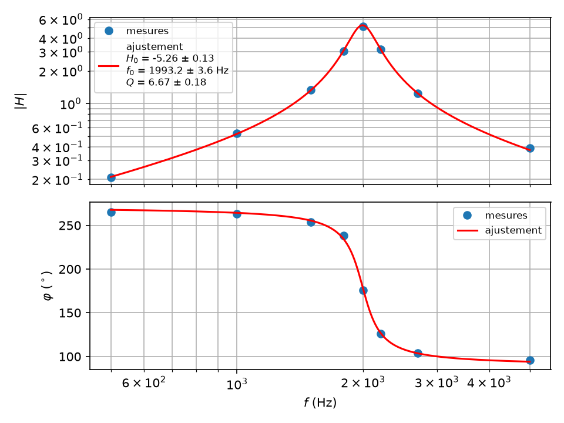

# tpllg

Module python utilisable en salle de TP de physique pour exploiter des mesures
rapidement sans passer son temps à écrire du code.

- Acquisition à la centrale **Sysam SP5** ;
- Import facilité de données numériques exportées depuis _Latis Pro_,
  _Regressi_ ou un tableur, et export d'un CSV que ces logiciels ouvrent ;
- Exploitation des mesures avec
  - ajustement des données, y compris une droite quand x et y sont
    incertains (régression de York) ;
  - gestion des incertitudes, en particulier par la méthode de Monte-Carlo ;
  - tracés et ajustements d'un diagramme de Bode ;
  - analyse de signaux : trouver un front montant, un pic, une fenêtre, une
    fréquence propre...
  - analyse des spectres par DFT ;
  - synthèse d'un signal par ses harmoniques et filtrage par le calcul.

Le paquet réunit ce qui revient souvent d'un TP à l'autre et fournit des
commandes « boîtes noires » qui s'appuient sur les modules classiques `numpy`
et `scipy` pour l'analyse de signaux, et `pycanum` en ce qui concerne
l'interfaçage avec **Sysam SP5** (en cours d'obsolescence, malgré des
performances tout à fait adaptées en TP, et surtout encore présent dans de
nombreuses salles de TP).

Il est écrit pour être copié tel quel à côté des scripts d'un TP, sur des postes
sans droits d'installation, et aussi pour tourner sans centrale : un simulateur
prend le relais le cas échéant, en le disant, et refuse ce que la centrale
refuserait.

## Sommaire

- [Installation](#installation)
- [Prérequis](#prérequis)
- [Prise en main](#prise-en-main-rapide)
- [La documentation](#la-documentation)
- [Les modules](#les-modules)
- [Point ou grandeur ?](#point-ou-grandeur-)
- [Les exemples](#les-exemples)
- [Erreurs courantes](#erreurs-courantes)
- [Développer, tester](#tester)
- [Licence](#licence)

## Installation

Quatre façons, selon le poste.

**Copier le dossier**, au lycée ou chez soi, sans pip ni réseau : le dossier
`tpllg/` de ce dépôt (celui qui contient `sysam.py`) se pose à côté des scripts,
et `from tpllg.sysam import Sysam` fonctionne, à condition d'exécuter le script
**depuis son dossier** (sous Spyder, « Exécuter dans le répertoire du
fichier »). C'est ce que font les dossiers distribués aux élèves : les
scripts et `tpllg/` ensemble, rien à installer.

**Avec pip depuis GitHub**, quand le réseau et pip sont disponibles, et que
les droits d'installation sont acquis :

```bash
pip install git+https://github.com/antnardo/tpllg
```

**Avec la roue d'une release**, pour un poste qui a pip mais pas git :
chaque [release](https://github.com/antnardo/tpllg/releases) porte un
fichier `tpllg-<version>-py3-none-any.whl` (et le sdist `.tar.gz`, avec
`doc/` et `exemples/`), qui s'installe par
`pip install tpllg-2026.10.2-py3-none-any.whl`.

**Pour développer**, une installation éditable depuis un clone :

```bash
git clone https://github.com/antnardo/tpllg
pip install -e tpllg
```

## Prérequis

Le paquet demande Python 3.7 ou plus, avec numpy (1.16 ou plus), scipy (1.3
ou plus) et matplotlib : une distribution Anaconda suffit, et les postes du
lycée restés en Python 3.7 avec un numpy antérieur à 1.17 sont servis (le
générateur aléatoire s'y rabat sur `RandomState`). Les exemples, eux,
écrivent `f"{x=}"`, que Python 3.8 a introduit : paquet 3.7+, exemples 3.8+.
Le tout est testé sous Python 3.8 (numpy 1.24, scipy 1.10, matplotlib 3.7),
3.11 et 3.14 (numpy 2.5, scipy 1.18, matplotlib 3.11) ; l'intégration
continue rejoue la suite sous 3.7 avec numpy 1.16, scipy 1.3 et
matplotlib 3.0.

La centrale nécessite le module **pycanum** installé, le module Python de
Frédéric Legrand pour la Sysam SP5, disponible sous Windows :
[interpy](https://www.f-legrand.fr/scidoc/docmml/sciphys/caneurosmart/interpy/interpy.html).
Sans pycanum, `tpllg.sysam` se rabat sur `tpllg.sysam_factice`, qui a la même
interface et rend des données de la même forme, et l'annonce à l'ouverture :

```text
[SYSAM] ATTENTION : pycanum absent, centrale simulée (tpllg.sysam_factice)
```

Les scripts tournent alors jusqu'au bout, ce qui permet de les tester chez soi,
mais les acquisitions ne rendent que du bruit de quantification. Le simulateur
refuse ce que la centrale refuse — un calibre au-delà de 10 V, une période trop
courte, trop de points pour la mémoire — : un script qui passe chez soi ne
découvre pas ces erreurs en salle de TP. Sur un poste qui a la centrale, le
message ci-dessus signifie que pycanum n'est pas installé pour ce Python-là
(pour cette distribution, il peut y avoir plusieurs distributions sur un même
poste), pas que le script est cassé.

Le simulateur, et les quatre corrections que `tpllg.sysam` apporte au
pilote, reproduisent les règles de **pycanum 4.x**, lues dans son source C.
pycanum 5.0 (2024) pilote la carte par un serveur HTTP et n'a pas encore
été vérifié sur un poste : ses refus et ses arrondis peuvent différer.

## Prise en main rapide

Acquérir les deux voies EA0 et EA1 simultanément, les enregistrer, les tracer :

```python
import matplotlib.pyplot as plt
from tpllg.acquisition import acquerir, sauvegarder

fe = 200_000.0  # échantillonnage en Hz
temps, tensions = acquerir([0, 1], calibre=5, te=1 / fe, nbpoints=6_000)
sauvegarder("essai", [0, 1], temps, tensions)  # essai_EA0.txt, essai_EA1.txt

plt.plot(temps[0], tensions[0], label="EA0")
plt.plot(temps[1], tensions[1], label="EA1")
plt.legend()
plt.show()
```

`temps` et `tensions` sont deux tableaux de forme `(2, 6000)` : une ligne par
voie, le temps en secondes, la tension en volts.

Ajuster un modèle sur des mesures, avec des incertitudes-types sur `y` :

```python
import numpy as np
from tpllg.ajustement import curvefit, resume_parametres


def modele(x, a, b):
    return a * x + b


x = np.array([0.1, 0.3, 0.5, 0.7, 0.9, 1.1, 1.3, 1.5, 1.7, 1.9])
y = np.array([-0.85, -0.42, 0.11, 0.35, 0.84, 1.15, 1.70, 1.95, 2.36, 2.85])
pfit, err, chi2 = curvefit(modele, x, y, p0=[1, 0], datayerrors=0.15)
print(resume_parametres(("a", "b"), pfit, err))
```

`curvefit` rend les paramètres, leurs incertitudes-types et le χ² réduit
(`verbose=True` lui fait annoncer la méthode employée, moindres carrés ou
variance effective), et `resume_parametres` met en forme les résultats,
deux chiffres significatifs sur l'incertitude :

```text
a = 2.010 ± 0.083
b = -1.006 ± 0.095
```

`datayerrors` s'écrit aussi `u_y`, et `dataxerrors` `u_x`, les noms de
`regression_york` et de `tpllg.montecarlo`.

Ajuster une fonction de transfert sur un diagramme de Bode mesuré, gain et phase
ensemble, et tracer :

```python
import numpy as np
from tpllg.ajustement import curve_fit_complex, resume_parametres
from tpllg.bode import tracer_bode


def passe_bande(f, H0, f0, Q):
    return H0 / (1 + 1j * Q * (f / f0 - f0 / f))


f = np.array([500, 1000, 1500, 1800, 2000, 2200, 2700, 5000.0])  # Hz
H = np.array([0.21, 0.53, 1.33, 3.06, 5.13, 3.16, 1.24, 0.39])  # |Vs/Ve|
phi = np.radians([-95, -97, -106, -122, 176, 126, 104, 96])  # radians

pfit, err, chi2 = curve_fit_complex(passe_bande, f, norm=H, phase=phi, p0=[-5, 2000, 6])
print(resume_parametres(("H0", "f0", "Q"), pfit, err, unites=("", "Hz", "")))
tracer_bode(
    f,
    H,
    phi,
    passe_bande,
    pfit,
    err,
    noms=("$H_0$", "$f_0$", "$Q$"),
    unites=("", "Hz", ""),
    fichier="bode.pdf",
)
```

```text
H0 = -5.26 ± 0.13
f0 = 1993.2 ± 3.6 Hz
Q = 6.67 ± 0.18
```



## La documentation

Une fiche par famille de fonctions, dans `doc/`. Chaque fonction y est donnée
avec sa signature, le sens de chaque argument, ce qu'elle rend, ce qui la fait
échouer, et un exemple exécuté avec ce qu'il imprime. Les fiches se terminent
par des cas complets, de bout en bout. Ce qui a changé d'une version à
l'autre est dans [CHANGELOG.md](CHANGELOG.md).

| Fiche | Contenu |
| --- | --- |
| [doc/centrale.md](doc/centrale.md) | la Sysam SP5 : voies, calibres, modes de conversion, mémoire partagée, échantillonnage, acquisition, déclenchement sur une voie, sorties analogiques, enregistrement, le simulateur, les pannes courantes |
| [doc/ajustement.md](doc/ajustement.md) | ce que fait `curve_fit` ; `curvefit` avec les incertitudes sur y, sur x et y, le χ² réduit ; la régression de York ; `curve_fit_complex` pour un module et une phase ; présenter un résultat ; choisir les valeurs de départ ; lire les résidus ; un modèle solution d'une équation différentielle |
| [doc/incertitudes.md](doc/incertitudes.md) | une série de mesures, l'écart-type, l'incertitude de la moyenne, le coefficient de Student ; la propagation par Monte-Carlo : `Point`, les lois uniforme et triangulaire d'une tolérance, l'intervalle le plus court, les indices de Sobol, la droite ajustée sur tous les tirages sans boucle, un modèle quelconque ajusté par tirages |
| [doc/signaux.md](doc/signaux.md) | repérer les fronts d'un créneau, découper une fenêtre, estimer une fréquence, les extremums et le taux d'amortissement d'une oscillation amortie ; le régime libre d'un filtre après un front, ajusté |
| [doc/bode.md](doc/bode.md) | tracer un diagramme de Bode, mesures et modèle, avec une phase continue ; la chaîne complète mesures, ajustement, figure ; la fonction de transfert mesurée par détection synchrone ; le Bode automatique par la centrale |
| [doc/spectres.md](doc/spectres.md) | le spectre d'un signal, brut ou fenêtré, et ses phases ; relever les harmoniques ; mesurer une fonction de transfert sur les harmoniques d'un créneau |
| [doc/harmoniques.md](doc/harmoniques.md) | un signal périodique par ses harmoniques : synthèse, filtrage par le calcul, valeur efficace, analyseur de spectre ; ce que devient `traitementsignal` |
| [doc/fichiers.md](doc/fichiers.md) | lire un CSV de tableur, un export Latis Pro ou Regressi, tous rendus de la même façon ; écrire un CSV ; relire ce que `sauvegarder` écrit |
| [doc/tests.md](doc/tests.md) | ce que vérifient les 322 tests |

## Les modules

| Module | Contenu |
| --- | --- |
| `tpllg.sysam` | `Sysam`, la classe de pycanum avec un `with`, des calibres simples, des temps en secondes et des acquisitions qui rendent directement temps et tensions ; `n_max`, `te_min`, `get_calibre` pour rester dans les limites ; se rabat sur le simulateur sans pycanum (règles de pycanum 4.x) |
| `tpllg.sysam_factice` | le simulateur : même interface, mêmes formes de données, mêmes refus que la centrale, sans matériel |
| `tpllg.acquisition` | `acquerir(voies, calibre, te, nbpoints, trigger=…)` en une ligne, déclenchement compris ; `sauvegarder` et `charger`, un fichier par voie |
| `tpllg.ajustement` | `curvefit` (incertitudes sur y, ou sur x et y par la variance effective, χ² réduit), `curve_fit_complex` (module et phase ajustés ensemble, en radians, refusés au-delà de 2π), `regression_york` (une droite, x et y incertains), `Ajustement` (le résultat), `ecarts_types`, `formater` (deux chiffres sur l'incertitude, notation scientifique hors de [10⁻³, 10⁵[), `resume_parametres`, `residus_complexes` |
| `tpllg.incertitudes` | `incertitudes` (moyenne, incertitude de la moyenne, écart-type estimé), `student_coef`, `loi_normale`, `loi_normale_cumulee` |
| `tpllg.montecarlo` | `Point` (lois `normale`, `uniforme`, `triangulaire`, `arcsinus`), `SerieLineaire`, `ajuster_modele`, `indices_sobol`, `fixer_graine` : la propagation des incertitudes par tirages, la droite sans boucle |
| `tpllg.signaux` | `fronts_montants`, `fronts_descendants`, `front_utile`, `fenetre`, `frequence_pic`, `extremums`, `taux_amortissement`, tous en `(t, v)` |
| `tpllg.bode` | `tracer_bode`, `phase_continue` et son inverse `phase_repliee` |
| `tpllg.fft` | `calcule_DFT`, `spectre` |
| `tpllg.traitement` | `fonction_transfert`, `choix_echantillonnage`, `indices_plages`, `detecte_maxima_secondaires`, `valeurs_correspondantes` |
| `tpllg.harmoniques` | `Signal`, `spectre_carre`, `spectre_triangle`, `spectre_dent_de_scie`, `passe_bas_1`, `passe_haut_1`, `passe_bas_2`, `passe_haut_2`, `passe_bande`, `coupe_bande` |
| `tpllg.fichiers` | `lire_csv`, `lire_latispro`, `lire_regressi`, qui rendent tous une liste de tableaux, un par colonne ; `ecrire_csv` |

Chaque module ne dépend que de numpy, scipy et matplotlib, jamais d'un
autre paquet : `tpllg` se copie seul dans un dossier de TP. Les noms de la
version 2026.9 (`readcsv`, `gain_std`, `phase_0_360`,
`decrement_logarithmique`, `frequence_pic(v, te)`, `Sysam.N_MAX`…)
restent valables et rendent ce qu'ils rendaient, sans avertissement ; la
liste est dans le [CHANGELOG](CHANGELOG.md) et dans la section « Anciens
noms » de chaque fiche.

## Point ou grandeur ?

Deux objets « valeur ± incertitude » existent dans le même écosystème, et
ne font pas la même chose :

| | `tpllg.montecarlo.Point` | `grandeurs.grandeur` (dépôt `grandeursphy`) |
| --- | --- | --- |
| Propagation | par **Monte-Carlo** : des tirages sur chaque grandeur, le calcul refait sur chaque tirage ; juste pour les lois non linéaires, les quotients à queue lourde, les tolérances (lois uniforme, triangulaire, arcsinus) | **linéaire** (dérivées partielles, loi de propagation du GUM), par `uncertainties` |
| Unités | aucune : des nombres, l'unité est dans la tête et dans `formater(val, u, "Hz")` | avec unités (`pint`) : les conversions et la cohérence dimensionnelle sont vérifiées |
| Sortie | texte et figures matplotlib : `formater`, `show`, les histogrammes | `siunitx` pour pythontex : les valeurs tombent directement dans un corrigé LaTeX |
| Dépendances | numpy, scipy, matplotlib : tourne sur les postes du lycée et dans une copie du dossier | pint, uncertainties : un environnement à installer |
| Pour | les scripts de TP, les corrigés calculés en Python, les figures qui montrent la dispersion | les corrigés et les cours compilés par pythontex, les tableaux de constantes |

Les deux ne s'importent pas l'un l'autre, et ne le feront pas : `tpllg` doit
vivre seul, copié dans un dossier de TP, et `grandeurs` a besoin de pint. Le
passage de l'un à l'autre se fait par les nombres : `Point(val, u)` depuis
une grandeur, `formater` ou `(X.val, X.u)` vers l'autre.

## Les exemples

Les scripts d'`exemples/` sont complets et tournent sans centrale. Ceux qui
ont besoin de mesures plausibles — `regime_libre.py`,
`spectre_harmoniques.py`, `ajustement_decharge.py`, `ajustement_sinusoide.py`,
`Bode.py` — ont en tête un interrupteur `SIMULATION` qui les fabrique comme la
centrale les rendrait ; `False` acquiert pour de bon. `acquisition_simple.py`
et `Acquisition.py` acquièrent toujours : sans centrale, le simulateur répond,
avec du bruit. Ils s'exécutent depuis n'importe quel dossier ayant accès à
`tpllg`, y écrivent leurs fichiers et leurs figures, et sont les mêmes que
ceux des fiches.

| Script | Ce qu'il fait |
| --- | --- |
| `acquisition_simple.py` | acquiert deux voies (ou une), enregistre un fichier par voie, trace |
| `regime_libre.py` | un créneau attaque un filtre ; repère un front, découpe le régime libre qui le suit, l'ajuste, trace acquisition, ajustement et résidus |
| `bode_ajustement.py` | des mesures point par point d'un diagramme de Bode, l'ajustement simultané du gain et de la phase, les résidus, la figure |
| `spectre_harmoniques.py` | le spectre d'un créneau, ses harmoniques, le gain d'un filtre mesuré sur chaque harmonique et ajusté |
| `harmoniques.py` | un créneau sommé harmonique par harmonique, passé dans un passe-bande, et un analyseur de spectre analogique |
| `lecture_fichiers.py` | écrit puis relit un CSV de tableur, un export Latis Pro, un export Regressi, un fichier de `sauvegarder` |
| `ajustement_droite.py` | une droite sur dix points, sans incertitudes, avec celles de y, avec celles de x et y : la bande où la droite peut passer |
| `ajustement_bruit_variable.py` | la même chose quand les incertitudes changent d'un point à l'autre, et la régression de York |
| `regression_york.py` | la régression de York face au Monte-Carlo de la même droite, à la variance effective, et à un Monte-Carlo non pondéré |
| `ajustement_chi2.py` | ce qu'un ajustement minimise : les écarts au modèle, la vallée du chi2 dans le plan des paramètres, le chemin des itérations de `curve_fit` |
| `ajustement_variance_effective.py` | une incertitude sur x ramenée en y par la pente du modèle, sur une exponentielle |
| `ajustement_chi2_reduit.py` | le chi2 réduit quand l'incertitude annoncée est juste, trop petite, trop grande, quand le modèle est faux ; sa loi sur deux mille jeux de mesures |
| `ajustement_complexe.py` | un passe-bande ajusté par son module et sa phase ensemble, face au module seul ; les mesures dans le plan complexe ; ce que les incertitudes changent |
| `ajustement_depart.py` | les valeurs de départ : le modèle tracé avant d'ajuster, un minimum absurde, l'issue de trois cents départs |
| `ajustement_residus.py` | les résidus d'un modèle qui décrit les mesures, et ceux d'un modèle auquel il manque quelque chose |
| `ajustement_decharge.py` | la décharge d'un condensateur : acquisition, valeurs de départ, ajustement de la constante de temps, résidus |
| `ajustement_sinusoide.py` | une sinusoïde ajustée en partant du pic de la FFT, et ce qu'un mauvais départ donne |
| `ajustement_equadiff.py` | un pendule aux grands angles : un modèle sans expression, intégré par `solve_ivp` à chaque appel, face à une sinusoïde |
| `incertitudes_serie.py` | une série de mesures répétées, cinq puis cinquante : la moyenne, l'écart-type et l'incertitude sur la moyenne, sur l'histogramme des mesures et sur les mesures dans l'ordre |
| `incertitudes_student.py` | le coefficient de Student en fonction du nombre de mesures, à 68,27 % et à 95,45 % |
| `incertitudes_loi_normale.py` | la loi normale et son cumul sur le même graphe |
| `montecarlo.py` | g par un pendule, un quotient à loi dissymétrique et son intervalle le plus court, une droite ajustée sur cent mille tirages face à York et à `curvefit`, une exponentielle ajustée par tirages, une résistance par la loi d'Ohm avec les tolérances des multimètres et la part de chacun, la valeur absolue d'une différence ; l'histogramme de chaque grandeur |
| `Acquisition.py`, `Bode.py` | deux scripts dérivés des exemples de Frédéric Legrand, « Enregistrement d'un signal » et « Diagramme de Bode » (voir [Licence](#licence)) : l'acquisition avec spectre, le Bode automatique |
| `regression_lineaire.py` | une droite par `np.polyfit`, par `curve_fit` et par `curvefit` : ce que chacun rend, et `formater` |
| `ajustement_incertitudes_x_y.py` | la même droite sans incertitudes, avec celles de y, avec celles de x et de y, quand le bruit est constant puis quand il ne l'est pas |
| `importer_donnees.py` | trois façons de lire un fichier de mesures : le module `csv`, `np.loadtxt`, `lire_csv` ; `np.save` pour conserver un tableau |
| `boussole_champ_terrestre.py` | la composante horizontale du champ magnétique terrestre par la période d'une boussole dans le champ de bobines : deux droites ajustées, un résultat formaté |
| `frequence_defilement_franges.py` | la fréquence d'un défilement de franges par comptage, par le pic de la DFT, et par le spectre fenêtré |
| `spectre_signal_periodique.py` | un signal périodique construit par ses harmoniques (`Signal`), échantillonné, et son spectre par `calcule_DFT`, exact quand les pics tombent sur la grille |
| `ecarts_moyennes_correcteurs.py` | combien de copies pour comparer les moyennes de plusieurs correcteurs : une simulation de Monte-Carlo sur deux distributions de notes, avec `loi_normale` |
| `loi_student_incertitudes.py` | l'histogramme de trente mesures et l'intervalle de confiance sur la moyenne, la probabilité de sortir de ±t écarts-types, les lois de Student et leurs coefficients |

## Erreurs courantes

**Les données sont des tableaux 2D.** `acquerir`, comme `can.acquerir()`, rend
`temps` et `tensions` de forme `(nombre de voies, nombre de points)`, en
`float64` : `temps[0]` et `tensions[0]` sont la première voie demandée, quel
que soit son numéro. Le temps est en secondes et commence à zéro. Les
fonctions d'analyse prennent une voie à la fois, `temps[0]` et `tensions[0]`,
et le disent si on leur donne le tout.

**Les temps sont en secondes** partout dans `tpllg` : la période
d'échantillonnage donnée à `config_echantillon` ou à `acquerir`, les fronts
rendus par `fronts_montants`, les fenêtres. Les fonctions de `tpllg.signaux`
prennent `(t, v)` et en déduisent la période : ni `te` ni `fe` à passer. Les
méthodes héritées de pycanum que `tpllg` ne réécrit pas (`config_sortie`,
`config_echantillon_permanent`) prennent, elles, des **microsecondes**.

**La mémoire est partagée.** La centrale a 262 143 mots pour toutes les voies
et les sorties ensemble : `Sysam.n_max(voies, sorties)` donne le nombre de
points par voie à ne pas dépasser.

**Les phases sont en radians** pour l'ajustement (`curve_fit_complex`,
`residus_complexes`) et en degrés dans les résultats lisibles
(`residus_complexes` les rend en degrés, `tracer_bode` les affiche en degrés,
continues d'une fréquence à l'autre). Une phase mesurée en degrés se
convertit par `np.radians` avant d'ajuster ; oubliée, elle est refusée dès
qu'elle dépasse 2π (`ValueError: les phases doivent être en radians`), au
lieu de donner un ajustement faux en silence. Une phase déroulée sur plus
d'un tour se replie par `phase_repliee`.

**Les valeurs de départ se lisent sur un tracé** avant tout ajustement : les
valeurs initiales d'un ajustement doivent être testées graphiquement avant de
lancer l'ajustement. L'ajustement ne doit apporter que de la précision. Un
facteur 2 peut faire converger l'ajustement vers des valeurs absurdes.

**Un script pour la centrale tourne sans elle.** Le simulateur répond avec des
tableaux de la bonne forme, remplis de bruit ; un script qui veut s'essayer avec
des données plausibles les fabrique lui-même derrière un interrupteur
`SIMULATION`, comme le font les exemples.

**Un script de 2026.9 tourne tel quel.** Ses noms (`gain_std`,
`phase_0_360`, `decrement_logarithmique`, `frequence_pic(v, te)`,
`readcsv`, `Sysam.N_MAX`…) restent valables, rendent ce qu'ils rendaient
et n'affichent aucun avertissement ; le [CHANGELOG](CHANGELOG.md) en donne
la liste, avec l'écriture d'aujourd'hui en regard. Ce qui a disparu en
2026.10.2 (`interpolation_fft`, `Point.apply_func`, `SerieLineaire.xi`…)
n'était employé par aucun script : le CHANGELOG le dit aussi.

## Tester

```bash
pip install -e .
python -m pytest
```

ou, sans rien installer soi-même, sous un Python donné, avec
[uv](https://docs.astral.sh/uv/), qui installe le paquet et pytest dans un
environnement à lui (`.venv/`) :

```bash
uv run --python 3.8 pytest -W error
```

Les tests n'ont pas besoin de la centrale : ils passent par le simulateur,
et aucun avertissement n'y est toléré (`filterwarnings = error` dans
`pyproject.toml`). `ruff format` et `ruff check` (réglés dans
`pyproject.toml`, cible Python 3.7) gardent le code et les exemples
propres. La description des tests est dans la documentation
[doc/tests.md](doc/tests.md). L'intégration continue
(`.github/workflows/ci.yml`) rejoue tout cela à chaque push, sous Python
3.8, 3.11 et 3.14, puis sous 3.7 avec numpy 1.16, scipy 1.3 et
matplotlib 3.0 dans un conteneur, ce que uv ne sait plus installer ; à
chaque release publiée, `publish.yml` construit la roue et le sdist et les
joint à la release.

## Licence

Le dépôt est sous licence
[CC BY-NC-SA 4.0](https://creativecommons.org/licenses/by-nc-sa/4.0/deed.fr),
dont le texte intégral est dans [LICENSE](LICENSE) : réutilisation et
modification libres hors usage commercial, en citant l'auteur et en partageant
les versions modifiées sous la même licence. Auteur : Antonin Marchand, lycée
Louis-le-Grand. Jusqu'au 26 septembre 2026, le code était sous licence MIT, à
l'exception des deux exemples dérivés de Frédéric Legrand.

Une partie du code revient en effet à Frédéric Legrand. `exemples/Acquisition.py`
et `exemples/Bode.py` dérivent de ses exemples, publiés sur son site sous
[CC BY-NC-SA 2.0 FR](https://creativecommons.org/licenses/by-nc-sa/2.0/fr/) —
[Enregistrement d'un signal](https://www.f-legrand.fr/scidoc/docmml/sciphys/caneurosmart/pyacquis/pyacquis.html)
et
[Diagramme de Bode](https://www.f-legrand.fr/scidoc/docmml/sciphys/caneurosmart/pybode/pybode.html).
Deux fonctions du paquet lui sont dues aussi, réécrites ici et créditées dans
leur docstring : `choix_echantillonnage` (`tpllg.traitement`), venue du même
« Diagramme de Bode », et le spectre fenêtré `spectre` (`tpllg.fft`), venu de
[Mesure de déphasage](https://www.f-legrand.fr/scidoc/docmml/sciphys/caneurosmart/dephasage/dephasage.html).
La mesure du gain du « Diagramme de Bode », `gain_std`, a été remplacée par une
détection synchrone, `fonction_transfert`, et son interpolation par FFT,
`interpolation_fft`, retirée en 2026.10.2. La 2.0 FR permet de diffuser une
adaptation sous une version ultérieure aux mêmes options : ces emprunts sont
donc sous CC BY-NC-SA 4.0, comme le reste.

`pycanum` n'en relève pas : c'est une dépendance, pas une partie du dépôt. Il
appartient à Frédéric Legrand, est publié sous licence CeCILL sur PyPI, et n'est
jamais redistribué ici.
