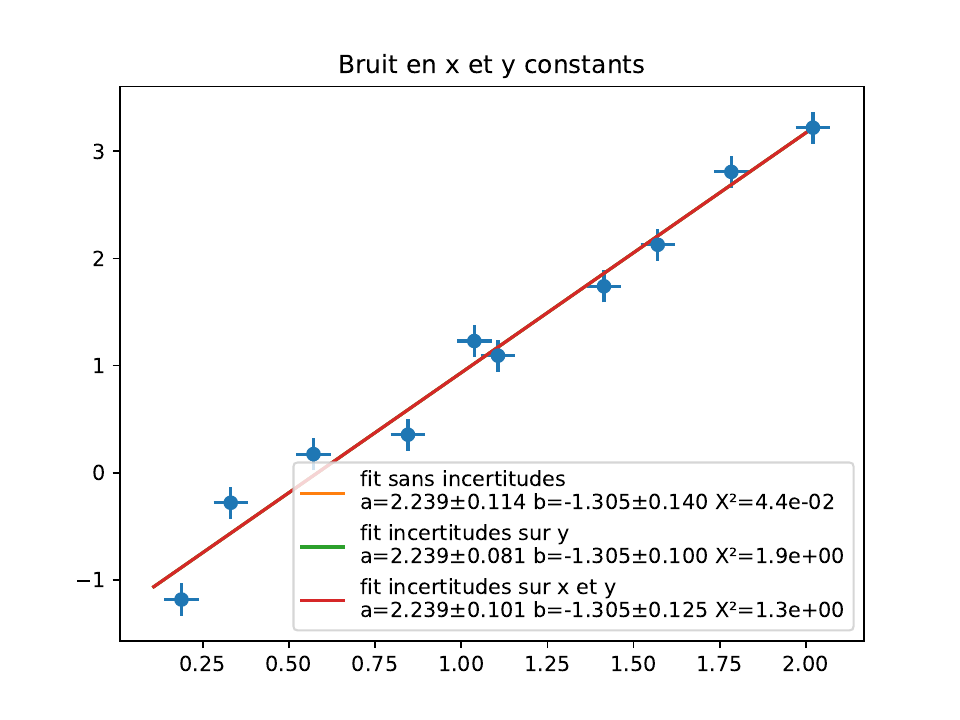
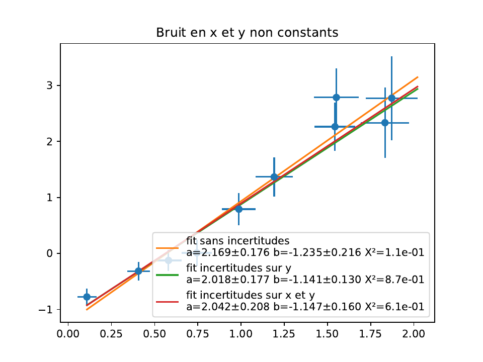

# Ajustements

`tpllg.ajustement` habille `scipy.optimize.curve_fit` pour deux besoins qui
reviennent en TP : tenir compte des incertitudes de mesure, sur `y` ou sur
`x` et `y`, et ajuster une grandeur complexe mesurée par son module et sa
phase. Il met aussi en forme les résultats, valeur et incertitude, et
calcule les résidus. Les incertitudes d'une série de mesures et la
propagation par Monte-Carlo sont dans [incertitudes.md](incertitudes.md).

## Sommaire

- [Ce que curve_fit fait](#ce-que-curve_fit-fait)
- [curvefit, avec les incertitudes](#curvefit-avec-les-incertitudes)
- [Lire le χ² réduit](#lire-le-χ²-réduit)
- [curve_fit_complex, module et phase ensemble](#curve_fit_complex-module-et-phase-ensemble)
- [Choisir les valeurs de départ](#choisir-les-valeurs-de-départ)
- [Les résidus](#les-résidus)
- [Présenter un résultat](#présenter-un-résultat)
- [Cas complets](#cas-complets)
- [Quand ça ne marche pas](#quand-ça-ne-marche-pas)

## Ce que curve_fit fait

Un ajustement cherche les paramètres `p` qui rendent minimale la somme des
carrés des écarts entre mesures et modèle, chaque écart étant rapporté à
l'incertitude du point :

```text
chi2(p) = somme sur i de ( (y_i - f(x_i ; p)) / sigma_i )²
```

Pour un modèle affine le minimum est analytique ; pour un modèle
quelconque, `curve_fit` itère (méthode de Levenberg-Marquardt) à partir des
valeurs de départ `p0`, et s'arrête quand `chi2` ne descend plus. Il rend les
paramètres `pfit` et leur matrice de covariance `pcov`, dont la diagonale
porte les variances des paramètres, et dont les racines sont les
**incertitudes-types** ; les termes croisés disent comment les paramètres
sont corrélés, ce qu'on regarde rarement mais qui compte pour propager.

Deux conséquences à garder en tête. Les **valeurs de départ comptent** : loin
du bon minimum, une descente locale peut s'arrêter dans un creux qui n'est
pas le bon, ou partir à l'infini ; on les lit sur un tracé des mesures avant
d'ajuster, et une section ci-dessous montre ce qui arrive sinon. Et **sans
incertitudes fournies**, `curve_fit` met `pcov` à l'échelle de la dispersion
des résidus : les incertitudes rendues supposent que le modèle est bon et que
les écarts sont aléatoires et indépendants ; elles ne connaissent ni une
erreur systématique ni un modèle faux, et elles sont d'autant plus
optimistes qu'il y a de points.

`curve_fit` s'appelle directement quand on n'a pas d'incertitudes, comme
dans [signaux.md](signaux.md#le-régime-libre-après-un-front) ; `curvefit`
sert dès qu'on en a.

## curvefit, avec les incertitudes

```python
from tpllg.ajustement import curvefit

pfit, err, chi2 = curvefit(function, datax, datay, p0,
                           datayerrors=None, dataxerrors=None,
                           function_derivate=None,
                           n_var_method_max=10, chi_limit=0.01,
                           verbose=True, **kwargs)
```

| Argument | Sens |
| --- | --- |
| `function` | le modèle, `function(x, a, b, …)`, un paramètre par argument après `x`. Vectorisé en `x` de préférence ; s'il ne l'est pas (un `math.exp`), `curvefit` s'en aperçoit et l'appelle point par point |
| `datax`, `datay` | les mesures, tableaux ou listes de même longueur |
| `p0` | les valeurs de départ, une par paramètre, dans l'ordre de `function` |
| `datayerrors` | les incertitudes-types sur `y` : un nombre, la même pour tous les points, ou un tableau de même longueur ; strictement positives. Sans elles, tous les points pèsent pareil, `pcov` est mise à l'échelle des résidus comme le fait `curve_fit`, et le χ² réduit rendu n'a pas de sens |
| `dataxerrors` | les incertitudes-types sur `x`, un nombre ou un tableau de même façon ; demande `datayerrors` et `function_derivate` |
| `function_derivate` | la dérivée du modèle par rapport à `x`, `function_derivate(x, a, b, …)`, mêmes arguments que `function`. Elle peut rendre un nombre quand elle est constante — `return a` pour une droite — et n'a pas besoin d'être vectorisée non plus |
| `n_var_method_max`, `chi_limit` | la boucle de la variance effective : au plus tant d'itérations, arrêt quand le χ² réduit ne baisse plus que de tant |
| `verbose` | `False` pour taire la ligne qui annonce la méthode employée |
| `**kwargs` | transmis à `curve_fit` : `maxfev` (nombre d'évaluations, si l'ajustement s'arrête faute d'itérations), `bounds` (des bornes sur les paramètres) |

Retour : `pfit` les paramètres, `err` leurs incertitudes-types, `chi2` le
**χ² réduit**, `chi2` divisé par le nombre de points moins le nombre de
paramètres.

Avec `datayerrors`, la matrice de covariance est **absolue** : les
incertitudes rendues sont celles que les incertitudes de mesure impliquent,
et le χ² réduit dit si les deux sont compatibles. Avec des incertitudes sur
`x` en plus, la méthode est celle de la **variance effective** (Orear,
Am. J. Phys. 1982) : chaque incertitude en `x` est ramenée en `y` par la
pente locale du modèle, `sigma_i² = sigma_y,i² + sigma_x,i² f'(x_i)²`, et
l'on itère puisque la pente dépend des paramètres. La fonction prévient si
la boucle ne converge pas, ce qui se règle par de meilleures valeurs de
départ.

Pour une droite avec des incertitudes constantes, les paramètres ne changent
pas d'une méthode à l'autre ; seules leurs incertitudes et le χ² bougent.
Avec des incertitudes variables d'un point à l'autre, les paramètres changent
aussi, sauf si les incertitudes en `x` sont proportionnelles à celles en `y`.
`exemples/ajustement_incertitudes.py` montre les deux cas :





Deux erreurs sont refusées, avec un message : des incertitudes sur `x` sans
la dérivée (`NotImplementedError: Pour utiliser des erreurs en x, il faut
indiquer la dérivée…`), et des incertitudes sur `x` seules, sans celles de
`y`.

Le cas d'une droite, dix points, incertitudes de 0,05 sur `x` et 0,15 sur
`y` :

```python
import numpy as np
from tpllg.ajustement import curvefit, resume_parametres

def modele(x, a, b):
    return a*x + b

def modele_derivee(x, a, b):     # dérivée par rapport à x : constante, un nombre suffit
    return a

x = np.array([0.1, 0.3, 0.5, 0.7, 0.9, 1.1, 1.3, 1.5, 1.7, 1.9])
y = np.array([-0.85, -0.42, 0.11, 0.35, 0.84, 1.15, 1.70, 1.95, 2.36, 2.85])
sigma_x = 0.05                   # la même pour tous les points ; un tableau, une par point, sinon
sigma_y = 0.15

# 1. tous les points pèsent pareil ; pcov est mise à l'échelle des résidus, chi2 sans objet
pfit, err, chi2 = curvefit(modele, x, y, p0=[1, 0], verbose=False)
print("sans incertitudes      ", resume_parametres(("a", "b"), pfit, err).replace("\n", "   "))
# 2. les incertitudes sur y pèsent les points ; chi2 dit si elles sont justes
pfit, err, chi2 = curvefit(modele, x, y, p0=[1, 0], datayerrors=sigma_y, verbose=False)
print("incertitudes sur y     ", resume_parametres(("a", "b"), pfit, err).replace("\n", "   "), "chi2 réduit = %.2f" % chi2)
# 3. incertitudes sur x et y : variance effective, il faut la dérivée
pfit, err, chi2 = curvefit(modele, x, y, p0=[1, 0], datayerrors=sigma_y,
                           dataxerrors=sigma_x, function_derivate=modele_derivee, verbose=False)
print("incertitudes sur x et y", resume_parametres(("a", "b"), pfit, err).replace("\n", "   "), "chi2 réduit = %.2f" % chi2)
```

```text
sans incertitudes       a = 2.010 ± 0.038   b = -1.006 ± 0.044
incertitudes sur y      a = 2.010 ± 0.083   b = -1.006 ± 0.095   chi2 réduit = 0.21
incertitudes sur x et y a = 2.010 ± 0.099   b = -1.01 ± 0.11   chi2 réduit = 0.14
```

Mêmes paramètres trois fois, comme annoncé. Sans incertitudes, l'ajustement
annonce ±0,038 sur la pente parce que les points sont bien alignés ; avec
les incertitudes déclarées, ±0,083, et un χ² réduit de 0,21 qui dit que les
points sont **plus** alignés que les incertitudes ne le laissaient attendre :
les 0,15 V annoncés sont surestimés d'un facteur deux environ.

## Lire le χ² réduit

Quand les incertitudes fournies sont justes et le modèle bon, le χ² réduit
vaut 1 à quelques dixièmes près, la fluctuation d'un tirage à l'autre étant
de l'ordre de `sqrt(2/(N - p))`. Sur une exponentielle décroissante de vingt
points bruités à 0,02 V, ajustée trois fois avec trois valeurs annoncées de
l'incertitude :

```python
x = np.linspace(0, 5, 20)
rng = np.random.RandomState(4)
y = 2*np.exp(-x/1.5) + rng.normal(0, 0.02, x.size)      # le vrai bruit : 0,02
for sigma in (0.02, 0.005, 0.08):
    pfit, err, chi2 = curvefit(lambda x, a, tau: a*np.exp(-x/tau), x, y, p0=[1, 1],
                               datayerrors=sigma, verbose=False)
    print("sigma = %g" % sigma, resume_parametres(("a", "tau"), pfit, err).replace("\n", "   "),
          "chi2 réduit = %.2f" % chi2)
```

```text
sigma = 0.02 a = 1.999 ± 0.014   tau = 1.495 ± 0.017   chi2 réduit = 0.66
sigma = 0.005 a = 1.9985 ± 0.0036   tau = 1.4951 ± 0.0042   chi2 réduit = 10.50
sigma = 0.08 a = 1.999 ± 0.057   tau = 1.495 ± 0.067   chi2 réduit = 0.04
```

| χ² réduit | Ce qu'il dit |
| --- | --- |
| proche de 1 | les incertitudes déclarées rendent compte des écarts au modèle : les incertitudes rendues sur les paramètres sont crédibles |
| nettement plus grand | les écarts sont plus grands que les incertitudes ne l'expliquent : elles sont sous-estimées, ou le modèle ne décrit pas les mesures. Les incertitudes rendues sur les paramètres sont alors trop petites d'un facteur `sqrt(chi2)` environ |
| nettement plus petit | les incertitudes sont surestimées ; les incertitudes rendues sur les paramètres, trop grandes |

Le même jeu de points ajusté par une droite, un modèle faux :

```text
a = -0.3353 ± 0.0029   b = 1.4406 ± 0.0086   chi2 réduit = 141.3
```

Un χ² réduit de 141 pour des incertitudes justes, c'est le modèle qui est
faux, et les ±0,003 annoncés ne veulent rien dire : ils décrivent la
précision avec laquelle on a trouvé la meilleure droite, pas la distance de
cette droite aux mesures. C'est le cas où l'on regarde les résidus.

## curve_fit_complex, module et phase ensemble

Une fonction de transfert se mesure par son module `|H|` et sa phase `φ`,
à chaque fréquence. Ajuster le module seul n'utilise que la moitié des
mesures, et ne connaît pas le signe de `H0` ; ajuster module et phase
séparément donne deux jeux de paramètres à réconcilier. `curve_fit_complex`
écrit chaque mesure sous forme complexe, `|H| e^{jφ}`, empile parties
réelles et imaginaires en un seul vecteur de `2N` valeurs, et ajuste le
modèle complexe dessus, en un seul jeu de paramètres :

```python
from tpllg.ajustement import curve_fit_complex

pfit, err, chi2 = curve_fit_complex(complex_func, datax, norm, phase, p0,
                                    datayerrors=None, dataxerrors=None,
                                    function_derivate=None, **kwargs)
```

| Argument | Sens |
| --- | --- |
| `complex_func` | le modèle, `complex_func(x, *params)`, qui rend un tableau **complexe** ; s'écrit avec `1j` |
| `datax` | les abscisses, la fréquence en général |
| `norm` | les modules mesurés, `Vs/Ve` |
| `phase` | les phases mesurées, en **radians**. Le tour complet ne pose aucun problème : +175° et −175° sont presque le même nombre complexe, et un saut de 360° dans les mesures est invisible |
| `p0` | les valeurs de départ, indispensables |
| `datayerrors` | les incertitudes-types sur les mesures, **un couple** `(u_norm, u_phase)` : celle du module et celle de la phase, en radians, chacune un nombre ou un tableau. Elles sont propagées aux parties réelle et imaginaire |
| `dataxerrors`, `function_derivate` | comme pour `curvefit` ; la dérivée du modèle est complexe, comme lui |
| `**kwargs` | transmis à `curvefit` : `verbose`, et pour `curve_fit` `maxfev`, `bounds` |

Retour : `pfit`, `err`, `chi2`, exactement comme `curvefit`, dont
`curve_fit_complex` est l'interface — il empile les mesures et l'appelle. Le
χ² réduit compte `2N` mesures, les parties réelles et les imaginaires. Sans
`datayerrors`, `err` vient de la dispersion des résidus et `chi2` n'a pas de
sens, comme pour `curvefit`.

Sur un passe-bande du second ordre, vingt-trois mesures :

```python
import numpy as np
from tpllg.ajustement import curve_fit_complex, residus_complexes, resume_parametres

def passe_bande(f, H0, f0, Q):
    return H0/(1 + 1j*Q*(f/f0 - f0/f))

f = np.array([200, 300, 500, 700, 1000, 1300, 1500, 1700, 1800, 1900, 1950, 2000,
              2050, 2100, 2200, 2400, 2700, 3300, 5000, 7000, 10000, 15000, 20000.])
H = np.array([0.09, 0.12, 0.21, 0.30, 0.53, 0.88, 1.33, 2.18, 3.06, 4.21, 4.62, 5.13,
              4.85, 4.42, 3.16, 1.95, 1.24, 0.72, 0.39, 0.24, 0.16, 0.11, 0.08])
phi = np.radians([-90, -94, -95, -92, -97, -103, -106, -114, -122, -152, -166, 176,
                  154, 144, 126, 117, 104, 94, 96, 92, 87, 89, 89])

pfit, err, chi2 = curve_fit_complex(passe_bande, f, H, phi, p0=[-5, 2000, 6])
print(resume_parametres(("H0", "f0", "Q"), pfit, err, unites=("", "Hz", "")))
```

```text
Least square method
H0 = -5.101 ± 0.056
f0 = 1988.3 ± 1.7 Hz
Q = 6.62 ± 0.14
```

Les mêmes mesures avec leurs incertitudes, 3 % sur le module et 3° sur la
phase, ce qu'on lit à l'oscilloscope :

```python
pfit, err, chi2 = curve_fit_complex(passe_bande, f, H, phi, p0=[-5, 2000, 6],
                                    datayerrors=(0.03*H, np.radians(3)), verbose=False)
print(resume_parametres(("H0", "f0", "Q"), pfit, err, unites=("", "Hz", "")))
print("chi2 réduit = %.2f" % chi2)
```

```text
H0 = -5.075 ± 0.081
f0 = 1991.0 ± 2.7 Hz
Q = 6.43 ± 0.12
chi2 réduit = 1.20
```

Les points ne pèsent plus pareil — un point à 0,09 V à 3 % près compte moins
qu'un point à 5 V —, les incertitudes rendues sont celles que les mesures
impliquent, et le χ² réduit de 1,2 dit qu'elles rendent compte des écarts.

Le même module ajusté seul, par `curve_fit` sur `|H0|/sqrt(1 + Q²(f/f0 -
f0/f)²)`, donne `|H0| = 5.06`, `f0 = 2003.7 Hz`, `Q = 6.40` : un autre jeu de
paramètres, sans le signe, et plus loin des vraies valeurs (`−5`, `1994,6 Hz`,
`6,27`). La phase, autour de la résonance, contraint `f0` mieux que le
module, dont le maximum est plat.

## Choisir les valeurs de départ

Sur un tracé des mesures, avant d'ajuster : `f0` à la fréquence du maximum
de `|H|` ; `H0` ce maximum, avec le signe que la phase à la résonance donne,
positif à 0°, négatif à 180° ; `Q` le rapport de `f0` à la largeur de la
bande où `|H|` dépasse `|H0|/sqrt(2)`. Une valeur approximative suffit ; une
valeur d'un autre ordre de grandeur non. Sur les mesures ci-dessus :

| `p0` | Résultat |
| --- | --- |
| `[-5, 2000, 6]` | `H0 = -5.10`, `f0 = 1988`, `Q = 6.62` |
| `[-5, 2000, 60]`, `[-5, 2000, 0.5]` | le même : `Q` faux d'un facteur dix se corrige seul |
| `[5, 2000, 6]` | le même : le signe de `H0` se corrige seul, la phase le dit |
| `[-1, 1500, 2]` | `H0 = -1.72`, `f0 = 2099`, `Q = -0.79` : un minimum local, faux |
| `[-5, 200, 6]` | `H0 = 147`, `f0 = 0.13`, `Q = 0.32` : n'importe quoi, sans erreur |
| `[-5, 20000, 6]` | `H0 = 5831`, `f0 = 3.7e6`, `Q = 82` : idem |

`f0` à une décade de la résonance mène à un résultat absurde, et `curve_fit`
ne lève aucune erreur : il a trouvé un minimum, ce n'est pas le bon. C'est
pourquoi on trace toujours la courbe ajustée sur les points, et pourquoi on
lit les résidus. Un `RuntimeError: Optimal parameters not found` signifie que
le nombre d'itérations est épuisé sans converger ; on augmente `maxfev`
(`maxfev=20000`) si les valeurs de départ sont bonnes, on les corrige sinon.

Une phase donnée en **degrés** au lieu de radians donne, sans erreur, un
ajustement qui n'a aucun sens : `H0 = -5.46`, `f0 = 1953 Hz`, `Q = 154`.

## Les résidus

```python
from tpllg.ajustement import residus_complexes

res_norm, res_phase = residus_complexes(complex_func, x, norm, phase, pfit)
```

L'écart des mesures au modèle ajusté, point par point : l'écart **relatif**
sur le module, `(|H|_mesuré - |H|_modèle)/|H|_mesuré`, et l'écart de phase en
**degrés**, `φ_mesuré - φ_modèle`, ramené dans `]-180, 180]`.

```python
res_H, res_phi = residus_complexes(passe_bande, f, H, phi, pfit)
print(np.round(res_H, 2))
print(np.round(res_phi, 1))
```

```text
[ 0.13  0.01  0.02 -0.03  0.03  0.01  0.02 -0.01 -0.01 -0.04 -0.07  0.01
  0.03  0.07  0.04  0.03  0.03 -0.    0.07  0.01  0.    0.05  0.03]
[ 0.9 -2.7 -2.7  1.5 -1.2 -3.2 -1.2  1.7  5.2 -3.  -0.4  0.4 -4.  -0.1
 -0.7  5.2  0.3 -4.1  1.9 -0.7 -4.8 -2.2 -1.9]
```

Des résidus répartis au hasard autour de zéro, de l'ordre des incertitudes
de mesure, valident le modèle ; ici 3 % et 3°, ce qui est ce qu'on lit à
l'oscilloscope. Une **tendance**, tous les résidus positifs d'un côté de
`f0` et négatifs de l'autre, est une information : un modèle incomplet (un
amplificateur qui n'est pas idéal en haute fréquence), une erreur
systématique (une phase lue avec le mauvais signe), un point faux. Pour un
ajustement réel, on calcule `y - modele(x, *pfit)` de la même façon.

## Présenter un résultat

```python
from tpllg.ajustement import formater, resume_parametres

texte = formater(valeur, sigma=None, unite="")
texte = resume_parametres(noms, pfit, err=None, unites=None)
```

`formater` écrit « valeur ± incertitude unité » avec **deux chiffres
significatifs sur l'incertitude** et la valeur arrondie au même rang, la
règle des comptes rendus de TP. Sans incertitude, ou avec une incertitude
nulle, quatre chiffres significatifs.

```python
>>> formater(1993.489, 1.875, "Hz")
'1993.5 ± 1.9 Hz'
>>> formater(6.609, 0.156)
'6.61 ± 0.16'
>>> formater(0.000123456, 0.0000047, "s")
'0.0001235 ± 0.0000047 s'
>>> formater(1234567.0, 5432.0, "Hz")
'1234600 ± 5400 Hz'
>>> formater(2.5, None, "V")
'2.5 V'
```

`resume_parametres` fait une ligne par paramètre, « nom = valeur ±
incertitude unité », par `formater` : une seule mise en forme, `formater`
pour une grandeur, `resume_parametres` pour plusieurs, nommées. `err` est ce
que `curvefit` et `curve_fit_complex` rendent, une incertitude-type par
paramètre ; la matrice de covariance de `scipy.optimize.curve_fit` est
acceptée aussi, on en prend la racine de la diagonale (c'est `ecarts_types`).
Sans, les valeurs seules. `unites` est facultatif, une chaîne par paramètre,
vide pour une grandeur sans dimension.

```python
>>> print(resume_parametres(("H0", "f0", "Q"), pfit, err, unites=("", "Hz", "")))
H0 = -5.101 ± 0.056
f0 = 1988.3 ± 1.7 Hz
Q = 6.62 ± 0.14
>>> print(resume_parametres(("a", "b"), pfit, pcov))       # pcov de scipy.optimize.curve_fit
a = 2.010 ± 0.083
b = -1.006 ± 0.095
```

Le texte convient tel quel à une légende de figure : c'est ce que
`tracer_bode` met dans la sienne.

## Cas complets

### Une constante de temps

La décharge d'un condensateur, acquise à la centrale, puis ajustée par une
exponentielle. Les incertitudes sur la tension sont celles de la
quantification et du bruit, ici 5 mV, données à `curvefit` :

```python
import numpy as np
from tpllg.acquisition import acquerir
from tpllg.ajustement import curvefit, resume_parametres

temps, tensions = acquerir([0], 5, te=1e-5, nbpoints=5000, trigger=(0, 2.0, 20, 0))   # front descendant
t, u = temps[0], tensions[0]

def decharge(t, U0, tau, u_inf):
    return u_inf + (U0 - u_inf)*np.exp(-t/tau)

p0 = [u[0], t[np.argmin(abs(u - u[0]/np.e))], u[-1]]    # lus sur les données
pfit, err, chi2 = curvefit(decharge, t, u, p0, datayerrors=0.005)
print(resume_parametres(("U0", "tau", "u_inf"), pfit, err, unites=("V", "s", "V")))
print("chi2 réduit = %.2f" % chi2)
```

### Une sinusoïde, amplitude, fréquence et phase

L'ajustement d'une sinusoïde est le cas où les valeurs de départ comptent le
plus : une fréquence de départ fausse d'une demi-période sur la durée du
signal fait tomber l'ajustement dans un minimum local. On prend la
fréquence du pic de la FFT, `tpllg.signaux.frequence_pic`, et l'amplitude
sur l'écart-type :

```python
from tpllg.signaux import frequence_pic

def sinus(t, A, f, phi, offset):
    return A*np.sin(2*np.pi*f*t + phi) + offset

te = t[1] - t[0]
p0 = [np.sqrt(2)*u.std(), frequence_pic(u, te), 0, u.mean()]
pfit, err, chi2 = curvefit(sinus, t, u, p0, datayerrors=0.005, verbose=False)
```

La phase de départ à zéro suffit en général, la fréquence étant bonne ; si
l'ajustement échoue, on essaie `phi = pi/2` et `pi`, et l'on garde le plus
petit χ².

### Une fonction de transfert sur un Bode mesuré

Le cas complet, mesures, ajustement, résidus, figure, est dans
[bode.md](bode.md#des-mesures-à-la-figure) et `exemples/bode_ajustement.py`.

## Quand ça ne marche pas

| Symptôme | Cause, remède |
| --- | --- |
| `RuntimeError: Optimal parameters not found: Number of calls to function has reached maxfev` | pas convergé : valeurs de départ à revoir, ou `maxfev=20000` si elles sont bonnes et le modèle raide |
| les paramètres sont absurdes, sans erreur | un minimum local : valeurs de départ lues sur un tracé ; vérifier les unités (Hz et non kHz, radians et non degrés) |
| `pcov` pleine de `inf`, incertitudes infinies | un paramètre n'est pas déterminé par les données (deux paramètres redondants, une amplitude nulle), ou moins de points que de paramètres |
| `TypeError: … only 0-dimensional arrays can be converted` | le modèle n'est pas vectorisé ; `curvefit` et `curve_fit_complex` s'en accommodent, `curve_fit` non : écrire `np.exp` plutôt que `math.exp` |
| `NotImplementedError: Pour utiliser des erreurs en x…` | `dataxerrors` sans `function_derivate`, ou sans `datayerrors` |
| `ValueError: datayerrors : le couple (u_norm, u_phase)…` | `curve_fit_complex` attend deux incertitudes, celle du module et celle de la phase, pas une seule |
| χ² réduit très grand | modèle faux, ou incertitudes sous-estimées : regarder les résidus |
| χ² réduit très petit | incertitudes surestimées |
| `curve_fit_complex` rend `Q` négatif ou `f0` hors de la plage mesurée | phase en degrés, ou signe de la phase inversé (entrée moins sortie au lieu de sortie moins entrée), ou `p0` loin |
| `ValueError: array must not contain infs or NaNs` | un `nan` dans les mesures (une cellule vide lue par `import_latispro`) : les retirer par `masque = ~np.isnan(y)` |
