# Ajustements

`tpllg.ajustement` habille `scipy.optimize.curve_fit` pour deux besoins qui
reviennent en TP : tenir compte des incertitudes de mesure, sur `y` ou sur
`x` et `y`, et ajuster une grandeur complexe mesurée par son module et sa
phase. Il ajuste aussi une droite quand `x` et `y` sont tous deux
incertains, par la régression de York, qui remplace `scipy.odr`, retiré de
SciPy 1.19. Il met enfin en forme les résultats, valeur et incertitude, et
calcule les résidus. Les incertitudes d'une série de mesures et la
propagation par Monte-Carlo sont dans [incertitudes.md](incertitudes.md).

## Sommaire

- [Ce que curve_fit fait](#ce-que-curve_fit-fait)
- [curvefit, avec les incertitudes](#curvefit-avec-les-incertitudes)
- [Lire le χ² réduit](#lire-le-χ²-réduit)
- [Une droite quand x et y sont incertains : regression_york](#une-droite-quand-x-et-y-sont-incertains--regression_york)
- [curve_fit_complex, module et phase ensemble](#curve_fit_complex-module-et-phase-ensemble)
- [Choisir les valeurs de départ](#choisir-les-valeurs-de-départ)
- [Les résidus](#les-résidus)
- [Présenter un résultat](#présenter-un-résultat)
- [Cas complets](#cas-complets)
- [Quand ça ne marche pas](#quand-ça-ne-marche-pas)

## Ce que curve_fit fait

Un ajustement cherche les paramètres `p` qui rendent minimale la somme des
carrés des écarts entre mesures et modèle, chaque écart étant rapporté à
l'incertitude du point :

```text
chi2(p) = somme sur i de ( (y_i - f(x_i ; p)) / sigma_i )²
```

`exemples/ajustement_chi2.py` trace ce que cette somme additionne, sur dix
points et une droite : en haut les écarts des mesures au modèle, en bas le
carré de chacun, rapporté à l'incertitude du point — aux valeurs de départ,
puis au minimum.

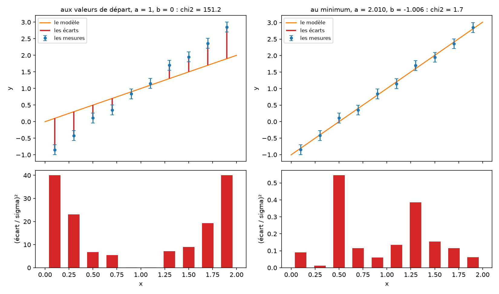

Pour un modèle affine le minimum est analytique ; pour un modèle
quelconque, `curve_fit` itère (méthode de Levenberg-Marquardt) à partir des
valeurs de départ `p0`, et s'arrête quand `chi2` ne descend plus. Il rend les
paramètres `pfit` et leur matrice de covariance `pcov`, dont la diagonale
porte les variances des paramètres, et dont les racines sont les
**incertitudes-types** ; les termes croisés disent comment les paramètres
sont corrélés, ce qu'on regarde rarement mais qui compte pour propager.

Dans le plan des deux paramètres, le chi2 est une vallée. Son fond est
`pfit`, et sa largeur donne les incertitudes : le contour où le chi2 dépasse
son minimum de 1 touche les droites `a ± 0.083` et `b ± 0.095`, les
incertitudes-types que l'ajustement rend. La vallée est en biais — une pente
plus forte se rattrape par une ordonnée à l'origine plus basse — et c'est ce
que disent les termes croisés de `pcov`.

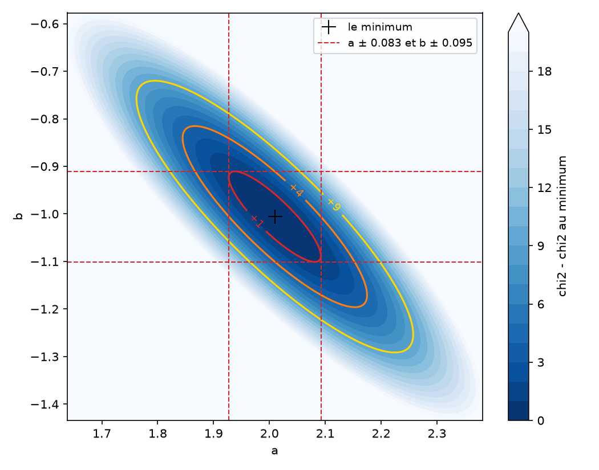

Et le chemin que `curve_fit` y suit depuis `p0`. Pour la droite la vallée est
une cuvette parabolique, et un pas suffit d'où qu'on parte ; pour une
exponentielle elle est courbe, et la descente prend quatre à six pas selon
le départ :

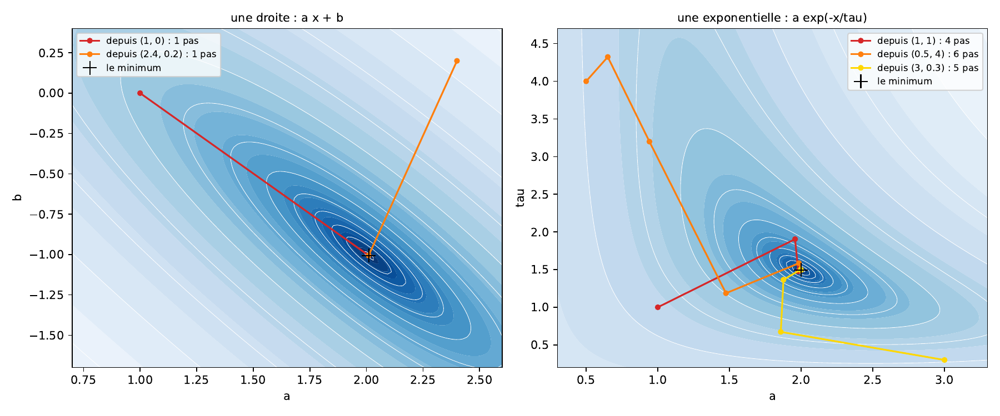

```text
une droite : a x + b, depuis [1, 0] : 1 pas, chi2 = 151.2 → 1.7
une exponentielle : a exp(-x/tau), depuis [1, 1] : 4 pas, chi2 = 11703.2 → 774.8 → 36.0 → 25.4 → 25.4
une exponentielle : a exp(-x/tau), depuis [0.5, 4] : 6 pas, chi2 = 15314.0 → 11518.8 → 6596.9 → 3925.9 → 64.9 → 25.4 → 25.4
```

Deux conséquences à garder en tête. Les **valeurs de départ comptent** : loin
du bon minimum, une descente locale peut s'arrêter dans un creux qui n'est
pas le bon, ou partir à l'infini ; on les lit sur un tracé des mesures avant
d'ajuster, et une section ci-dessous montre ce qui arrive sinon. Et **sans
incertitudes fournies**, `curve_fit` met `pcov` à l'échelle de la dispersion
des résidus : les incertitudes rendues supposent que le modèle est bon et que
les écarts sont aléatoires et indépendants ; elles ne connaissent ni une
erreur systématique ni un modèle faux, et elles sont d'autant plus
optimistes qu'il y a de points.

`curve_fit` s'appelle directement quand on n'a pas d'incertitudes, comme
dans [signaux.md](signaux.md#le-régime-libre-après-un-front) ; `curvefit`
sert dès qu'on en a.

## curvefit, avec les incertitudes

```python
from tpllg.ajustement import curvefit

pfit, err, chi2 = curvefit(
    function,
    datax,
    datay,
    p0,
    datayerrors=None,
    dataxerrors=None,
    function_derivate=None,
    n_var_method_max=10,
    chi_limit=0.01,
    verbose=False,
    u_y=None,
    u_x=None,
    **kwargs,
)
```

| Argument | Sens |
| --- | --- |
| `function` | le modèle, `function(x, a, b, …)`, un paramètre par argument après `x`. Vectorisé en `x` de préférence ; s'il ne l'est pas (un `math.exp`), `curvefit` s'en aperçoit et l'appelle point par point |
| `datax`, `datay` | les mesures, tableaux ou listes de même longueur |
| `p0` | les valeurs de départ, une par paramètre, dans l'ordre de `function` |
| `datayerrors`, ou `u_y` | les incertitudes-types sur `y` : un nombre, la même pour tous les points, ou un tableau de même longueur ; strictement positives (une incertitude nulle est refusée). Sans elles, tous les points pèsent pareil, `pcov` est mise à l'échelle des résidus comme le fait `curve_fit`, et le χ² réduit rendu n'est que la variance des résidus |
| `dataxerrors`, ou `u_x` | les incertitudes-types sur `x`, un nombre ou un tableau de même façon ; seules, ou avec `datayerrors`. `u_x` et `u_y` sont les noms courts, ceux de `regression_york` et de `montecarlo` ; les deux écritures valent, pas ensemble |
| `function_derivate` | facultatif : la dérivée du modèle par rapport à `x`, `function_derivate(x, a, b, …)`, mêmes arguments que `function`. Elle peut rendre un nombre quand elle est constante — `return a` pour une droite — et n'a pas besoin d'être vectorisée non plus. Sans elle, la pente est prise sur le modèle lui-même, `(f(x + sigma_x) - f(x - sigma_x))/2` |
| `n_var_method_max`, `chi_limit` | la boucle de la variance effective : au plus tant d'itérations, arrêt quand le χ² réduit ne baisse plus que de tant |
| `verbose` | `True` pour imprimer la ligne qui annonce la méthode employée, « Moindres carrés » ou « Variance effective » ; muet par défaut |
| `**kwargs` | transmis à `curve_fit` : `maxfev` (nombre d'évaluations, si l'ajustement s'arrête faute d'itérations), `bounds` (des bornes sur les paramètres) |

Retour : un `Ajustement`, qui se dépaquette en `pfit` les paramètres, `err`
leurs incertitudes-types, `chi2` le **χ² réduit**, le χ² divisé par le
nombre de points moins le nombre de paramètres. `pfit, err, chi2 =
curvefit(...)` s'écrit comme avant, `curvefit(...)[0]` est `pfit`, et
`resultat.pcov` donne en plus la matrice de covariance, pour la bande
d'incertitude d'une courbe ajustée.

Avec `datayerrors`, la matrice de covariance est **absolue** : les
incertitudes rendues sont celles que les incertitudes de mesure impliquent,
et le χ² réduit dit si les deux sont compatibles. Avec des incertitudes sur
`x` en plus, la méthode est celle de la **variance effective** (Orear,
Am. J. Phys. 1982) : chaque incertitude en `x` est ramenée en `y` par la
pente locale du modèle, `sigma_i² = sigma_y,i² + sigma_x,i² f'(x_i)²`, et
l'on itère puisque la pente dépend des paramètres : au plus
`n_var_method_max` fois, jusqu'à ce que le χ² réduit ne baisse plus de
`chi_limit`. Si une itération fait moins bien que la meilleure, la méthode
diverge : la fonction le dit et rend la meilleure, ce qui se règle par de
meilleures valeurs de départ. La variance effective itère à poids figés et
s'arrête un peu à côté du minimum exact de cette somme ; pour une droite,
`regression_york` le trouve exactement.

`exemples/ajustement_variance_effective.py` le montre sur une exponentielle,
dix points, 0,15 s d'incertitude sur le temps et 0,03 V sur la tension. À
gauche, sur un point : la barre en `t`, portée sur la tangente, vaut
`|f'| sigma_t` en tension, bien plus que `sigma_u`. À droite, sur tous : la
barre effective est longue là où la courbe est raide, et se réduit à
`sigma_u` là où elle est plate.


```text
incertitudes sur u seules   A = 1.917 ± 0.041 V   tau = 1.536 ± 0.045 s   chi2 réduit = 30.44
incertitudes sur t et sur u A = 2.02 ± 0.11 V   tau = 1.442 ± 0.063 s   chi2 réduit = 1.52
```

Les mesures ont été tirées autour de `A = 2 V` et `tau = 1,5 s`. En oubliant
l'incertitude sur le temps, l'ajustement annonce `A = 1,917 ± 0,041 V`, à
deux incertitudes-types de la vraie valeur, et un χ² réduit de 30 qui dit
que les écarts ne sont pas expliqués ; avec elle, `2,02 ± 0,11 V`, à un
cinquième d'incertitude, et un χ² réduit de 1,5. Les premiers points, là où
la courbe est raide, ne méritaient pas le poids que `sigma_u` seule leur
donnait.

Pour une droite avec des incertitudes constantes, les paramètres ne changent
pas d'une méthode à l'autre ; seules leurs incertitudes et le χ² bougent
(l'exemple qui suit). Avec des incertitudes variables d'un point à l'autre,
les paramètres changent aussi, sauf si les incertitudes en `y` sont
proportionnelles à celles en `x`. `exemples/ajustement_bruit_variable.py`
montre ce second cas, `sigma_x` croissant comme `x + 1` et `sigma_y` comme
`x² + 1` :

```text
sans incertitudes        a = 2.29 ± 0.28   b = -1.37 ± 0.34   chi2 réduit : sans objet
incertitudes sur y       a = 1.93 ± 0.18   b = -1.13 ± 0.12   chi2 réduit = 1.35
incertitudes sur x et y  a = 1.96 ± 0.20   b = -1.14 ± 0.15   chi2 réduit = 0.99
régression de York       a = 2.01 ± 0.21   b = -1.17 ± 0.15   chi2 réduit = 0.99
```

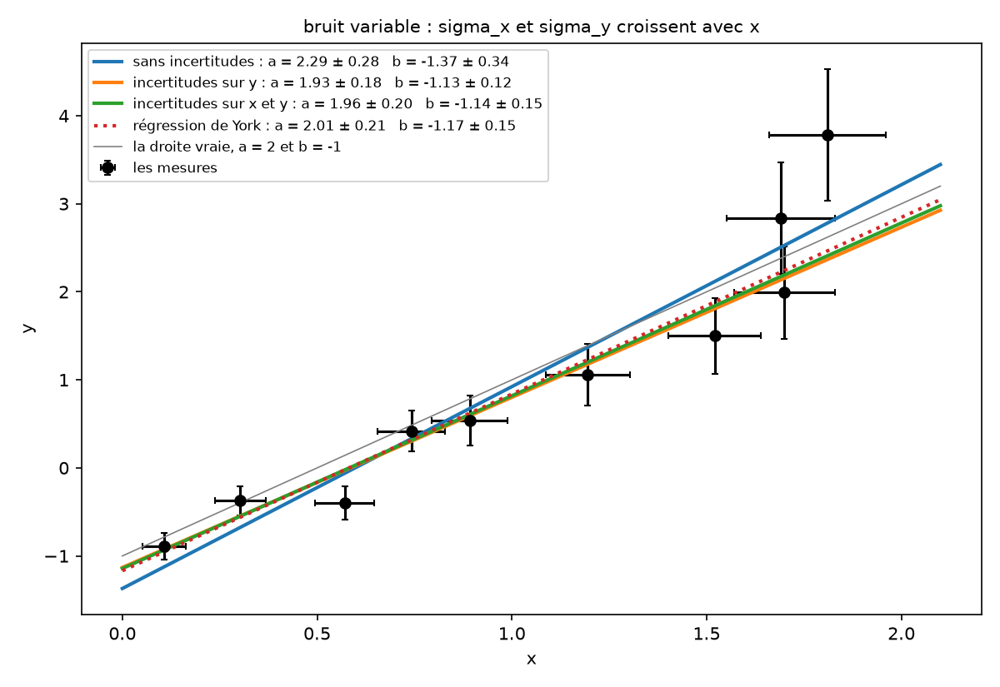

Les points précis pèsent plus, et la droite sans incertitudes, que les
points imprécis de droite tirent vers le haut, s'écarte des autres. La
régression de York trouve le minimum exact que la variance effective
approche.

Le cas d'une droite, dix points, incertitudes de 0,05 sur `x` et 0,15 sur
`y` :

```python
import numpy as np
from tpllg.ajustement import curvefit, resume_parametres


def modele(x, a, b):
    return a * x + b


def modele_derivee(x, a, b):  # dérivée par rapport à x : constante, un nombre suffit
    return a


x = np.array([0.1, 0.3, 0.5, 0.7, 0.9, 1.1, 1.3, 1.5, 1.7, 1.9])
y = np.array([-0.85, -0.42, 0.11, 0.35, 0.84, 1.15, 1.70, 1.95, 2.36, 2.85])
sigma_x = 0.05  # la même pour tous les points ; un tableau, une par point, sinon
sigma_y = 0.15

# 1. tous les points pèsent pareil ; pcov est mise à l'échelle des résidus, chi2 sans objet
pfit, err, chi2 = curvefit(modele, x, y, p0=[1, 0], verbose=False)
print("sans incertitudes      ", resume_parametres(("a", "b"), pfit, err).replace("\n", "   "))
# 2. les incertitudes sur y pèsent les points ; chi2 dit si elles sont justes
pfit, err, chi2 = curvefit(modele, x, y, p0=[1, 0], datayerrors=sigma_y, verbose=False)
print(
    "incertitudes sur y     ",
    resume_parametres(("a", "b"), pfit, err).replace("\n", "   "),
    f"chi2 réduit = {chi2:.2f}",
)
# 3. incertitudes sur x et y : variance effective ; la dérivée est facultative
pfit, err, chi2 = curvefit(
    modele,
    x,
    y,
    p0=[1, 0],
    datayerrors=sigma_y,
    dataxerrors=sigma_x,
    function_derivate=modele_derivee,
    verbose=False,
)
print(
    "incertitudes sur x et y",
    resume_parametres(("a", "b"), pfit, err).replace("\n", "   "),
    f"chi2 réduit = {chi2:.2f}",
)
```

```text
sans incertitudes       a = 2.010 ± 0.038   b = -1.006 ± 0.044
incertitudes sur y      a = 2.010 ± 0.083   b = -1.006 ± 0.095   chi2 réduit = 0.21
incertitudes sur x et y a = 2.010 ± 0.099   b = -1.01 ± 0.11   chi2 réduit = 0.14
```

Mêmes paramètres trois fois, comme annoncé. Sans incertitudes, l'ajustement
annonce ±0,038 sur la pente parce que les points sont bien alignés ; avec
les incertitudes déclarées, ±0,083, et un χ² réduit de 0,21 qui dit que les
points sont **plus** alignés que les incertitudes ne le laissaient attendre :
les 0,15 V annoncés sont surestimés d'un facteur deux environ.

`exemples/ajustement_droite.py` refait ces trois ajustements et les trace.
En haut, la même droite trois fois ; en bas, une fois la droite retranchée,
la bande où elle peut passer à ± une incertitude-type : c'est elle qui
change d'un ajustement à l'autre.

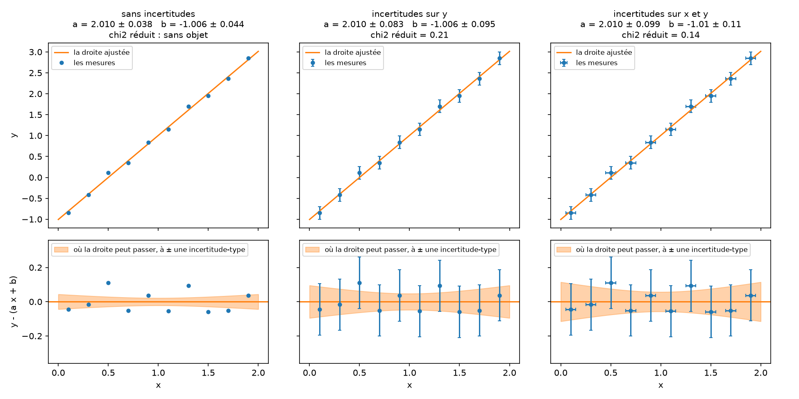

## Lire le χ² réduit

Quand les incertitudes fournies sont justes et le modèle bon, le χ² réduit
vaut 1 à quelques dixièmes près, la fluctuation d'un tirage à l'autre étant
de l'ordre de `sqrt(2/(N - p))`. Sur une exponentielle décroissante de vingt
points bruités à 0,02 V, ajustée trois fois avec trois valeurs annoncées de
l'incertitude :

```python
x = np.linspace(0, 5, 20)
rng = np.random.default_rng(4)
y = 2 * np.exp(-x / 1.5) + rng.normal(0, 0.02, x.size)  # le vrai bruit : 0,02
for sigma in (0.02, 0.005, 0.08):
    pfit, err, chi2 = curvefit(
        lambda x, a, tau: a * np.exp(-x / tau), x, y, p0=[1, 1], datayerrors=sigma, verbose=False
    )
    print(
        f"sigma = {sigma:g}",
        resume_parametres(("a", "tau"), pfit, err).replace("\n", "   "),
        f"chi2 réduit = {chi2:.2f}",
    )
```

```text
sigma = 0.02 a = 1.998 ± 0.014   tau = 1.500 ± 0.017   chi2 réduit = 1.41
sigma = 0.005 a = 1.9983 ± 0.0036   tau = 1.5000 ± 0.0042   chi2 réduit = 22.54
sigma = 0.08 a = 1.998 ± 0.057   tau = 1.500 ± 0.067   chi2 réduit = 0.09
```

`exemples/ajustement_chi2_reduit.py` trace les trois cas. Ce sont les
résidus, en bas, qui disent si la barre est à la bonne taille : à 0,02 V,
douze barres sur vingt coupent le zéro, ce qu'on attend d'une
incertitude-type (68 %) ; à 0,005 V, quatre ; à 0,08 V, toutes, et de loin.

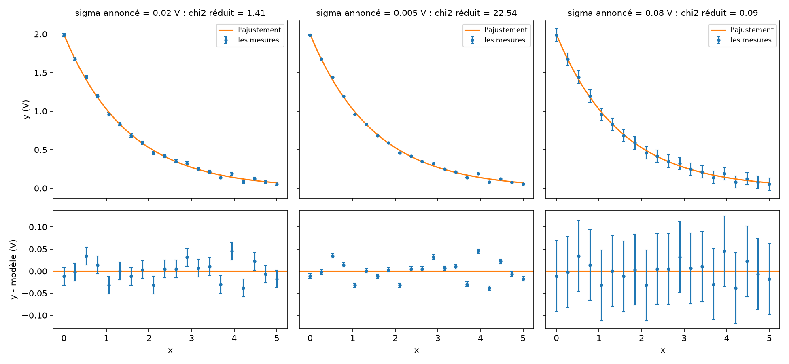

| χ² réduit | Ce qu'il dit |
| --- | --- |
| proche de 1 | les incertitudes déclarées rendent compte des écarts au modèle : les incertitudes rendues sur les paramètres sont crédibles |
| nettement plus grand | les écarts sont plus grands que les incertitudes ne l'expliquent : elles sont sous-estimées, ou le modèle ne décrit pas les mesures. Les incertitudes rendues sur les paramètres sont alors trop petites d'un facteur `sqrt(chi2)` environ |
| nettement plus petit | les incertitudes sont surestimées ; les incertitudes rendues sur les paramètres, trop grandes |

Le même jeu de points ajusté par une droite, un modèle faux :

```text
a = -0.3378 ± 0.0029   b = 1.4468 ± 0.0086   chi2 réduit = 136.4
```

Un χ² réduit de 136 pour des incertitudes justes, c'est le modèle qui est
faux, et les ±0,003 annoncés ne veulent rien dire : ils décrivent la
précision avec laquelle on a trouvé la meilleure droite, pas la distance de
cette droite aux mesures. C'est le cas où l'on regarde les résidus.

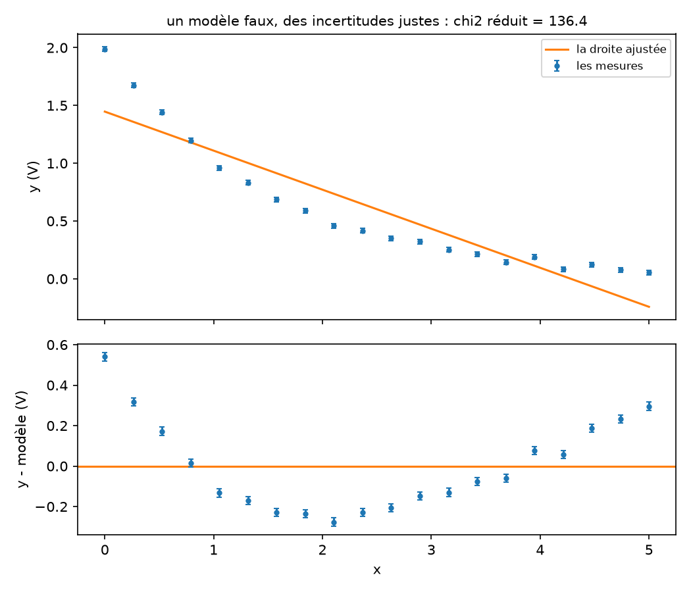

Les résidus dessinent un arc, positifs aux deux bouts et négatifs au milieu :
ce n'est pas du bruit, c'est la courbure que la droite n'a pas.

« À quelques dixièmes près » se mesure. Sur deux mille jeux de vingt points
tirés avec le bon modèle et la juste incertitude, le χ² réduit vaut 1 en
moyenne, avec un écart-type de 0,34, soit `sqrt(2/18)`, et 69 % des jeux
tombent entre 0,67 et 1,33 : le 1,41 obtenu plus haut n'a rien d'anormal.

```text
chi2 réduit sur 2000 jeux : moyenne 1.004, écart-type 0.337 ; attendu 1 et sqrt(2/18) = 0.333
part des jeux entre 1 - 0.33 et 1 + 0.33 : 69 %
```

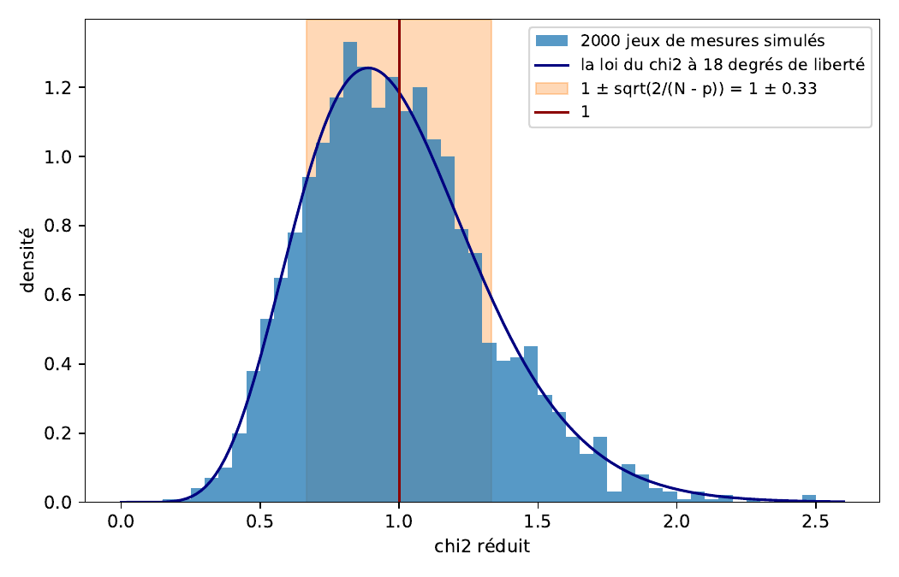

## Une droite quand x et y sont incertains : regression_york

```python
from tpllg.ajustement import regression_york

(a, b), (u_a, u_b), chi2 = regression_york(x, u_x, y, u_y)
```

| Argument | Sens |
| --- | --- |
| `x`, `y` | les mesures, trois points au moins |
| `u_x`, `u_y` | leurs incertitudes-types, un nombre pour tous les points ou un tableau ; pas nulles toutes les deux en un même point |

Retour : un `Ajustement`, comme `curvefit` : `pfit = (a, b)` pour la droite
`y = a x + b`, leurs incertitudes-types, le χ² réduit, et `pcov`.

C'est la solution exacte des moindres carrés pondérés par les deux
incertitudes : la droite qui minimise la somme des
`(y_i - a x_i - b)²/(u_y,i² + a² u_x,i²)`, calculée par les équations de
York et al. (Am. J. Phys. 72, 367, 2004), sans corrélation entre les erreurs
sur `x` et sur `y`. Sans incertitude sur `x`, elle se réduit aux moindres
carrés pondérés ; elle est symétrique, et échanger `x` et `y` donne la
droite inverse. Elle fait pour une droite ce que faisait `scipy.odr`,
déprécié dans SciPy 1.17 et retiré de la 1.19 ; pour un modèle quelconque,
c'est `curvefit` avec `dataxerrors`. Les incertitudes rendues découlent de
`u_x` et `u_y` : un χ² réduit loin de 1 dit qu'elles sont mal estimées.

Sur le cas d'épreuve de York (2004), les données de Pearson avec des poids
très différents d'un point à l'autre, elle rend la pente −0,4805 et
l'ordonnée 5,4799 de la publication, et les incertitudes de `scipy.odr`.
`exemples/regression_york.py` la compare, sur vingt points d'incertitudes
variables, au Monte-Carlo de la même droite et à la variance effective :

```text
régression de York                   a = -1.717 ± 0.037   b = -0.410 ± 0.022
Monte-Carlo, York sur chaque tirage  a = -1.717 ± 0.038   b = -0.410 ± 0.022
variance effective (curvefit)        a = -1.708 ± 0.037   b = -0.409 ± 0.022
Monte-Carlo sans pondération         a = -1.636 ± 0.050   b = -0.417 ± 0.027
chi2 réduit de York : 0.78
```

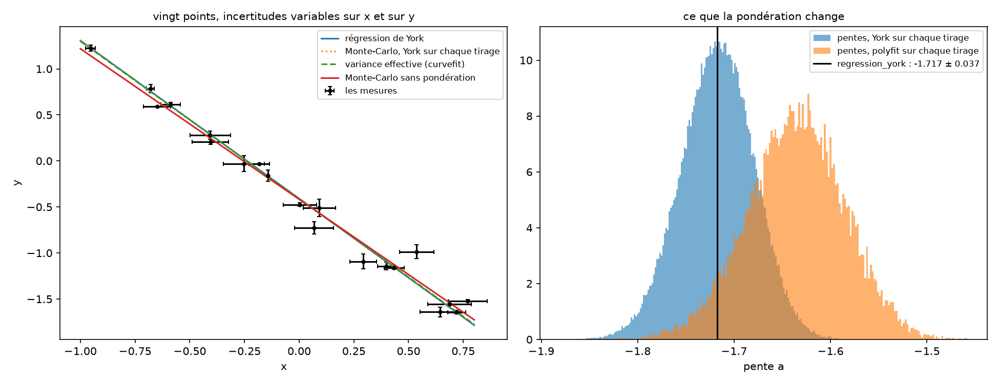

La dernière ligne est le Monte-Carlo d'un ancien script qui comparait
`scipy.odr` et des tirages ajustés par `np.polyfit` : sans pondération, un
point très incertain pèse autant qu'un point précis, et la pente sort à
deux incertitudes de la bonne. Un Monte-Carlo ne dispense pas de pondérer.

## curve_fit_complex, module et phase ensemble

Une fonction de transfert se mesure par son module `|H|` et sa phase `φ`,
à chaque fréquence. Ajuster le module seul n'utilise que la moitié des
mesures, et ne connaît pas le signe de `H0` ; ajuster module et phase
séparément donne deux jeux de paramètres à réconcilier. `curve_fit_complex`
ajuste le modèle complexe sur les deux à la fois, en un seul jeu de
paramètres : ce qu'il rapproche, ce sont `ln|H|` et la phase du modèle de
ceux des mesures, un écart relatif sur le module et un écart de phase, empilés
en un seul vecteur de `2N` valeurs :

```python
from tpllg.ajustement import curve_fit_complex

pfit, err, chi2 = curve_fit_complex(
    complex_func,
    datax,
    norm,
    phase,
    p0,
    datayerrors=None,
    dataxerrors=None,
    function_derivate=None,
    u_y=None,
    u_x=None,
    **kwargs,
)
```

| Argument | Sens |
| --- | --- |
| `complex_func` | le modèle, `complex_func(x, *params)`, qui rend un tableau **complexe** ; s'écrit avec `1j` |
| `datax` | les abscisses, la fréquence en général |
| `norm` | les modules mesurés, `Vs/Ve` |
| `phase` | les phases mesurées, en **radians**, celles de `np.angle` ou d'un oscilloscope converties par `np.radians`. Le tour complet ne pose aucun problème : la phase du modèle est prise, pour chaque mesure, à moins d'un demi-tour d'elle, et un saut de 360° dans les mesures est invisible. Une phase qui dépasse 2π en valeur absolue est refusée (`ValueError: les phases doivent être en radians`) : elle est en degrés, et passait auparavant en silence, avec un résultat faux. Une phase déroulée au-delà d'un tour se replie par `tpllg.bode.phase_repliee` |
| `p0` | les valeurs de départ, indispensables |
| `datayerrors`, ou `u_y` | les incertitudes-types sur les mesures, **un couple** `(u_norm, u_phase)` : celle du module et celle de la phase, en radians, chacune un nombre ou un tableau. `u_norm/norm` pèse l'écart sur `ln\|H\|`, `u_phase` celui sur la phase |
| `dataxerrors` (ou `u_x`), `function_derivate` | comme pour `curvefit` ; la dérivée du modèle est complexe, comme lui |
| `**kwargs` | transmis à `curvefit` : `verbose`, et pour `curve_fit` `maxfev`, `bounds` |

Retour : un `Ajustement` (`pfit`, `err`, `chi2`, `pcov`), exactement comme
`curvefit`, dont `curve_fit_complex` est l'interface — il empile les mesures
et l'appelle. Le χ² réduit compte `2N` mesures, les modules et les phases.
Sans `datayerrors`, `err` vient de la dispersion des résidus et `chi2` n'a
pas de sens, comme pour `curvefit` ; un écart de 1 % sur le module pèse
alors autant qu'un écart de 0,01 rad (0,6°) sur la phase.

Pourquoi `ln|H|` et la phase, et non les parties réelle et imaginaire,
comme la version précédente ? Les deux mesures, module et phase, sont
indépendantes ; leurs erreurs, reportées sur `Re H` et `Im H`, ne le sont
plus, et ignorer cette corrélation faussait les incertitudes rendues de 15 %
et biaisait `H0` et `Q` de 0,7 incertitude-type avec 10 % et 1°, ou 1 % et
10°. Les parties réelle et imaginaire servent encore, mais seulement pour
améliorer `p0` avant l'ajustement : leur écart est lisse partout et laisse
`H0` passer par zéro, ce qui corrige un signe de `H0` faux, alors que
`ln|H|` l'interdit.

Sur un passe-bande du second ordre, vingt-trois mesures :

```python
import numpy as np
from tpllg.ajustement import curve_fit_complex, residus_complexes, resume_parametres


def passe_bande(f, H0, f0, Q):
    return H0 / (1 + 1j * Q * (f / f0 - f0 / f))


# fmt: off
f = np.array([200, 300, 500, 700, 1000, 1300, 1500, 1700, 1800, 1900, 1950, 2000, 2050, 2100, 2200,
              2400, 2700, 3300, 5000, 7000, 10000, 15000, 20000.0])
H = np.array([0.09, 0.12, 0.21, 0.30, 0.53, 0.88, 1.33, 2.18, 3.06, 4.21, 4.62, 5.13, 4.85, 4.42,
              3.16, 1.95, 1.24, 0.72, 0.39, 0.24, 0.16, 0.11, 0.08])
phi = np.radians([-90, -94, -95, -92, -97, -103, -106, -114, -122, -152, -166, 176, 154, 144, 126,
                  117, 104, 94, 96, 92, 87, 89, 89])
# fmt: on

pfit, err, chi2 = curve_fit_complex(passe_bande, f, H, phi, p0=[-5, 2000, 6])
print(resume_parametres(("H0", "f0", "Q"), pfit, err, unites=("", "Hz", "")))
```

```text
H0 = -5.121 ± 0.098
f0 = 1989.7 ± 2.9 Hz
Q = 6.49 ± 0.14
```

Dans le plan complexe, les mesures d'un passe-bande sont sur un cercle qui
passe par l'origine, parcouru de −90° à +90° en passant par `H0` à la
résonance. L'ajustement rapproche chaque mesure du point du modèle à la
même fréquence, en module relatif et en angle. On y voit aussi pourquoi le
tour complet ne gêne pas : à 1950 Hz la phase vaut −166°, à 2000 Hz +176°,
et ce sont deux points voisins. La figure est tracée par
`exemples/ajustement_complexe.py`, comme les deux suivantes.

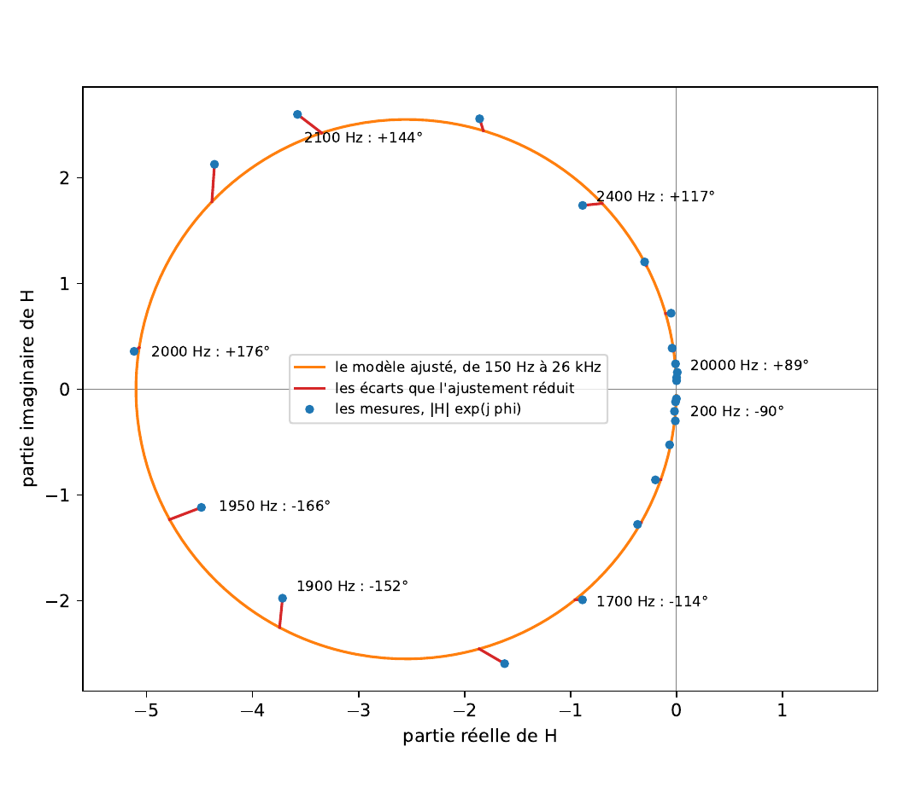

Les mêmes mesures avec leurs incertitudes, 3 % sur le module et 3° sur la
phase, ce qu'on lit à l'oscilloscope :

```python
pfit, err, chi2 = curve_fit_complex(
    passe_bande, f, H, phi, p0=[-5, 2000, 6], datayerrors=(0.03 * H, np.radians(3)), verbose=False
)
print(resume_parametres(("H0", "f0", "Q"), pfit, err, unites=("", "Hz", "")))
print(f"chi2 réduit = {chi2:.2f}")
```

```text
H0 = -5.080 ± 0.072
f0 = 1993.2 ± 2.7 Hz
Q = 6.42 ± 0.11
chi2 réduit = 1.25
```

Les incertitudes rendues sont maintenant celles que les mesures impliquent,
et le χ² réduit de 1,25 dit qu'elles rendent compte des écarts. Avec des
incertitudes relatives constantes sur le module, les points pèsent comme
sans incertitudes déclarées, à l'échelle près : un point à 0,09 V compte
autant, en relatif, qu'un point à 5 V.

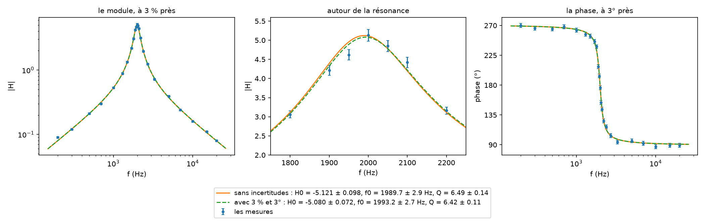

Les deux courbes ne se séparent qu'autour de la résonance, et de bien moins
qu'une barre d'incertitude : ce que les incertitudes changent, ce sont
d'abord les incertitudes rendues et le χ².

Le même module ajusté seul, par `curve_fit` sur `|H0|/sqrt(1 + Q²(f/f0 -
f0/f)²)`, donne `|H0| = 5.06`, `f0 = 2003.7 Hz`, `Q = 6.40` : un autre jeu de
paramètres, sans le signe, et `f0` plus loin de sa vraie valeur (`−5`,
`1994,6 Hz`, `6,27`). La phase, autour de la résonance, contraint `f0` mieux que le
module, dont le maximum est plat.

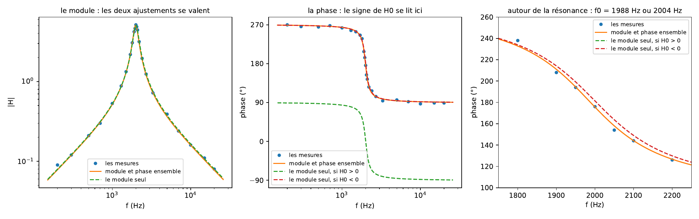

Sur le module, les deux ajustements se confondent. Sur la phase, le module
seul laisse le choix entre deux courbes distantes de 180°, selon le signe
qu'on donne à `H0` ; et autour de la résonance, même avec le bon signe, sa
courbe passe à côté des points, décalée de 14 Hz.

## Choisir les valeurs de départ

Sur un tracé des mesures, avant d'ajuster : `f0` à la fréquence du maximum
de `|H|` ; `H0` ce maximum, avec le signe que la phase à la résonance donne,
positif à 0°, négatif à 180° ; `Q` le rapport de `f0` à la largeur de la
bande où `|H|` dépasse `|H0|/sqrt(2)`. Pour `H0` et `Q`, une valeur
approximative suffit ; `f0` doit tomber dans la résonance. Sur les mesures
ci-dessus :

| `p0` | Résultat |
| --- | --- |
| `[-5, 2000, 6]` | `H0 = -5.12`, `f0 = 1990`, `Q = 6.49` |
| `[-5, 2000, 60]`, `[-5, 2000, 0.5]` | le même : `Q` faux d'un facteur dix se corrige seul |
| `[5, 2000, 6]` | le même : le signe de `H0` se corrige seul, la phase le dit |
| `[-1, 1500, 2]`, `[-5, 200, 6]`, `[-5, 10000, 6]` | le même, en partant loin : ça arrive |
| `[-5, 20000, 6]` | `H0 = -5.12`, `f0 = -1990`, `Q = -6.49` : le même modèle, qui ne change pas quand `f0` et `Q` changent de signe ensemble |
| `[-5, 600, 6]` | `H0 = 1013`, `f0 = 1431`, `Q = -939` : n'importe quoi, sans erreur |
| `[-5, 1000, 6]` | `H0 = 26507`, `f0 = 1857`, `Q = -38690` : idem |
| `[-5, 240, 6]`, `[-5, 4715, 6]` | `RuntimeError: Optimal parameters not found` : pas de convergence |

C'est `f0` qui ne pardonne pas. Loin de la résonance, l'ajustement aboutit
parfois, et sinon finit de deux façons : un `RuntimeError`, qui au moins se voit, ou un résultat absurde
**sans aucune erreur** — `curve_fit` a trouvé un minimum, ce n'est pas le
bon. C'est pourquoi on trace toujours la courbe ajustée sur les points, et
pourquoi on lit les résidus. Le `RuntimeError: Optimal parameters not found`
signifie que le nombre d'itérations est épuisé sans converger ; on augmente
`maxfev` (`maxfev=20000`) si les valeurs de départ sont bonnes, on les
corrige sinon.

`exemples/ajustement_depart.py` trace le modèle aux valeurs de départ
par-dessus les mesures, ce qu'on fait avant tout ajustement, puis ce que
l'ajustement en tire :

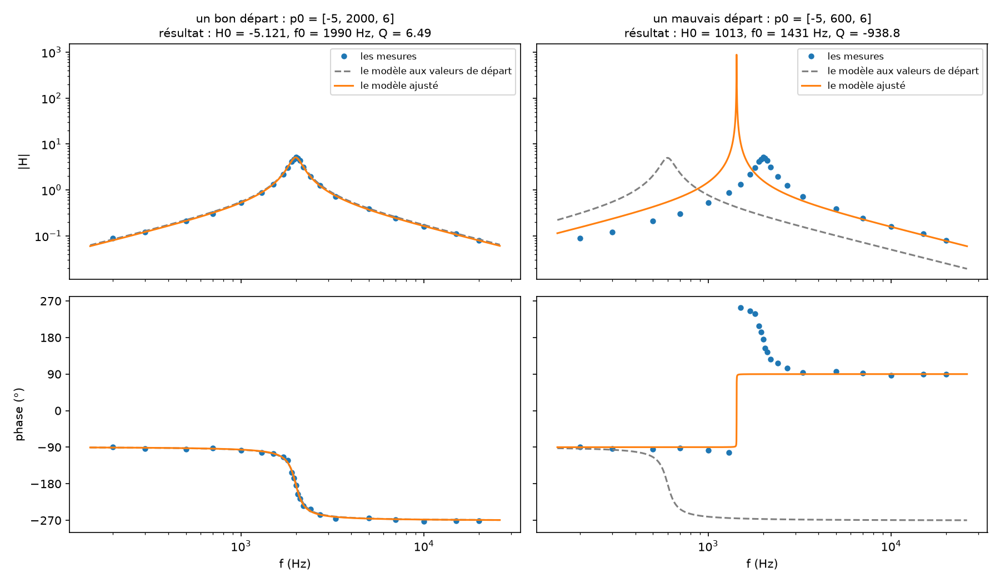

Et la raison : la somme des carrés des écarts en fonction de `f0` est une
vallée étroite, large comme la résonance, au milieu d'un plateau où rien
n'indique de quel côté descendre. La bande du bas donne l'issue de trois
cents ajustements partis de `[-5, f0, 6]`, de 100 Hz à 30 kHz :


```text
sur 300 départs [-5, f0, 6] : 124 mènent au bon minimum, 106 à un autre résultat sans erreur, 70 ne convergent pas
tous les départs de 1106 à 3099 Hz mènent au bon minimum
```

De 1,1 à 3,1 kHz, tous les départs aboutissent. Au-delà, l'issue change
d'un départ à son voisin — 200 Hz aboutit, 240 Hz non — et il ne faut pas y
compter.

Une phase donnée en **degrés** au lieu de radians donne, sans erreur, un
ajustement qui n'a aucun sens : `H0 = -15.1`, `f0 = 1953 Hz`, `Q = 23.3`.

## Les résidus

```python
from tpllg.ajustement import residus_complexes

res_norm, res_phase = residus_complexes(complex_func, x, norm, phase, pfit)
```

L'écart des mesures au modèle ajusté, point par point : l'écart **relatif**
sur le module, `(|H|_mesuré - |H|_modèle)/|H|_mesuré`, et l'écart de phase en
**degrés**, `φ_mesuré - φ_modèle`, ramené dans `]-180, 180]`. La phase
mesurée est en radians, comme pour `curve_fit_complex`, et refusée au-delà
de 2π.

```python
res_H, res_phi = residus_complexes(passe_bande, f, H, phi, pfit)
print(np.round(res_H, 2))
print(np.round(res_phi, 1))
```

```text
[ 0.11 -0.01 -0.01 -0.05  0.   -0.01 -0.   -0.03 -0.02 -0.04 -0.07  0.
  0.02  0.05  0.01  0.01  0.   -0.03  0.05 -0.02 -0.02  0.03  0.01]
[ 0.9 -2.6 -2.6  1.5 -1.1 -3.  -0.9  2.   5.5 -2.9 -0.7 -0.2 -4.8 -1.
 -1.4  4.8  0.  -4.3  1.8 -0.7 -4.8 -2.2 -1.9]
```

Des résidus répartis au hasard autour de zéro, de l'ordre des incertitudes
de mesure, valident le modèle ; ici 3 % et 3°, ce qui est ce qu'on lit à
l'oscilloscope. Une **tendance**, tous les résidus positifs d'un côté de
`f0` et négatifs de l'autre, est une information : un modèle incomplet (un
amplificateur qui n'est pas idéal en haute fréquence), une erreur
systématique (une phase lue avec le mauvais signe), un point faux. Pour un
ajustement réel, on calcule `y - modele(x, *pfit)` de la même façon.

`exemples/ajustement_residus.py` trace les deux cas. À gauche, les résidus
ci-dessus, avec la bande de l'incertitude de mesure. À droite, le même modèle
ajusté sur des mesures simulées où l'amplificateur coupe à 50 kHz, ce que le
modèle ignore : jusqu'à 5 kHz rien ne se voit, puis la phase décroche, de
−10° à −22°, quand le bruit de mesure n'est que de 3°.

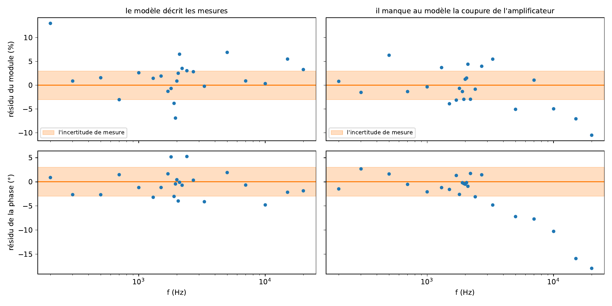

L'ajustement, lui, ne signale rien. Sur ces mesures simulées autour de
`H0 = -5`, `f0 = 1994,6 Hz` et `Q = 6,27`, il rend :

```text
H0 = -5.08 ± 0.22   f0 = 1982.3 ± 6.5 Hz   Q = 6.50 ± 0.32
```

des valeurs plausibles, à moins de deux incertitudes-types des vraies : rien,
dans les paramètres, ne trahit le modèle incomplet. Seuls les résidus le
disent.

## Présenter un résultat

```python
from tpllg.ajustement import formater, resume_parametres

texte = formater(valeur, sigma=None, unite="")
texte = resume_parametres(noms, pfit, err=None, unites=None)
```

`formater` écrit « valeur ± incertitude unité » avec **deux chiffres
significatifs sur l'incertitude** et la valeur arrondie au même rang, la
règle des comptes rendus de TP — y compris quand l'arrondi change de
décade : 0,0996 donne 0,10, pas 0,100. Sans incertitude, ou avec une
incertitude nulle, quatre chiffres significatifs ; une incertitude infinie
ou indéfinie s'écrit telle quelle, une incertitude négative est refusée.

Hors de `[10⁻³, 10⁵[`, la **notation scientifique**, avec une puissance de
dix commune à la valeur et à l'incertitude, celle de la valeur (celle de
l'incertitude si la valeur est nulle) : `(6.6260 ± 0.0010) × 10⁻³⁴`, et
non quarante zéros. La puissance s'écrit en exposants Unicode, lisibles
dans une console comme dans une légende matplotlib.

```python
>>> formater(1993.489, 1.875, "Hz")
'1993.5 ± 1.9 Hz'
>>> formater(6.609, 0.156)
'6.61 ± 0.16'
>>> formater(0.001234, 0.000047, "s")
'0.001234 ± 0.000047 s'
>>> formater(0.000123456, 0.0000047, "s")
'(1.235 ± 0.047) × 10⁻⁴ s'
>>> formater(1234567.0, 5432.0, "Hz")
'(1.2346 ± 0.0054) × 10⁶ Hz'
>>> formater(6.626e-34, 1e-37, "J s")
'(6.6260 ± 0.0010) × 10⁻³⁴ J s'
>>> formater(1.0, 0.0996)
'1.00 ± 0.10'
>>> formater(2.5, None, "V")
'2.5 V'
>>> formater(6.626e-34, None, "J s")
'6.626 × 10⁻³⁴ J s'
>>> formater(2.5, float("inf"), "V")
'2.5 ± inf V'
```

`resume_parametres` fait une ligne par paramètre, « nom = valeur ±
incertitude unité », par `formater` : une seule mise en forme, `formater`
pour une grandeur, `resume_parametres` pour plusieurs, nommées. `err` est ce
que `curvefit` et `curve_fit_complex` rendent, une incertitude-type par
paramètre ; la matrice de covariance de `scipy.optimize.curve_fit` est
acceptée aussi, on en prend la racine de la diagonale (c'est `ecarts_types`).
Sans, les valeurs seules. `unites` est facultatif, une chaîne par paramètre,
vide pour une grandeur sans dimension. Des listes de longueurs différentes
sont refusées, au lieu d'être tronquées en silence.

```python
>>> print(resume_parametres(("H0", "f0", "Q"), pfit, err, unites=("", "Hz", "")))
H0 = -5.121 ± 0.098
f0 = 1989.7 ± 2.9 Hz
Q = 6.49 ± 0.14
>>> print(resume_parametres(("a", "b"), pfit, pcov))       # pcov de scipy.optimize.curve_fit
a = 2.010 ± 0.083
b = -1.006 ± 0.095
```

Le texte convient tel quel à une légende de figure : c'est ce que
`tracer_bode` met dans la sienne.

## Cas complets

### Une constante de temps

La décharge d'un condensateur, acquise à la centrale, puis ajustée par une
exponentielle. Les incertitudes sur la tension sont celles de la
quantification et du bruit, ici 5 mV, données à `curvefit` :

```python
import numpy as np
from tpllg.acquisition import acquerir
from tpllg.ajustement import curvefit, resume_parametres

temps, tensions = acquerir([0], 5, te=1e-5, nbpoints=5000, trigger=(0, 2.0, 20, 0))  # front descendant
t, u = temps[0], tensions[0]


def decharge(t, U0, tau, u_inf):
    return u_inf + (U0 - u_inf) * np.exp(-t / tau)


p0 = [u[0], t[np.argmin(abs(u - u[0] / np.e))], u[-1]]  # lus sur les données
pfit, err, chi2 = curvefit(decharge, t, u, p0, datayerrors=0.005)
print(resume_parametres(("U0", "tau", "u_inf"), pfit, err, unites=("V", "s", "V")))
print(f"chi2 réduit = {chi2:.2f}")
```

`exemples/ajustement_decharge.py` est ce script, avec un interrupteur
`SIMULATION` qui fabrique l'acquisition et la figure en plus. Sur la décharge
simulée, constante de temps 8,3 ms et bruit de 5 mV :

```text
valeurs de départ : U0 = 2.049 V   tau = 0.00854 s   u_inf = 0.0535 V
U0 = 2.04790 ± 0.00036 V
tau = 0.0082936 ± 0.0000028 s
u_inf = 0.04028 ± 0.00012 V
chi2 réduit = 1.00
```

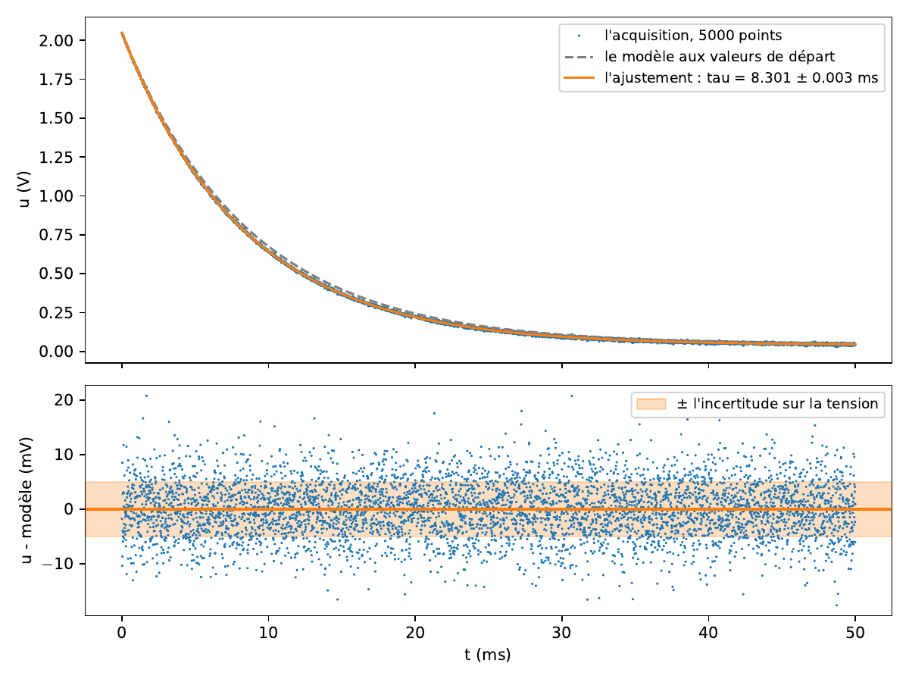

Cinq mille points donnent `tau` à 3 µs près. Le χ² réduit de 1 dit que les
5 mV annoncés sont bien ceux des écarts, et les résidus ne montrent aucune
tendance.

### Une sinusoïde, amplitude, fréquence et phase

L'ajustement d'une sinusoïde est le cas où les valeurs de départ comptent le
plus : une fréquence de départ fausse d'une demi-période sur la durée du
signal fait tomber l'ajustement dans un minimum local. On prend la
fréquence du pic de la FFT, `tpllg.signaux.frequence_pic`, et l'amplitude
sur l'écart-type :

```python
from tpllg.signaux import frequence_pic


def sinus(t, A, f, phi, offset):
    return A * np.sin(2 * np.pi * f * t + phi) + offset


p0 = [np.sqrt(2) * u.std(), frequence_pic(t, u), 0, u.mean()]
pfit, err, chi2 = curvefit(sinus, t, u, p0, datayerrors=0.005, verbose=False)
```

La phase de départ à zéro suffit en général, la fréquence étant bonne ; si
l'ajustement échoue, on essaie `phi = pi/2` et `pi`, et l'on garde le plus
petit χ².

`exemples/ajustement_sinusoide.py` le fait sur 0,2 s d'une sinusoïde à
52,3 Hz, puis recommence en partant 12 Hz trop haut :

```text
valeurs de départ : A = 1.5 V   f = 50 Hz   phi = 0 rad   offset = 0.2386 V
tel que l'ajustement le rend : A = -1.5 V   f = 52.3 Hz   phi = -2.442 rad   offset = 0.2001 V
A = 1.49992 ± 0.00016 V
f = 52.30006 ± 0.00029 Hz
phi = 0.70007 ± 0.00021 rad
offset = 0.20014 ± 0.00011 V
chi2 réduit = 0.99
en partant de f = 62 Hz : A = 0.3181 V   f = 59.43 Hz   phi = -0.5924 rad   offset = 0.2361 V   chi2 réduit = 43081
```


Le χ² en fonction de la fréquence est un puits étroit — sa demi-largeur est
l'inverse de la durée du signal, 5 Hz ici — au milieu d'un plateau qui
ondule à peine, et dont chaque creux est un minimum local. Parti de 50 Hz,
dans le puits, l'ajustement trouve 52,3001 Hz ; parti de 62 Hz, il s'arrête
dans le premier creux, à 59,43 Hz, avec une amplitude de 0,3 V et un χ²
réduit de 43 000, sans erreur.

Deux remarques. L'ajustement a rendu `A = -1,5 V` et `phi = -2,44 rad` :
c'est la même sinusoïde que `A = 1,5 V` et `phi = 0,70 rad`, une amplitude
négative valant un décalage de phase de π, et le script la ramène à
l'amplitude positive. Et la résolution de la FFT, l'inverse de la durée, est
celle du puits : `frequence_pic` y tombe, sans beaucoup de marge.

### Un modèle sans expression : la solution d'une équation différentielle

`curvefit` ne voit qu'une fonction `modele(t, *paramètres)` : elle peut
intégrer une équation différentielle par `scipy.integrate.solve_ivp` à
chaque appel. `exemples/ajustement_equadiff.py` le fait pour un pendule
lâché de 2 rad, `theta'' = -w0² sin theta`, dont la période s'allonge aux
grands angles :

```python
from scipy.integrate import solve_ivp


def pendule(t, w0, theta0):
    def derivee(_, etat):
        theta, omega = etat
        return [omega, -(w0**2) * np.sin(theta)]

    return solve_ivp(derivee, (0, t[-1]), [theta0, 0.0], t_eval=t, rtol=1e-9, atol=1e-9).y[0]


depart = [w * (1 + theta0**2 / 16), theta0]  # w et theta0 d'une sinusoïde ajustée d'abord
non_lineaire = curvefit(pendule, t, theta, depart, datayerrors=0.02, verbose=False)
```

```text
une sinusoïde            : w = 4.72840 ± 0.00023 rad/s   theta0 = 2.0539 ± 0.0016 rad   chi2 réduit = 5.05
theta'' = -w0² sin theta : w0 = 6.2843 ± 0.0031 rad/s   theta0 = 2.0004 ± 0.0015 rad   chi2 réduit = 1.03
```

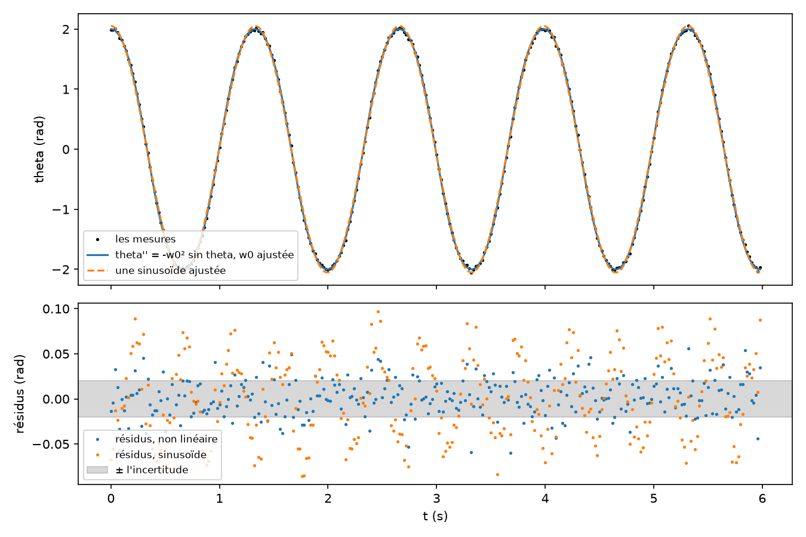

La sinusoïde trouve la pulsation des oscillations, 4,73 rad/s, pas `w0`, et
ses résidus ondulent ; le modèle non linéaire retrouve `w0 = 2π` à 0,05 %
près. Les valeurs de départ comptent ici aussi : parti de `w`, 25 % trop
bas, l'ajustement s'égare ; la formule de Borda, `w0 ≈ w (1 + theta0²/16)`,
le met dans la vallée.

### Une fonction de transfert sur un Bode mesuré

Le cas complet, mesures, ajustement, résidus, figure, est dans
[bode.md](bode.md#des-mesures-à-la-figure) et `exemples/bode_ajustement.py`.

## Quand ça ne marche pas

| Symptôme | Cause, remède |
| --- | --- |
| `RuntimeError: Optimal parameters not found: Number of calls to function has reached maxfev` | pas convergé : valeurs de départ à revoir, ou `maxfev=20000` si elles sont bonnes et le modèle raide |
| les paramètres sont absurdes, sans erreur | un minimum local : valeurs de départ lues sur un tracé ; vérifier les unités (Hz et non kHz) |
| `pcov` pleine de `inf`, incertitudes infinies | un paramètre n'est pas déterminé par les données (deux paramètres redondants, une amplitude nulle), ou moins de points que de paramètres |
| `TypeError: … only 0-dimensional arrays can be converted` | le modèle n'est pas vectorisé ; `curvefit` et `curve_fit_complex` s'en accommodent, `curve_fit` non : écrire `np.exp` plutôt que `math.exp` |
| `ValueError: incertitude nulle, négative ou non définie au point …` | une incertitude à zéro dans `datayerrors` : un point n'a jamais une incertitude nulle |
| `ValueError: datayerrors : le couple (u_norm, u_phase)…` | `curve_fit_complex` attend deux incertitudes, celle du module et celle de la phase, pas une seule |
| χ² réduit très grand | modèle faux, ou incertitudes sous-estimées : regarder les résidus |
| χ² réduit très petit | incertitudes surestimées |
| `curve_fit_complex` rend `Q` négatif ou `f0` hors de la plage mesurée | phase en degrés, ou signe de la phase inversé (entrée moins sortie au lieu de sortie moins entrée), ou `p0` loin ; `f0` et `Q` négatifs ensemble, c'est le bon résultat, écrit autrement |
| `ValueError: norm : les modules mesurés doivent être strictement positifs` | un module nul ou négatif : `ln\|H\|` n'existe pas ; le retirer ou le corriger |
| `ValueError: array must not contain infs or NaNs` | un `nan` dans les mesures (une cellule vide lue par `lire_latispro`) : les retirer par `masque = ~np.isnan(y)` |
| `ValueError: les phases doivent être en radians` | `curve_fit_complex`, `residus_complexes` ou `tracer_bode` ont reçu une phase qui dépasse 2π : des degrés, à convertir par `np.radians` ; ou une phase déroulée sur plus d'un tour, à replier par `tpllg.bode.phase_repliee` |
| `ValueError: datayerrors et u_y sont la même chose` | les deux noms de la même incertitude donnés ensemble : n'en garder qu'un |
