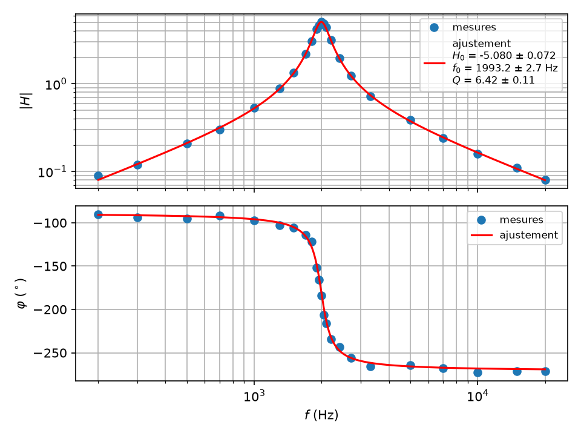
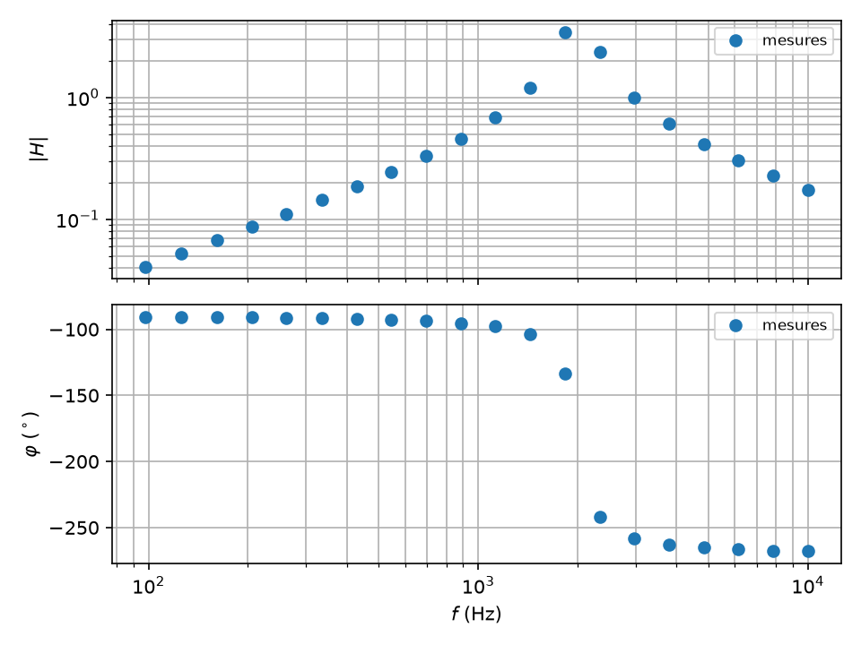

# Diagramme de Bode et gain d'un filtre

`tpllg.bode` trace un diagramme de Bode, mesures et modèle ajusté ;
`tpllg.traitement` mesure la fonction de transfert d'un filtre sur ses
signaux d'entrée et de sortie, sans ajustement, et choisit l'échantillonnage
pour une fréquence donnée. Ensemble, avec la centrale, ils font un Bode
automatique.

## Sommaire

- [Tracer un diagramme de Bode](#tracer-un-diagramme-de-bode)
- [Une phase continue](#une-phase-continue)
- [Des mesures à la figure](#des-mesures-à-la-figure)
- [Mesurer la fonction de transfert sur les signaux](#mesurer-la-fonction-de-transfert-sur-les-signaux)
- [Choisir l'échantillonnage](#choisir-léchantillonnage)
- [Le Bode automatique](#le-bode-automatique)

## Tracer un diagramme de Bode

```python
from tpllg.bode import tracer_bode

fig = tracer_bode(
    f, norm, phase, modele=None, pfit=None, err=None, noms=None, unites=None, fichier=None, gain_log=True
)
```

| Argument | Sens |
| --- | --- |
| `f` | les fréquences, en Hz |
| `norm` | le module de la fonction de transfert à chaque fréquence, `Vs/Ve` |
| `phase` | la phase, en **radians** |
| `modele` | facultatif : la fonction de transfert complexe, `modele(f, *pfit)`, celle qu'on a ajustée |
| `pfit`, `err` | les paramètres ajustés et leurs incertitudes-types, ce que `curve_fit_complex` rend ; `err` est facultatif, il ajoute les incertitudes à la légende (la matrice de covariance de `curve_fit` convient aussi) |
| `noms`, `unites` | les noms des paramètres pour la légende, en LaTeX si l'on veut, `("$H_0$", "$f_0$", "$Q$")`, et leurs unités, `("", "Hz", "")` |
| `fichier` | facultatif : le nom du fichier où enregistrer la figure, `.pdf` ou `.png` |
| `gain_log` | `True` pour un module en échelle logarithmique (un vrai Bode), `False` pour une échelle linéaire |

Deux graphes l'un au-dessus de l'autre, aux fréquences en abscisse
logarithmique : le module en haut, la phase en bas, en degrés et
**continue** (section suivante). Les mesures sont des points ; si `modele`
et `pfit` sont donnés, la courbe ajustée s'ajoute, calculée sur deux mille
fréquences entre la plus basse et la plus haute mesurées, et la légende du
gain porte les paramètres, mis en forme par `resume_parametres`. La figure
est rendue et reste ouverte : `plt.show()` l'affiche, et l'on peut retoucher
`fig.axes` avant.

## Une phase continue

```python
from tpllg.bode import phase_continue

degres = phase_continue(f, phase, reference=None)
```

Une phase n'est définie qu'à un tour près, et un oscilloscope la donne sur
`]-180°, 180°]` : un passe-bande inverseur, dont la phase va de −90° loin
sous `f0` à −270° loin au-dessus en passant par −180°, saute alors d'un bord
à l'autre au voisinage de `f0`, où l'on mesure justement le plus de points.
`phase_continue` rend la phase en degrés, **sans saut** d'une fréquence à la
suivante : déroulée dans l'ordre des fréquences, la plus basse prise entre
-180° et 180°. Un passe-bas va ainsi de 0 à −90°, un passe-bande de 90° à
−90°, un passe-bande inverseur de −90° à −270°.

```python
>>> phase_continue([100, 200, 300, 400], np.radians([-0.5, 0.3, -1.0, 0.4]))
array([-0.5,  0.3, -1. ,  0.4])
>>> f = np.array([500, 1000, 1500, 1800, 2000, 2200, 2700, 5000.0])
>>> np.round(phase_continue(f, np.radians([-95, -97, -106, -122, 176, 126, 104, 96])), 1)
array([ -95.,  -97., -106., -122., -184., -234., -256., -264.])
```

Avec `reference`, une valeur en degrés par fréquence — celle d'un modèle —,
chaque phase est prise au tour le plus proche de la référence : c'est ce
que `tracer_bode` fait des mesures, une fois le modèle déroulé.

```python
>>> phase_continue([1, 2, 3], np.radians([10, -170, 175]), reference=[370, 190, 180])
array([370., 190., 175.])
```

(La version précédente repliait la phase sur `[0, 360[`. Cela recollait
l'inverseur, mais faisait sauter de 360° celle d'un passe-bande non
inverseur en pleine résonance, et dispersait entre 0 et 359,5° des mesures
voisines de 0°.)

Une phase mesurée en degrés se convertit en radians par `np.radians`
avant tout ; `tracer_bode` fait la conversion inverse pour l'affichage.

## Des mesures à la figure

Le cas complet, `exemples/bode_ajustement.py` : un diagramme de Bode relevé
point par point à l'oscilloscope, sur un passe-bande actif du second ordre.
À chaque fréquence on note l'amplitude d'entrée, l'amplitude de sortie, le
déphasage de la sortie sur l'entrée.

```python
import matplotlib.pyplot as plt
import numpy as np

from tpllg.ajustement import curve_fit_complex, residus_complexes, resume_parametres
from tpllg.bode import tracer_bode

# 1. les mesures
# fmt: off
f = [200, 300, 500, 700, 1000, 1300, 1500, 1700, 1800, 1900, 1950, 2000,
     2050, 2100, 2200, 2400, 2700, 3300, 5000, 7000, 10000, 15000, 20000]      # Hz
Ve = [1.0] * len(f)                                                            # V crête
Vs = [0.09, 0.12, 0.21, 0.30, 0.53, 0.88, 1.33, 2.18, 3.06, 4.21, 4.62, 5.13,
      4.85, 4.42, 3.16, 1.95, 1.24, 0.72, 0.39, 0.24, 0.16, 0.11, 0.08]        # V crête
phi = [-90, -94, -95, -92, -97, -103, -106, -114, -122, -152, -166, 176,
       154, 144, 126, 117, 104, 94, 96, 92, 87, 89, 89]                        # degrés, sortie - entrée
# fmt: on

f = np.array(f, dtype=float)
H = np.array(Vs) / np.array(Ve)  # le module de la fonction de transfert
phi = np.radians(phi)  # la phase, en radians pour l'ajustement


# 2. le modèle, et les valeurs de départ lues sur les mesures
def passe_bande(f, H0, f0, Q):
    return H0 / (1 + 1j * Q * (f / f0 - f0 / f))


PARAM_INIT = [-5, 2000, 6]  # H0 : |H| au maximum, signe donné par la phase (180° : négatif)
# f0 : la fréquence du maximum ; Q : f0 sur la largeur à -3 dB

# 3. l'ajustement simultané du gain et de la phase, 3 % sur |H| et 3° sur la phase
pfit, err, chi2 = curve_fit_complex(
    passe_bande, f, norm=H, phase=phi, p0=PARAM_INIT, datayerrors=(0.03 * H, np.radians(3))
)
print(resume_parametres(("H0", "f0", "Q"), pfit, err, unites=("", "Hz", "")))
print(f"chi2 réduit = {chi2:.2f}")

# 4. les résidus : l'écart de chaque point à la courbe, sur le module et sur la phase
res_H, res_phi = residus_complexes(passe_bande, f, H, phi, pfit)
print(
    f"résidus relatifs sur |H| : écart-type {100 * res_H.std():.1f} %, maximum {100 * abs(res_H).max():.1f} %"
)
print(f"résidus sur phi          : écart-type {res_phi.std():.1f}°, maximum {abs(res_phi).max():.1f}°")

# 5. la figure, gain au-dessus et phase au-dessous, l'ajustement en légende
tracer_bode(
    f,
    H,
    phi,
    passe_bande,
    pfit,
    err,
    noms=("$H_0$", "$f_0$", "$Q$"),
    unites=("", "Hz", ""),
    fichier="bode_ajustement.pdf",
)
plt.show()
```

```text
Least square method
H0 = -5.080 ± 0.072
f0 = 1993.2 ± 2.7 Hz
Q = 6.42 ± 0.11
chi2 réduit = 1.25
résidus relatifs sur |H| : écart-type 3.4 %, maximum 10.9 %
résidus sur phi          : écart-type 2.7°, maximum 6.1°
```



Ces mesures ont été fabriquées avec 3 % de bruit sur les amplitudes et 3°
sur les phases, autour de `H0 = −5`, `f0 = 1994,6 Hz`, `Q = 6,27`. Ce sont
ces incertitudes-là qu'on a données à l'ajustement, et les résidus les
retrouvent ; le maximum de 11 % sur le module est un point à 0,09 V lu à
0,01 V près. Le χ² réduit de 1,25 dit que les incertitudes déclarées rendent
compte des écarts, donc que les incertitudes rendues sont crédibles : `f0`
sort à 1,4 Hz de la vraie valeur pour 2,7 Hz annoncés, `Q` à 1,4
incertitude. La fiche [ajustement.md](ajustement.md) dit ce que valent ces
incertitudes, ce qui se passe quand on ne les donne pas, et ce qu'il advient
quand `PARAM_INIT` est loin.

Sur une vraie mesure, `Ve` n'est pas constant : le GBF a une impédance de
sortie, et un filtre actif charge peu, un filtre passif davantage. On note
`Ve` à chaque fréquence, et le module est bien `Vs/Ve`.

## Mesurer la fonction de transfert sur les signaux

Quand on a acquis l'entrée `e` et la sortie `s` d'un filtre attaqué par une
sinusoïde, on n'a pas besoin d'ajuster deux sinusoïdes pour avoir la
fonction de transfert :

```python
from tpllg.traitement import fonction_transfert

H = fonction_transfert(t, e, s, freq=None)
```

| Argument | Sens |
| --- | --- |
| `t` | les instants |
| `e`, `s` | les signaux d'entrée et de sortie, tableaux de même longueur, sinusoïdaux, sans transitoire, une dizaine de périodes au moins |
| `freq` | la fréquence de la sinusoïde ; sans elle, le pic de la FFT de `e` |

Retour : la fonction de transfert complexe `H` ; `abs(H)` est le gain,
`np.angle(H)` la phase de la sortie sur l'entrée, en radians.

C'est une **détection synchrone** : chaque signal, moyenne retirée, est
multiplié par `exp(-2jπ freq t)` et par une fenêtre de Hann, puis sommé, et
`H` est le rapport des deux sommes. Pour `e = E cos(ωt)` et
`s = GE cos(ωt + φ)`, chaque somme ne garde que la composante à `freq`, et le
rapport vaut `G e^{jφ}`. Ce qui est commun aux deux — la fenêtre, un nombre
non entier de périodes, une petite erreur sur `freq` — s'élimine du rapport,
et la fenêtre rend négligeables les composantes continues et l'image de
fréquence négative. D'où une phase juste à mieux qu'un millième de degré sur
des signaux propres, quel que soit le nombre de points par période.

```python
fs = 20000.0
t = np.arange(20000) / fs
e = 1.7 * np.cos(2 * np.pi * 200 * t) + 0.3
s = 0.5 * 1.7 * np.cos(2 * np.pi * 200 * t - 1.0) + 0.1  # G = 0,5, phi = -1 rad, et des offsets
H = fonction_transfert(t, e, s, 200)
print(abs(H), np.angle(H))
```

```text
0.49999999977035825 -0.9999999997443219
```

La fonction remplace `gain_std` et `gain`. `gain_std`, d'après la fonction
`mesure()` de l'exemple
[Diagramme de Bode](https://www.f-legrand.fr/scidoc/docmml/sciphys/caneurosmart/pybode/pybode.html)
de Frédéric Legrand, prenait la phase dans la moyenne du produit
`s(t) (e(t) - j e(t - T/4))`, le quart de période arrondi au point : la
phase était biaisée de 0,15° pour cent points par période à 3° pour dix, de
0,6° pour des signaux non centrés, et valait toujours −45° ou 135° avec
`Np=0`, la valeur par défaut. `interpolation_fft` et `choix_echantillonnage`
viennent du même exemple.

## Choisir l'échantillonnage

```python
from tpllg.traitement import choix_echantillonnage

te, N = choix_echantillonnage(freq, temin, Npmin, permin, Nmax, Tmax)
```

| Argument | Sens |
| --- | --- |
| `freq` | la fréquence du signal |
| `temin` | la période d'échantillonnage minimale de la carte, `Sysam.TE_MIN_SORTIE` avec une sortie |
| `Npmin` | le nombre de points par période souhaité |
| `permin` | le nombre de périodes souhaité, pour la précision des moyennes |
| `Nmax` | le nombre de points maximal, `Sysam.n_max(voies, sorties)` : 87 296 pour deux voies et une sortie |
| `Tmax` | la durée maximale d'une acquisition |

Retour : la période d'échantillonnage, multiple de `temin`, et le nombre de
points. La règle : `Npmin` points par période sans descendre sous `temin`,
puis autant de points que `Tmax` et `Nmax` le permettent. La fonction
prévient si l'on a moins de `permin` périodes ou moins de `Npmin` points par
période, ce qui arrive aux deux bouts du spectre :

```python
for freq in (10, 1000, 1e5):
    print(freq, choix_echantillonnage(freq, 2e-7, 100, 20, 87296, 1))
```

```text
[WARNING] : nb de périodes faible 10.0<20
10 (0.001, 1000)
1000 (9.999999999999999e-06, 87296)
[WARNING] : nb de points par période faible 50.0<100
100000.0 (2e-07, 87296)
```

## Le Bode automatique

La centrale génère elle-même la sinusoïde sur sa sortie SA1, la relit sur
EA0 (un câble entre les deux) et lit la sortie du filtre sur EA1, fréquence
par fréquence, et trace le diagramme de Bode sans toucher au GBF. C'est
`exemples/Bode.py`, script dérivé de l'exemple
[Diagramme de Bode](https://www.f-legrand.fr/scidoc/docmml/sciphys/caneurosmart/pybode/pybode.html) de
Frédéric Legrand, dont voici l'ossature :

```python
import numpy as np
from tpllg.sysam import Sysam
from tpllg.traitement import choix_echantillonnage, fonction_transfert

VOIES = [0, 1]  # EA0 lit la sortie SA1, EA1 la sortie du filtre
AMPLITUDE = 1.7  # V ; |H| max × amplitude doit rester sous 10 V
N_MAX = Sysam.n_max(2, 1)  # la mémoire, partagée entre les deux voies et la sortie
frequences = np.logspace(2, 4, 20)


def mesure(can, freq, amplitude, calibres):
    te, N = choix_echantillonnage(freq, Sysam.TE_MIN_SORTIE, 100, 20, N_MAX, 1)
    periodes = int(freq * N * te)  # on ajuste la fréquence pour un nombre entier de périodes
    freq = periodes / (N * te)
    Np = N / periodes  # points par période
    e1 = amplitude * np.cos(2 * np.pi * np.arange(N) / Np)
    can.config_entrees(VOIES, calibres)
    can.config_echantillon(te, N)
    temps, (e, s) = can.acquerir_avec_sorties(e1)
    n1 = int(5 * Np)  # on écarte cinq périodes de transitoire
    return freq, fonction_transfert(temps[0][n1:], e[n1:], s[n1:], freq)


resultats = []
with Sysam() as can:
    for f in frequences:
        f, H = mesure(can, f, AMPLITUDE, [5, 10])  # une première mesure
        amplitude = min(AMPLITUDE, AMPLITUDE / abs(H))  # pour ne pas saturer la sortie
        f, H = mesure(can, f, amplitude, [amplitude * 1.1, amplitude * abs(H) * 1.1])  # calibres ajustés
        resultats.append((f, H))
```

Quatre choix à comprendre. La fréquence demandée est **ajustée** pour
qu'un nombre entier de périodes tienne dans l'acquisition : la sinusoïde
générée, répétée en boucle par la sortie, se raccorde sans saut ; c'est la
fréquence ajustée qu'on garde. Les **cinq premières périodes** sont
écartées : c'est le régime transitoire du filtre. Chaque fréquence est
mesurée **deux fois** : une première fois avec des calibres larges, pour
connaître le gain, une seconde avec l'amplitude et les calibres adaptés,
pour la précision. Et le nombre de points tient dans la **mémoire**, que
les deux voies et la sortie se partagent : `Sysam.n_max(2, 1)` ; l'ancien
script prenait 262 144 points par voie, et dépassait la mémoire dès que
`choix_echantillonnage` en demandait plus de 87 000, vers 870 Hz.

`choix_echantillonnage` rend une période multiple de 0,2 µs, la seule
cadence des sorties ; la classe `Sysam` refuserait une autre période avec
une sortie.

Le script complet enregistre `f`, `|H|` et la phase dans
`bode_automatique.txt`, séparés par des tabulations, et trace le diagramme
par `tracer_bode`. Avec `SIMULATION = True`, il remplace la centrale par un
passe-bande inverseur simulé (`f0 = 2 kHz`, `Q = 6`, `H0 = −5`), bruit et
quantification compris : la chaîne entière tourne sans matériel, et retrouve
le gain à 0,03 % et la phase à 0,1° près.



Le résultat s'ajuste ensuite exactement comme des mesures à la main,
`curve_fit_complex(modele, f, abs(H), np.angle(H), p0=...)`, puis
`tracer_bode`.
