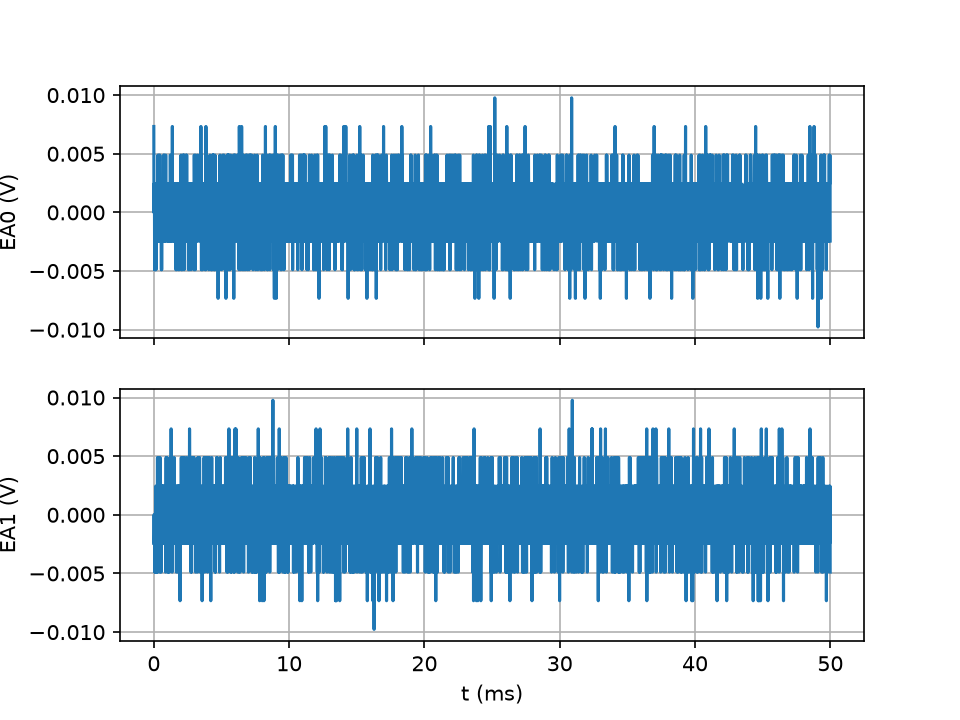

# La centrale Sysam SP5

`tpllg.sysam.Sysam` est la classe `Sysam` de pycanum, avec quelques
commodités : un `with` qui ouvre et ferme la centrale, des calibres qu'on
donne une fois pour toutes les voies, des temps en secondes, et des
acquisitions qui rendent directement temps et tensions. Tout ce que pycanum
sait faire reste accessible, la classe en hérite. Elle corrige au passage
quelques pièges du pilote de pycanum, lus dans son source C et décrits plus
bas. `tpllg.acquisition` réduit le cas courant à une fonction, et
`tpllg.sysam_factice` tient lieu de centrale quand il n'y en a pas, en
refusant ce que la centrale refuse.

## Sommaire

- [Ce qu'est la centrale](#ce-quest-la-centrale)
- [Ouvrir la centrale](#ouvrir-la-centrale)
- [Configurer les entrées](#configurer-les-entrées)
- [Échantillonner](#échantillonner)
- [Acquérir](#acquérir)
- [Déclencher sur une voie](#déclencher-sur-une-voie)
- [Générer et acquérir en même temps](#générer-et-acquérir-en-même-temps)
- [Le reste de pycanum](#le-reste-de-pycanum)
- [En une ligne : tpllg.acquisition](#en-une-ligne--tpllgacquisition)
- [Sans centrale : le simulateur](#sans-centrale--le-simulateur)
- [Cas complets](#cas-complets)
- [Quand ça ne marche pas](#quand-ça-ne-marche-pas)

## Ce qu'est la centrale

La Sysam SP5 est une carte d'acquisition USB d'Eurosmart :

| Organe | Caractéristiques |
| --- | --- |
| entrées analogiques | 8, EA0 à EA7, ±10 V, impédance 1 MΩ, convertisseur 12 bits |
| calibres | 0,2 V, 1 V, 5 V, 10 V (la carte en connaît d'autres, pycanum non) |
| échantillonnage | jusqu'à 10 MHz en mode direct, 500 kHz en mode multiplexé |
| mémoire | 0x3FFFF = 262 143 mots de 12 bits, partagés entre les entrées (voies × points) et les sorties |
| sorties analogiques | 2, SA1 et SA2, ±10 V, 50 mA, 12 bits, 5 MHz, 131 071 points chacune au plus |
| entrées-sorties logiques | 16 lignes, ports B et C |
| déclenchement | sur une voie (seuil, front, prétrig) ou sur l'entrée externe |

Les huit entrées sont groupées en **quatre modules** de deux : EA0 avec EA4,
EA1 avec EA5, EA2 avec EA6, EA3 avec EA7. Un module convertit une seule
tension à la fois. Tant qu'une seule entrée de chaque module est active, ou
que le module est en mode différentiel, la carte est en mode **direct** :
chaque module a son convertisseur, et l'on peut échantillonner jusqu'à
10 MHz. Dès que les deux entrées d'un même module sont actives en mode simple
(EA0 et EA4 par exemple), la carte passe en mode **multiplexé**, et la
période d'échantillonnage ne descend plus sous 2 µs. Pour acquérir jusqu'à
quatre voies vite, on prend donc EA0, EA1, EA2, EA3.

Le convertisseur a 12 bits : 4096 niveaux sur l'étendue du calibre, du moins
au plus. La **résolution** vaut donc le calibre divisé par 2048, soit 2,4 mV
au calibre 5 V et 98 µV au calibre 0,2 V. Un signal de 100 mV crête se mesure
au calibre 0,2 V, où il occupe la moitié de l'échelle, pas au calibre 10 V,
où il tiendrait sur vingt niveaux. À l'inverse un signal qui dépasse le
calibre est **écrêté** à sa valeur, sans erreur ni avertissement : la seule
façon de le voir est de regarder le tracé.

## Ouvrir la centrale

```python
from tpllg.sysam import Sysam

with Sysam([0, 1], 5) as can:  # EA0 et EA1, calibre 5 V sur les deux
    ...  # can est ouvert ici
    # et fermé là, même en cas d'erreur
```

`Sysam(voies=None, calibres=None, diff=None)` ouvre la centrale et, si des
voies sont données, les configure aussitôt par `config_entrees`. Sans
argument, `Sysam()` ouvre sans rien configurer, ce qui sert quand la
configuration change en cours de route, comme dans le Bode automatique.

Le `with` appelle `fermer()` à la sortie du bloc, qu'il se termine
normalement ou par une exception. C'est important : une centrale laissée
ouverte par un script interrompu ne se rouvre pas toujours, et il faut alors
redémarrer la console (sous Spyder, redémarrer le noyau). Sans `with`, on
écrit `can = Sysam([0], 5)` et l'on n'oublie pas `can.fermer()`.

Deux constantes de module : `SYSAM_TYPE = "SP5"`, le seul modèle au lycée,
et `CAL_DEFAUT = 10`, le calibre quand on n'en donne pas.

## Configurer les entrées

```python
can.config_entrees(voies, calibres=None, diff=None)
```

| Argument | Sens |
| --- | --- |
| `voies` | la liste des entrées analogiques à acquérir, numéros de 0 à 7, dans l'ordre où l'on veut les retrouver dans les résultats ; une voie ne peut y être qu'une fois |
| `calibres` | la tension maximale en valeur absolue, en volts : un nombre, appliqué à toutes les voies, ou une liste avec une valeur par voie ; 10 V par défaut. La carte prend le plus petit calibre qui contient la valeur (0,5 V donne 1 V) ; au-delà de 10 V, 10 V, en le disant ; une valeur nulle, négative ou `nan` donne 10 V |
| `diff` | la liste des modules à mettre en mode différentiel : `[0]` mesure EA0 − EA4, `[0, 1]` aussi EA1 − EA5 ; on ne met alors que EA0 (ou EA1) dans `voies`, EA4 étant l'entrée moins |

Après la configuration, `can.voies` et `can.calibres` donnent les voies et
les calibres réellement pris, dans l'ordre demandé.

`Sysam.CALIBRES` est la liste des calibres que pycanum accepte, `(0.2, 1,
5, 10)`, et `Sysam.get_calibre(valeur)` dit lequel une valeur donnée
obtiendra. `Sysam.te_min(voies, diff=())` dit si une liste de voies impose
le mode multiplexé : elle rend `TE_MIN_DIRECT` ou `TE_MIN_MULTIPLEX`.

```python
>>> Sysam.get_calibre(0.5), Sysam.get_calibre(2), Sysam.get_calibre(20)
(1, 5, 10)
>>> Sysam.te_min([0, 1, 2, 3]), Sysam.te_min([0, 4]), Sysam.te_min([0, 4], diff=[0])
(1e-07, 2e-06, 1e-07)
```

Le pilote de pycanum range les voies dans l'ordre croissant, mais applique
les calibres dans l'ordre où on les donne : `[1, 0]` avec `[10, 0.2]`
mettait 10 V sur EA0 et 0,2 V sur EA1. La classe range les couples (voie,
calibre) ensemble avant de les passer au pilote, et rend les lignes dans
l'ordre demandé.

Les constantes et méthodes de classe, utiles pour écrire un script qui reste
dans les limites :

| Nom | Valeur | Sens |
| --- | --- | --- |
| `Sysam.TE_MIN_DIRECT` | `1e-7` s | période d'échantillonnage minimale, mode direct |
| `Sysam.TE_MIN_MULTIPLEX` | `2e-6` s | idem, mode multiplexé |
| `Sysam.TE_MIN_SORTIE` | `2e-7` s | idem quand une sortie analogique est utilisée en même temps ; la période est alors un multiple de 0,2 µs |
| `Sysam.PAS_TE` | `1e-7` s | la carte compte la période en dixièmes de microseconde |
| `Sysam.MEMOIRE` | `0x3FFFF` = 262 143 | mots de mémoire, entrées et sorties ensemble |
| `Sysam.POINTS_SORTIE_MAX` | `0x1FFFF` = 131 071 | points d'une sortie |
| `Sysam.CALIBRES` | `(0.2, 1, 5, 10)` | les calibres accessibles |
| `Sysam.MODULES_ANALOG` | `((0, 4), (1, 5), (2, 6), (3, 7))` | les deux entrées de chaque module |
| `Sysam.n_max(nb_voies, nb_sorties=0)` | `261888` pour une voie, `130944` pour deux, `87296` pour deux voies et une sortie | le nombre de points par voie le plus grand que la mémoire accepte, quand chaque sortie a autant de points que les entrées |
| `Sysam.te_effectif(te)` | `te` arrondie à 0,1 µs | la période que la carte appliquera |

## Échantillonner

```python
can.config_echantillon(te, nbpoints)
```

| Argument | Sens |
| --- | --- |
| `te` | la période d'échantillonnage, en **secondes** ; la même pour toutes les voies. pycanum la prend en microsecondes, la classe convertit |
| `nbpoints` | le nombre de points **par voie** |

La carte compte la période en dixièmes de microseconde : la classe arrondit
`te` au dixième le plus proche, `can.te` la donne, et c'est le pas qu'on
relit dans `temps`. (Le pilote de pycanum passe la période en flottant
32 bits puis la **tronque** : 0,7 µs demandées donnaient 0,6 µs, 1,4 µs
donnaient 1,3 µs. La classe lui passe la valeur arrondie avec un demi-pas de
marge.) La période ne descend pas sous `te_min(voies)`, sans quoi pycanum
refuse.

La mémoire fixe le nombre de points : au plus `MEMOIRE // nombre de voies`,
soit 131 071 points pour deux voies et 65 535 pour quatre, et moins encore
si des sorties tournent en même temps (voir plus bas). Au-delà, la carte
**rend moins de points que demandé**, sans erreur ; la classe le dit :

```text
[SYSAM] ATTENTION : 150000 points demandés sur 2 voie(s), la mémoire en permet au plus 131071 : la centrale en rendra moins
```

Le choix se fait toujours de la même façon. On veut assez de points par
période pour dessiner le signal : une centaine si l'on ajuste point par
point, dix suffisent pour un spectre. On veut une durée qui contient ce qu'on
cherche : un front complet et le régime libre qui le suit, vingt périodes
pour un spectre fin. Et la fréquence d'échantillonnage doit rester très
au-dessus du double de la plus haute fréquence présente, sans quoi le spectre
se replie. `tpllg.traitement.choix_echantillonnage` fait ce calcul pour une
fréquence de signal donnée, voir [bode.md](bode.md#le-bode-automatique).

Quelques réglages qui reviennent :

| Ce qu'on regarde | `fe` | `T` | `N` par voie |
| --- | --- | --- | --- |
| un régime libre à 2 kHz après un front d'un créneau à 100 Hz | 200 kHz | 30 ms | 6000 |
| le spectre d'un créneau à 200 Hz, harmoniques jusqu'à 10 kHz | 100 kHz | 100 ms | 10 000 |
| une sinusoïde à 1 kHz pour un gain, cent points par période, vingt périodes | 100 kHz | 20 ms | 2000 |
| un signal audio, une seconde | 20 kHz | 1 s | 20 000 |

## Acquérir

```python
temps, tensions = can.acquerir(reduction=1)
```

Lance l'acquisition, attend qu'elle soit finie, et rend deux tableaux numpy
de forme `(nombre de voies, nbpoints)`, en `float64` : `temps[i]` et
`tensions[i]` sont les instants en secondes et les tensions en volts de la
i-ième voie de la liste `voies`, dans cet ordre. Le temps commence à zéro. Avec
`reduction=4`, un point sur quatre est rendu (`nbpoints // 4` points), sans
changer l'acquisition.

L'appel **bloque** le temps de l'acquisition, et davantage si un
déclenchement est configuré et que le front attendu ne vient pas : un
déclenchement sur une voie débranchée ne rend jamais la main (voir plus
bas).

Les mêmes données se relisent ensuite par `can.temps(reduction)` et
`can.entrees(reduction)`, tant que la centrale est ouverte et qu'aucune
acquisition n'a suivi.

```python
import matplotlib.pyplot as plt
import numpy as np
from tpllg.sysam import Sysam

ENTREES = [0, 1]
CALIBRE = 5
fe = 100000.0  # Hz
T = 0.05  # s
te, N = 1 / fe, int(fe * T)

with Sysam(ENTREES, CALIBRE) as can:
    can.config_echantillon(te, N)
    temps, tensions = can.acquerir()

print(temps.shape, tensions.shape)
for ea, t, u in zip(ENTREES, temps, tensions):
    np.savetxt(f"essai_EA{ea}.txt", [t, u])
    plt.plot(t * 1e3, u, label=f"EA{ea}")
plt.xlabel("t (ms)")
plt.ylabel("u (V)")
plt.legend()
plt.grid()
plt.show()
```

```text
(2, 5000) (2, 5000)
```

## Déclencher sur une voie

L'acquisition démarre normalement à l'appel, donc n'importe où dans le
signal. La centrale sait attendre qu'une voie passe par un seuil :

```python
can.config_trigger(voie, seuil, montant=1, pretrigger=1, pretriggerSouple=0, hysteresis=0)
```

| Argument | Sens |
| --- | --- |
| `voie` | l'entrée surveillée, numéro de 0 à 7 ; elle doit être parmi les voies configurées, sans quoi pycanum refuse. `-1` désactive le déclenchement |
| `seuil` | la tension de seuil, en volts, dans le calibre de la voie ; codée sur les 4096 niveaux du calibre |
| `montant` | `1` pour un front montant (la voie passe au-dessus du seuil), `0` pour un front descendant |
| `pretrigger` | le nombre de points **gardés avant le front** : le front se retrouve à cet indice dans les tableaux rendus. Jusqu'à 262 143, mais moins que `nbpoints` |
| `pretriggerSouple` | `1` pour déclencher même si `pretrigger` points n'ont pas encore été acquis quand le front arrive ; `0` pour attendre un front qui les laisse tous derrière lui |
| `hysteresis` | un code sur un octet, `0` pour aucune ; une hystérésis évite qu'un signal bruité déclenche plusieurs fois autour du seuil |

`config_trigger_externe(pretrigger=1, pretriggerSouple=0)` déclenche sur
l'entrée de synchronisation externe de la carte, front montant.

Le déclenchement se configure **après** les entrées et l'échantillonnage,
et avant `acquerir`. Il reste en place pour les acquisitions suivantes de la
même session ; `config_trigger(-1, 0)` le retire.

Le pilote de pycanum code le seuil avec le calibre qu'il trouve à la
position du numéro de la voie dans sa table, pas avec celui de la voie : EA1
seule au calibre 1 V, un seuil de 0,5 V déclenchait à 0,05 V. La classe
corrige le seuil d'autant ; elle connaît la table, qu'elle a remplie.

```python
with Sysam([0, 1], 5) as can:
    can.config_echantillon(1 / 200000, 6000)
    can.config_trigger(0, 0.0, montant=1, pretrigger=50)  # EA0 passe par 0 V en montant
    temps, tensions = can.acquerir()
```

Le front se retrouve alors vers le cinquantième point de chaque voie. Un
script qui dépend de la position du front a intérêt à la vérifier dans les
données plutôt qu'à la supposer, avec `tpllg.signaux.fronts_montants` : le
seuil est codé au pas du calibre, le bruit fait passer le signal plusieurs
fois par le seuil, et l'on veut l'instant du front à mieux qu'un point
près. Le déclenchement matériel garantit qu'un front est dans l'acquisition,
et à peu près où ; c'est déjà beaucoup. Voir
[signaux.md](signaux.md#le-régime-libre-après-un-front).

Sans front, `acquerir` attend indéfiniment. Avant de déclencher sur une
voie, on vérifie donc que le signal y est : une acquisition sans
déclenchement et un tracé.

## Générer et acquérir en même temps

La centrale a deux sorties analogiques. On peut y envoyer un signal
échantillonné et acquérir les entrées de façon synchrone, à la même période
d'échantillonnage, qui ne peut alors pas descendre sous `TE_MIN_SORTIE`,
0,2 µs :

```python
temps, tensions = can.acquerir_avec_sorties(sortie1=None, sortie2=None)
```

| Argument | Sens |
| --- | --- |
| `sortie1`, `sortie2` | pour chaque sortie SA1 et SA2 : les tensions à envoyer, en volts, un tableau ou une liste, un point par période d'échantillonnage, répétées en boucle ; un nombre pour une tension constante ; `None`, par défaut, pour ne rien générer |

Le retour est celui d'`acquerir`. Trois limites, que le simulateur vérifie
comme la carte :

- la **mémoire est partagée** : voies × points des entrées + points de SA1 +
  points de SA2 ≤ 262 143. Pour deux voies et une sortie aussi longue que
  l'acquisition, `Sysam.n_max(2, 1)`, 87 296 points. Au-delà, pycanum lève
  `Erreur : memoire insuffisante`. Les points d'une sortie restent comptés
  jusqu'à la fermeture de la centrale, même pour une acquisition suivante
  sans sortie ;
- une sortie a au plus 131 071 points ;
- la période doit être un **multiple de 0,2 µs** : les sorties ne
  connaissent pas d'autre cadence, et la carte les ferait tourner à une
  autre période que les entrées. La classe le refuse (`ValueError`).

pycanum ignorait sans rien dire une sortie qui n'était pas un tableau numpy
de flottants — une liste, un nombre : la classe les convertit.

```python
import numpy as np
from tpllg.sysam import Sysam

N, Np = 20000, 100  # points, points par période
e1 = 1.7 * np.cos(2 * np.pi * np.arange(N) / Np)  # une sinusoïde d'amplitude 1,7 V
with Sysam([0, 1], 5) as can:
    can.config_echantillon(1e-5, N)  # 100 points par période à 1 kHz
    temps, tensions = can.acquerir_avec_sorties(e1)  # SA1 : e1 ; SA2 : rien
```

Un câble relie la sortie SA1 à l'entrée EA0 pour lire ce qu'on envoie
réellement, et la sortie du montage étudié va sur EA1 : c'est la base du
Bode automatique, [bode.md](bode.md#le-bode-automatique). Les premières
périodes contiennent le régime transitoire du montage ; on les écarte avant
de mesurer.

La sortie est un convertisseur 12 bits sur ±10 V : une sinusoïde de 1,7 V
crête y a 350 niveaux, ce qui suffit ; une sinusoïde de 50 mV n'en aurait
que dix, et l'on ajouterait plutôt un pont diviseur après la sortie.

## Le reste de pycanum

La classe hérite de tout pycanum. Ce qui sert le plus, au-delà de ce qui
précède :

| Méthode | Rôle |
| --- | --- |
| `config_quantification(nbits)` | nombre de bits de la conversion, 12 au plus ; moins pour montrer la quantification |
| `temps(reduction)`, `entrees(reduction)` | relire la dernière acquisition, dans l'ordre des voies demandées |
| `entrees_filtrees(reduction)`, `config_filtre(A, B)` | la même après un filtre numérique récursif dont on donne les coefficients |
| `lancer()`, `stopper_acquisition()`, `nombre_echant()` | lancer sans attendre la fin, arrêter, savoir où l'on en est |
| `config_echantillon_permanent(te_us, N)`, `acquerir_permanent()`, `lancer_permanent(repetition)`, `paquet(premier, reduction)` | l'acquisition continue, en mémoire circulaire, lue par paquets |
| `config_sortie(nsortie, te_us, valeurs, repetition)`, `declencher_sorties(ns1, ns2)`, `stopper_sorties(ns1, ns2)` | les sorties seules, sans acquisition ; `repetition=1` boucle sur le signal |
| `ecrire(ns1, v1, ns2, v2)`, `activer_lecture(voies)`, `lire()`, `desactiver_lecture()` | une tension constante sur une sortie, une lecture instantanée des entrées |
| `portB_config`, `portB_ecrire`, `portB_lire`, `portC_*` | les ports logiques, bit par bit |
| `config_compteur`, `compteur`, `lire_compteur`, `config_chrono`, `chrono`, `lire_chrono` | compteur d'impulsions et chronomètre sur une entrée |
| `afficher_calibrage()` | imprime la configuration des entrées |

Ces méthodes-là sont celles de pycanum, et prennent leurs temps en
**microsecondes**. Les exemples du site de Frédéric Legrand les emploient
directement, sans passer par `tpllg` ; ils ne sont pas reproduits ici. La
documentation complète est celle de pycanum,
[interpy](https://www.f-legrand.fr/scidoc/docmml/sciphys/caneurosmart/interpy/interpy.html),
et les registres de la carte sont décrits dans la notice de programmation
d'Eurosmart.

## En une ligne : tpllg.acquisition

```python
from tpllg.acquisition import acquerir, sauvegarder

temps, tensions = acquerir(voies, calibre, te, nbpoints, trigger=None)
sauvegarder(prefixe, voies, temps, tensions)
```

`acquerir` ouvre la centrale, configure les voies, l'échantillonnage et le
déclenchement, acquiert, ferme, et rend ce que `can.acquerir()` rend. Ses
arguments sont ceux de `Sysam` et de `config_echantillon` ; `trigger` est
`None` pour partir tout de suite, ou un tuple `(voie, seuil, pretrigger)`,
front montant, ou `(voie, seuil, pretrigger, montant)`.

`sauvegarder` écrit un fichier texte par voie, `<prefixe>_EA<n>.txt`, deux
lignes, le temps puis les tensions ; `np.loadtxt` les relit :

```python
temps, tensions = acquerir([0, 1], 5, 1 / 200000, 6000, trigger=(0, 0.0, 50))
sauvegarder("echelon", [0, 1], temps, tensions)  # echelon_EA0.txt, echelon_EA1.txt

t, u = np.loadtxt("echelon_EA1.txt")  # plus tard, sans centrale
```

Une acquisition par appel : `acquerir` rouvre la centrale à chaque fois.
Pour enchaîner beaucoup d'acquisitions, on garde un `with Sysam(...)` ouvert
et l'on appelle `can.acquerir()` dedans.

## Sans centrale : le simulateur

Quand pycanum n'est pas installé, sur un Mac, sur un poste sans carte, dans
les tests, `tpllg.sysam` importe `tpllg.sysam_factice` à sa place, et
l'ouverture l'annonce. Le simulateur a la même interface, et rend des
données de la même forme : deux tableaux `(voies, nbpoints)` en `float64`,
le temps en secondes, les tensions en volts, remplies d'un bruit gaussien
d'un pas de quantification du calibre, arrondi au pas. Les méthodes de
configuration impriment ce qu'elles ont pris, `acquerir` attend la durée de
l'acquisition :

```text
[SYSAM] ATTENTION : pycanum absent, centrale simulée (tpllg.sysam_factice)
[SYSAM] Entrées EA[0, 1] : calibres [5.0, 5.0] V, différentiel []
[SYSAM] Échantillonnage : 5.0 µs, 6000 points
[SYSAM] Déclenchement sur EA0, seuil 0 V, front montant, 50 points avant
[SYSAM] Acquisition...
[SYSAM] Terminée.
```

Il **refuse ce que la carte refuse**, avec les règles du pilote C de
pycanum, et lève les mêmes `ValueError` : un calibre au-delà de 10 V, un
nombre de calibres différent du nombre de voies, une période sous le
minimum, une mémoire insuffisante, une sortie trop longue ou trop rapide,
un déclenchement sur une voie non configurée. Il en reproduit aussi les
arrondis et les silences : la période tronquée au dixième de microseconde,
le nombre de points arrondi au paquet de la mémoire tampon et plafonné sans
message, les voies rangées dans l'ordre croissant. Un script qui passe sur
le simulateur ne découvre donc pas ces erreurs en salle de TP.

Un script écrit pour la centrale tourne partout, jusqu'au bout, mais sur du
bruit. Pour l'essayer sur des données plausibles, c'est au script de les
fabriquer, comme la centrale les rendrait, derrière un interrupteur :

```python
SIMULATION = True

if SIMULATION:
    temps, tensions = acquisition_simulee(te, N)  # une fonction du script
else:
    temps, tensions = acquerir(ENTREES, CALIBRE, te, N)
```

`exemples/regime_libre.py`, `exemples/spectre_harmoniques.py` et
`exemples/Bode.py` font cela ; leur simulation reproduit ce qui fait la
difficulté de la vraie mesure, un créneau dont on ne choisit pas la phase,
un bruit, un offset, la quantification.

`sysam_factice.VERBOSE = False` avant d'ouvrir tait les messages du
simulateur. Ce qu'il ne simule pas — l'acquisition permanente, la lecture
par paquets, le filtrage, la lecture directe, le compteur, le chronomètre —
lève `NotImplementedError` ; les ports logiques et les sorties seules ne
font rien.

## Cas complets

### Acquérir, enregistrer, tracer

`exemples/acquisition_simple.py` :

```python
import matplotlib.pyplot as plt
from tpllg.acquisition import acquerir, sauvegarder

PREFIXE = "essai"  # essai_EA0.txt, essai_EA1.txt, essai.pdf
ENTREES = [0, 1]  # EA0 et EA1 ; [0] pour une seule voie
CALIBRE = 5  # V : 0.2, 1, 5 ou 10
fe = 100000.0  # Hz
T = 0.05  # s
te, N = 1 / fe, int(fe * T)

temps, tensions = acquerir(ENTREES, CALIBRE, te, N)
sauvegarder(PREFIXE, ENTREES, temps, tensions)
voies, points = temps.shape
print(f"acquis : {voies} voie(s) de {points} points, de {temps[0][0]} à {temps[0][-1]} s")

# squeeze=False : un tableau de repères même pour une seule voie
fig, axes = plt.subplots(len(ENTREES), 1, sharex=True, squeeze=False)
for ax, ea, t, u in zip(axes[:, 0], ENTREES, temps, tensions):
    ax.plot(t * 1e3, u)
    ax.set_ylabel(f"EA{ea} (V)")
    ax.grid()
axes[-1, 0].set_xlabel("t (ms)")
plt.savefig(PREFIXE + ".pdf")
plt.show()
```

```text
acquis : 2 voie(s) de 5000 points, de 0.0 à 0.04999 s
```



Sans centrale, c'est le simulateur qui répond, et la figure ne montre que
son bruit, arrondi au pas de quantification — `2 × 5/4096 = 2,4 mV` au
calibre 5 V ; avec la centrale, ce sont les deux signaux branchés.

### Un créneau et la réponse d'un filtre, déclenchés sur le front

Le GBF envoie un créneau sur EA0 et sur l'entrée du filtre, la sortie du
filtre va sur EA1. On veut un front montant du créneau au début de
l'acquisition, et le régime libre qui le suit en entier :

```python
from tpllg.acquisition import acquerir, sauvegarder

fe = 200000.0  # cent points par pseudo-période à 2 kHz
T = 0.03  # trois périodes d'un créneau à 100 Hz
temps, tensions = acquerir([0, 1], 5, 1 / fe, int(fe * T), trigger=(0, 0.0, 50))
sauvegarder("echelon", [0, 1], temps, tensions)
```

Le front est vers le point 50 ; l'exploitation est dans
[signaux.md](signaux.md#le-régime-libre-après-un-front).

### Quatre voies vite

Quatre signaux à 1 MHz d'échantillonnage : EA0 à EA3, un par module, en
mode direct, 60 000 points par voie, sous les 65 535 que la mémoire permet
pour quatre voies.

```python
temps, tensions = acquerir([0, 1, 2, 3], [10, 10, 1, 1], 1e-6, 60000)
```

Les mêmes voies avec EA4 à la place d'EA3 mettraient la carte en mode
multiplexé, et `config_echantillon(1e-6, …)` demanderait moins que
`TE_MIN_MULTIPLEX` : pycanum refuserait, `Erreur : periode d'echantillonnage
trop faible`.

### Une mesure différentielle

Une tension prise entre deux points dont aucun n'est la masse, aux bornes
d'une résistance de mesure par exemple, se mesure entre EA0 et EA4 en mode
différentiel :

```python
with Sysam([0], 1, diff=[0]) as can:  # EA0 − EA4, calibre 1 V
    can.config_echantillon(1e-4, 10000)
    temps, tensions = can.acquerir()
```

### Beaucoup d'acquisitions de suite

Une centrale ouverte une fois, et une acquisition par valeur d'un paramètre
qu'on règle à la main entre deux :

```python
from tpllg.sysam import Sysam

resultats = []
with Sysam([0, 1], 5) as can:
    can.config_echantillon(1e-5, 20000)
    for k in range(5):
        input(f"réglage {k + 1} prêt ? Entrée pour acquérir")
        temps, tensions = can.acquerir()
        resultats.append(tensions)
```

## Quand ça ne marche pas

| Symptôme | Cause, remède |
| --- | --- |
| `[SYSAM] ATTENTION : pycanum absent` sur un poste qui a la carte | pycanum n'est pas installé pour ce Python : vérifier l'environnement que Spyder utilise |
| le script se bloque à `acquerir` | un déclenchement attend un front qui ne vient pas : la voie est-elle branchée, le seuil est-il dans l'amplitude du signal ? Acquérir d'abord sans déclenchement |
| la centrale ne répond plus après une interruption | elle est restée ouverte : redémarrer le noyau, ou toujours ouvrir dans un `with` |
| `Erreur : voie de trigger non configuree` | la voie de déclenchement n'est pas dans la liste des voies acquises |
| `Erreur : periode d'echantillonnage trop faible` | sous 0,1 µs, ou sous 2 µs avec deux entrées d'un même module : prendre EA0 à EA3 |
| `Erreur : memoire insuffisante` | entrées et sorties ensemble dépassent la mémoire : `Sysam.n_max(voies, sorties)` points au plus ; les points d'une sortie déjà utilisée comptent encore |
| `ValueError: période de … µs : avec des sorties, elle doit être un multiple de 0,2 µs` | les sorties ne tournent qu'à un multiple de 0,2 µs : choisir `te` en conséquence (`choix_echantillonnage` le fait) |
| le signal est plat au sommet | il dépasse le calibre : le monter. Un signal de ±6 V au calibre 5 V est écrêté à ±5 V, en silence |
| le signal est en marches d'escalier | calibre trop grand pour un petit signal : le descendre |
| la période lue diffère de celle demandée | la carte compte en dixièmes de microseconde ; `can.te` donne la période appliquée |
| moins de points que demandé, et un message `la centrale en rendra moins` | voies × points dépasse la mémoire |
| le signal généré par la sortie est déformé | trop peu de points par période, ou trop peu de niveaux pour une petite amplitude |
| des acquisitions consécutives donnent la même chose | on relit `temps()` et `entrees()` sans avoir relancé `acquerir()` |
