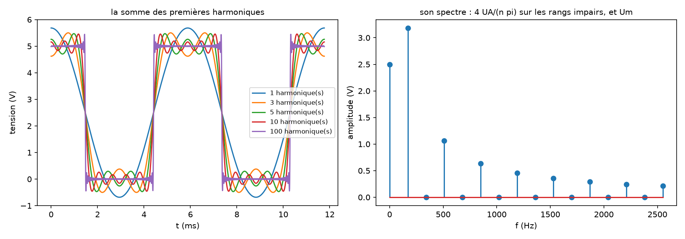
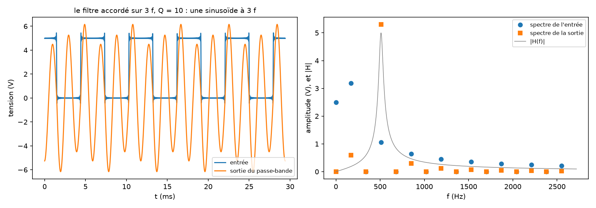
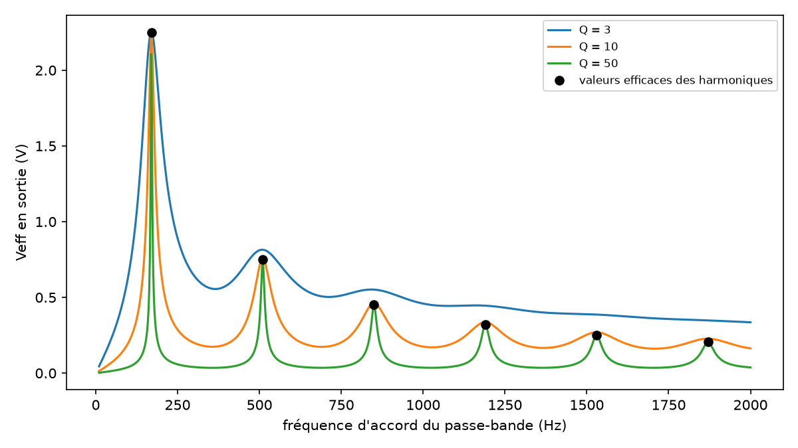

# Un signal par ses harmoniques

`tpllg.harmoniques` construit un signal périodique à partir de ses
harmoniques, le fait passer par le calcul dans un filtre linéaire, et en
donne la valeur efficace. C'est le chemin inverse de
[spectres.md](spectres.md), qui part d'un signal mesuré : ici rien n'est
mesuré, tout se calcule, ce qui sert à préparer un TP de filtrage, un
exercice, ou à simuler l'acquisition qu'un script exploitera. Le module
reprend `traitementsignal` (2014-2019), corrigé.

## Sommaire

- [Le signal](#le-signal)
- [Les spectres usuels](#les-spectres-usuels)
- [Les filtres](#les-filtres)
- [Filtrer et lire la valeur efficace](#filtrer-et-lire-la-valeur-efficace)
- [Cas complet : synthèse, filtrage, analyseur de spectre](#cas-complet--synthèse-filtrage-analyseur-de-spectre)
- [Depuis traitementsignal](#depuis-traitementsignal)

## Le signal

```python
from tpllg.harmoniques import Signal, spectre_carre

carre = Signal(f0=100, spectre=spectre_carre, moyenne=2.5, amplitude=2.5, nmax=50)
s = carre(t)  # le signal aux instants t
```

Le signal est

`s(t) = moyenne + somme pour n de 1 à nmax de A_n cos(2π n f0 t + φ_n)`.

| Argument | Sens |
| --- | --- |
| `f0` | la fréquence du fondamental, en Hz |
| `spectre` | une fonction `spectre(n) -> (A_n, φ_n)` qui reçoit le tableau des rangs `n = 1, 2, … nmax` et rend les amplitudes et les phases (radians) ; les spectres usuels sont fournis |
| `moyenne` | la composante continue ; 0 par défaut |
| `amplitude` | un facteur sur toutes les harmoniques (pas sur la moyenne) ; 1 par défaut |
| `nmax` | le nombre d'harmoniques ; 20 par défaut |

Les arguments se donnent par leur nom. L'objet est un résultat de calcul :
pour changer `nmax`, on en construit un autre.

| Attribut | Contenu |
| --- | --- |
| `n` | les rangs, de 1 à `nmax` |
| `frequences`, `pulsations` | `n f0` et `2π n f0` |
| `amplitudes`, `phases` | `A_n`, toujours positives (un signe moins devient un demi-tour de phase), et `φ_n` entre -π et π |
| `frequences_0`, `amplitudes_0`, `phases_0` | les mêmes, précédées de la composante continue : ce qu'on trace pour un spectre |
| `Veff` | la valeur efficace, par Parseval |

`carre(t)` accepte un nombre ou un tableau, et calcule harmonique par
harmonique : 100 harmoniques sur 100 000 instants prennent une fraction de
seconde.

Un signal donné par la liste de ses coefficients, composante continue en
tête :

```python
s = Signal.depuis_coefficients(200, [1.59, 2.5, 1.06, 0, 0.212], [0, np.pi / 2, 0, 0, 0])
```

`amplitudes[0]` est la composante continue, `amplitudes[n]` et `phases[n]`
l'harmonique `n` ; la phase du rang 0 est ignorée, et les listes passées ne
sont pas modifiées.

## Les spectres usuels

Trois fonctions `spectre(n)`, pour des signaux qui vont de -1 à 1 ;
`amplitude` les met à l'échelle et `moyenne` les décale.

| Fonction | Signal | Harmoniques |
| --- | --- | --- |
| `spectre_carre` | le créneau, qui vaut 1 autour de `t = 0` | impaires, `4/(nπ)`, en phase pour `n = 1, 5, 9…`, en opposition pour `n = 3, 7…` |
| `spectre_triangle` | le triangle, qui vaut 1 en `t = 0` | impaires, `8/(nπ)²`, en phase |
| `spectre_dent_de_scie` | la dent de scie qui monte de -1 à 1, nulle en `t = 0` | toutes, `2/(nπ)` |

## Les filtres

Six fonctions de transfert usuelles, chacune une fabrique qui rend la
fonction `H(f)`, complexe et vectorisée en `f` :

| Fabrique | `H(f)`, avec `x = f/f0` |
| --- | --- |
| `passe_bas_1(fc, H0=1)` | `H0/(1 + j f/fc)` |
| `passe_haut_1(fc, H0=1)` | `H0 j(f/fc)/(1 + j f/fc)` |
| `passe_bas_2(f0, Q, H0=1)` | `H0/(1 - x² + j x/Q)` |
| `passe_haut_2(f0, Q, H0=1)` | `-H0 x²/(1 - x² + j x/Q)` |
| `passe_bande(f0, Q, H0=1)` | `H0/(1 + jQ(x - 1/x))`, écrite pour valoir 0 en `f = 0` sans division par zéro |
| `coupe_bande(f0, Q, H0=1)` | `H0 (1 - x²)/(1 - x² + j x/Q)` |

```python
>>> from tpllg.harmoniques import passe_bande
>>> H = passe_bande(1000, Q=5, H0=2)
>>> print(H(1000.0), abs(H(np.array([500.0, 2000.0]))))
(2+0j) [0.26432744 0.26432744]
```

Toute fonction `H(f)` écrite à la main convient aussi, celle d'un modèle
d'ajustement par exemple.

## Filtrer et lire la valeur efficace

```python
sortie = signal.filtre(H)
```

Rend un nouveau `Signal` : chaque harmonique multipliée par `|H(n f0)|` et
déphasée de `arg H(n f0)`, la moyenne multipliée par `H(0)` — signe compris :
un inverseur change le signe de la composante continue. Une fonction écrite
avec `f0/f` ne se calcule pas en 0 ; on prend alors sa limite.

`signal.Veff` est la valeur efficace, `sqrt(moyenne² + Σ A_n²/2)` : la
composante continue compte entière, chaque harmonique pour la moitié du
carré de son amplitude. Pour `2 + cos(ωt)`, `sqrt(4 + 1/2) = 2,12`.

## Cas complet : synthèse, filtrage, analyseur de spectre

`exemples/harmoniques.py` en trois figures. D'abord un créneau entre 0 et
5 V à 170 Hz, sommé sur 1, 3, 5, 10 puis 100 harmoniques, et son spectre :

```python
import numpy as np
from tpllg.harmoniques import Signal, passe_bande, spectre_carre

UA, Um, F_GBF = 2.5, 2.5, 170.0
t = np.linspace(0, 2 / F_GBF, 2000)
for nmax in (1, 3, 5, 10, 100):
    creneau = Signal(f0=F_GBF, spectre=spectre_carre, moyenne=Um, amplitude=UA, nmax=nmax)
    plt.plot(t * 1e3, creneau(t), label=f"{nmax} harmonique(s)")
```



La valeur efficace, par Parseval et par la moyenne du carré sur une
période, et celle du créneau entier, `sqrt(Um² + UA²)` :

```text
Veff du créneau à 100 harmoniques : 3.5319 V par Parseval, 3.5319 V sur une période
Veff du créneau entier : racine de Um² + UA² = 3.5355 V
```

Puis le créneau dans un passe-bande accordé sur sa troisième harmonique,
`Q = 10` : la composante continue disparaît, la troisième harmonique passe,
amplifiée par `H0 = 5`, les autres sont atténuées ; en sortie, presque une
sinusoïde à 510 Hz.

```python
sortie = creneau.filtre(passe_bande(3 * F_GBF, Q=10, H0=5))
```

```text
en sortie : moyenne 0 V, harmonique 3 de 5.305 V, Veff 3.782 V
```



Enfin un **analyseur de spectre analogique** : on accorde le passe-bande de
10 Hz à 2 kHz et l'on relève la valeur efficace de sa sortie. Chaque
harmonique fait une bosse, d'autant plus fine que `Q` est grand ; avec
`Q = 50`, les bosses atteignent presque les valeurs efficaces des
harmoniques.

```python
accords = np.linspace(10, 2000, 1000)
veff = [creneau.filtre(passe_bande(f0, 50)).Veff for f0 in accords]
```



`exemples/spectre_harmoniques.py` se sert du même module pour simuler
l'acquisition d'un créneau et de sa sortie par un passe-bas, que le script
analyse ensuite comme une vraie mesure ([spectres.md](spectres.md)).

## Depuis traitementsignal

| `traitementsignal` | `tpllg` |
| --- | --- |
| `filtrage.Signal(moyenne=, f0=, spectre=, amplitude=, nmax=)` | `harmoniques.Signal(...)`, mêmes arguments, `moyenne` facultative |
| `filtrage.spectre_carre` | `harmoniques.spectre_carre` |
| `filtrage.passebande(f0, Q, H0)`, `passebas_ordre1`, `passebas_ordre2`, `passehaut_ordre1`, `passehaut_ordre2` | `passe_bande`, `passe_bas_1`, `passe_bas_2`, `passe_haut_1`, `passe_haut_2`, avec `H0=1` par défaut |
| `filtrage.filtre_passebande(f, f0, Q, H0)` et les autres | `passe_bande(f0, Q, H0)(f)` |
| `signal.set_harmoniques(nmax)` | un nouveau `Signal(..., nmax=…)` |
| `fourier.spectre_to_func(amplitudes, phases)` puis `func(f0, t)` | `Signal.depuis_coefficients(f0, amplitudes, phases)` puis `signal(t)` |
| `fourier.fourier(t, s)` | `tpllg.fft.calcule_DFT(t, s)` |

Ce qui était faux et ne l'est plus : les cinq fabriques de filtres
plantaient (`make_filtre` appelé en positionnel) ; `Veff` comptait la
moyenne pour la moitié de son carré (1,58 au lieu de 2,12 pour
`2 + cos`) ; le filtrage multipliait la moyenne par `|H(0)|`, perdant le
signe d'un inverseur ; un spectre en entiers levait `UFuncTypeError` ;
`spectre_to_func` modifiait la liste de phases qu'on lui passait ; et
`fourier` normalisait par `2 dt`, juste pour une seconde de signal
seulement — `calcule_DFT` normalise par `2/N`.
