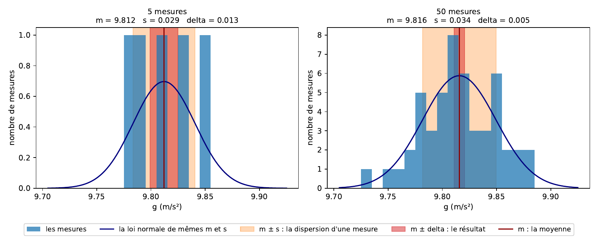
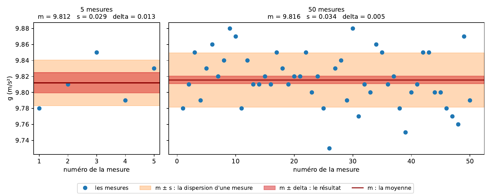
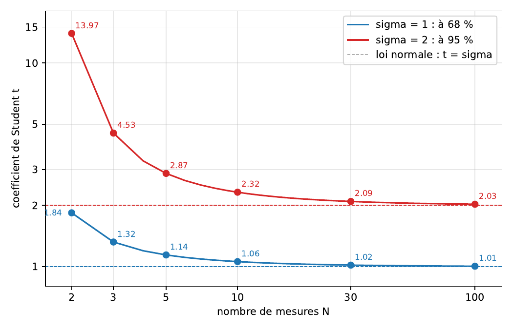
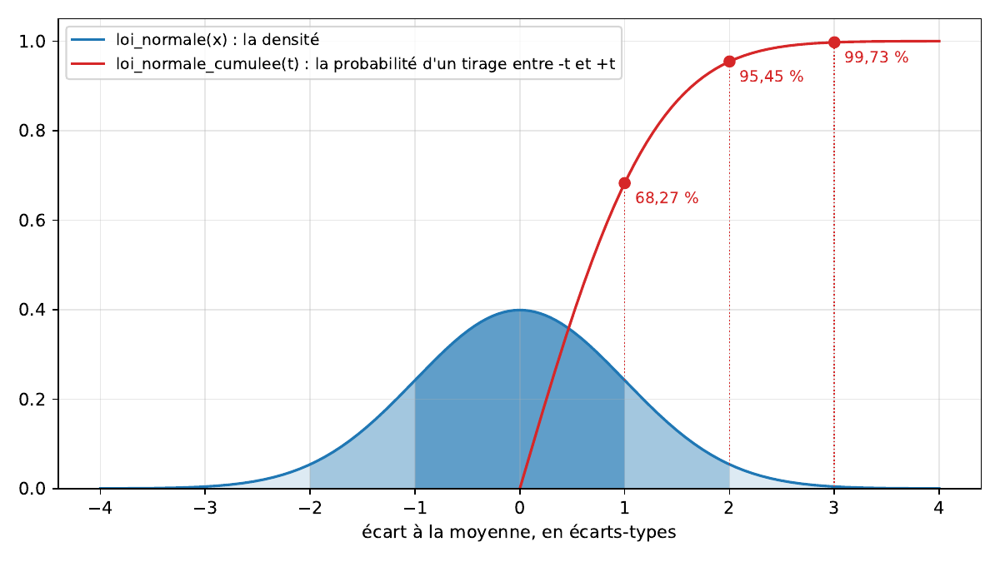
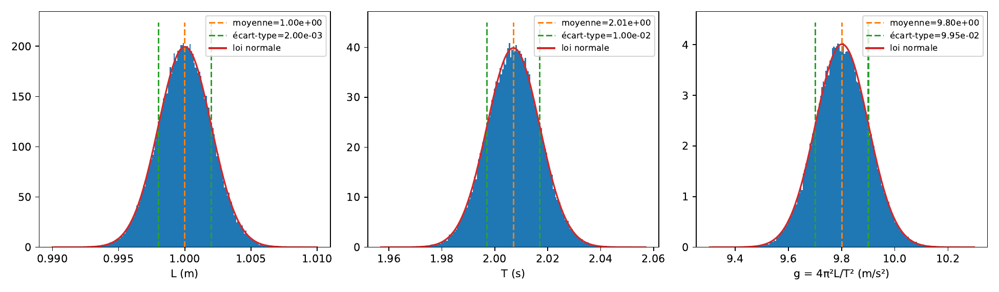
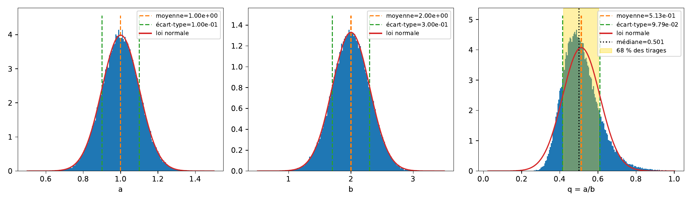
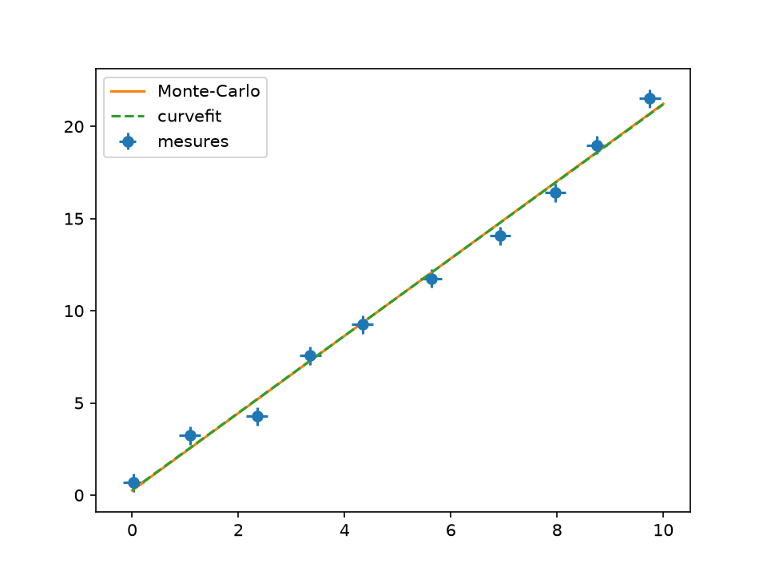
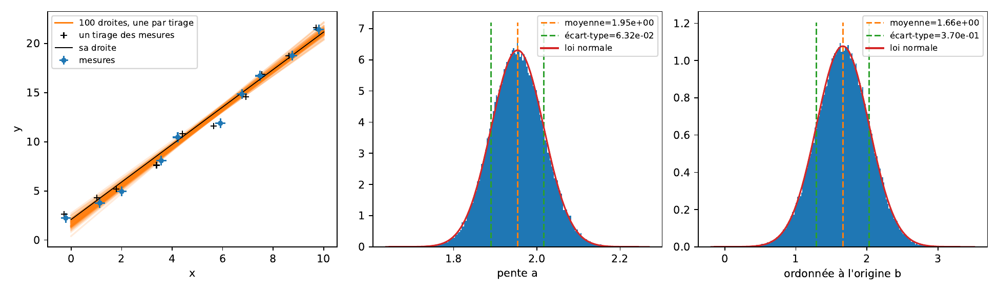
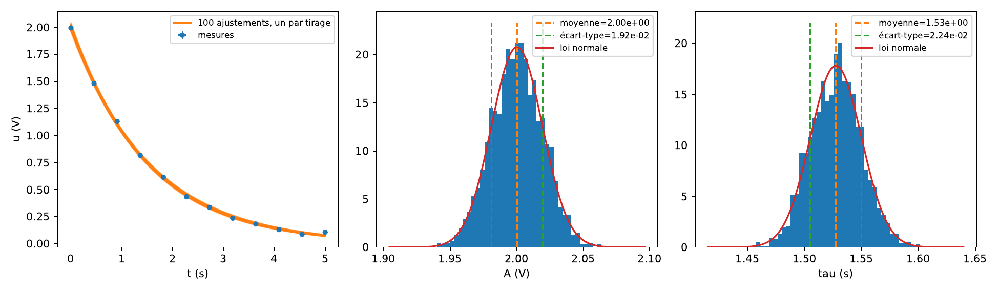
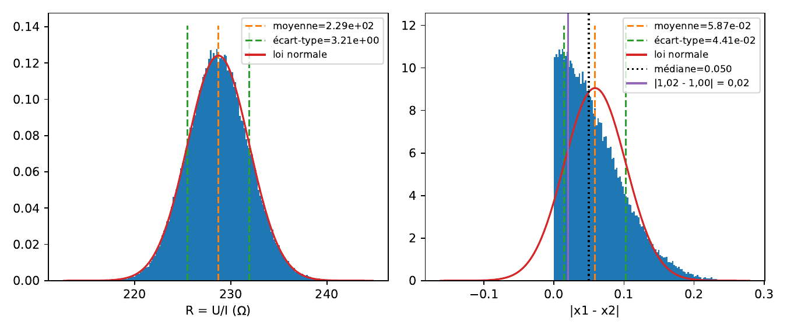

# Incertitudes

`tpllg.incertitudes` estime une valeur et son incertitude sur une série de
mesures répétées, avec ou sans coefficient de Student ; `tpllg.montecarlo`
propage des incertitudes à travers un calcul par tirages aléatoires, sans
formule de dérivées partielles, et ajuste une droite ou un modèle sur chaque
tirage des mesures. Les incertitudes que rend un ajustement sont
dans [ajustement.md](ajustement.md).

## Sommaire

- [Une série de mesures](#une-série-de-mesures)
- [Le coefficient de Student](#le-coefficient-de-student)
- [La loi normale](#la-loi-normale)
- [Monte-Carlo : un Point](#monte-carlo--un-point)
- [Ce que vaut un tirage](#ce-que-vaut-un-tirage)
- [Une droite sur tous les tirages, sans boucle](#une-droite-sur-tous-les-tirages-sans-boucle)
- [Un modèle quelconque par tirages](#un-modèle-quelconque-par-tirages)
- [Cas complets](#cas-complets)

## Une série de mesures

```python
from tpllg.incertitudes import incertitudes

m, delta, s = incertitudes(liste, sigma=1, advanced=False)
```

| Argument | Sens |
| --- | --- |
| `liste` | les mesures, au moins deux |
| `sigma` | le niveau de confiance, en nombre d'écarts-types : 1 pour 68 %, 2 pour 95 % ; ne sert qu'avec `advanced` |
| `advanced` | `True` pour multiplier l'incertitude par le coefficient de Student, ce qui compte quand les mesures sont peu nombreuses |

Retour : la **moyenne** `m`, l'**incertitude** `delta` sur cette moyenne, et
l'**écart-type estimé** `s` de la série. Ce sont les trois estimateurs d'une
incertitude de **type A**, sur `N` mesures indépendantes `x_i` :

```text
m     = (1/N) somme des x_i                       la moyenne
s     = sqrt( somme des (x_i - m)² / (N - 1) )    l'écart-type de la série, estimé sans biais
delta = s / sqrt(N)                               l'incertitude-type sur la moyenne
```

Rien qu'on ne puisse écrire soi-même en numpy, et c'est exactement ce que la
fonction fait :

```python
m = np.mean(mesures)
s = np.std(mesures, ddof=1)          # ddof=1 : la division par N - 1
delta = s/np.sqrt(len(mesures))
```

Avec `advanced`, `delta` est multipliée par le coefficient de Student au
niveau `sigma` (section suivante).

```python
import numpy as np
from tpllg.ajustement import formater, resume_parametres
from tpllg.incertitudes import incertitudes

mesures = [9.78, 9.81, 9.85, 9.79, 9.83]           # g, en m/s², cinq fois
m, delta, s = incertitudes(mesures)
print(m, delta, s)
print(formater(m, delta, "m/s²"))
m2, delta2, s2 = incertitudes(mesures, sigma=2, advanced=True)
print(formater(m2, delta2, "m/s²"), "à 95 %, avec Student")
print(resume_parametres(("g",), [m], [delta], ("m/s²",)))
```

```text
9.812 0.012806248474865799 0.028635642126552934
9.812 ± 0.013 m/s²
9.812 ± 0.037 m/s² à 95 %, avec Student
g = 9.812 ± 0.013 m/s²
```

`s` est la dispersion d'**une** mesure ; `delta` est ce qu'on gagne à en
faire `N`, et c'est `delta` qu'on écrit derrière le `±`. Deux fonctions de
`tpllg.ajustement` mettent en forme, avec deux chiffres significatifs sur
l'incertitude et la valeur arrondie au même rang : `formater` pour une
grandeur, `resume_parametres` pour plusieurs grandeurs nommées, une ligne
chacune — c'est la même mise en forme, la seconde appelle la première
(voir [ajustement.md](ajustement.md#présenter-un-résultat)).

`exemples/incertitudes_serie.py` trace les trois estimateurs sur deux
séries : les cinq mesures ci-dessus, puis cinquante de même dispersion — les
cinq mêmes et quarante-cinq autres, simulées. D'abord sur l'histogramme des
mesures, où `m ± s` et `m ± delta` sont deux bandes verticales autour de la
moyenne :



Puis sur les mesures dans l'ordre où elles ont été faites, les mêmes bandes
à l'horizontale :



```text
5 mesures  : m = 9.8120  s = 0.0286  delta = 0.0128  soit g = 9.812 ± 0.013 m/s²
50 mesures : m = 9.8156  s = 0.0339  delta = 0.0048  soit g = 9.8156 ± 0.0048 m/s²
```

De cinq à cinquante mesures, la bande `m ± s` garde sa largeur : c'est là
que tombe une mesure, deux fois sur trois si la loi est normale, et en faire
davantage n'y change rien. La bande `m ± delta` rétrécit, de 0,013 à
0,005 m/s² : elle ne dit pas où tombent les mesures — sur les cinquante, six
seulement y sont — mais où est la moyenne, et c'est elle le résultat.

## Le coefficient de Student

```python
from tpllg.incertitudes import student_coef

t = student_coef(sigma, n)
```

La règle : une incertitude de **type A**, estimée sur `N` mesures répétées,
s'écrit `delta = t × s/sqrt(N)`, où `t` est le coefficient de Student au
niveau de confiance voulu, à `k = N - 1` degrés de liberté. Le coefficient
ne corrige pas `s` — l'écart-type de la série reste `np.std(mesures,
ddof=1)` — il élargit l'intervalle de confiance sur la **moyenne**, parce que
`s` est lui-même estimé sur ces mêmes `N` mesures, et d'autant moins bien
connu que `N` est petit. `sigma` dit le niveau, en nombre d'écarts-types
d'une loi normale : 1 pour 68 %, 2 pour 95 %. `t` tend vers `sigma` quand
`N` grandit :

| `N` | à 68 % (`sigma=1`) | à 95 % (`sigma=2`) |
| --- | --- | --- |
| 2 | 1,84 | 13,97 |
| 3 | 1,32 | 4,53 |
| 5 | 1,14 | 2,87 |
| 10 | 1,06 | 2,32 |
| 30 | 1,02 | 2,09 |
| 100 | 1,005 | 2,03 |

`exemples/incertitudes_student.py` trace `t` en fonction de `N` aux deux
niveaux, avec les valeurs du tableau :



Sur les cinq mesures de `g` ci-dessus, à 95 % : `t = 2.87`, et
`delta = 2.87 × 0.0286/sqrt(5) = 0.037 m/s²`, ce que `incertitudes(mesures,
sigma=2, advanced=True)` rend. Deux mesures ne disent presque rien de
l'écart-type : à 95 % le facteur est 14. À partir d'une dizaine de mesures,
la correction est de quelques pour cent à 68 %, et l'on peut s'en passer en
incertitude-type.

## La loi normale

```python
from tpllg.incertitudes import loi_normale, loi_normale_cumulee

y = loi_normale(x, m=0, s=1)         # la densité, de moyenne m et d'écart-type s
p = loi_normale_cumulee(t)           # la probabilité d'un tirage dans [-t s, +t s]
```

```python
>>> [round(loi_normale_cumulee(k), 4) for k in (1, 2, 3)]
[0.6827, 0.9545, 0.9973]
```

Les 68 %, 95 % et 99,7 % à un, deux et trois écarts-types. `loi_normale`
sert aux tracés, pour superposer la gaussienne à un histogramme.

`exemples/incertitudes_loi_normale.py` trace les deux sur le même graphe.
La valeur du cumul en `t` est l'aire sous la densité entre `-t` et `+t` :



## Monte-Carlo : un Point

La méthode : on suppose chaque
grandeur mesurée gaussienne, centrée sur sa valeur avec son incertitude-type
pour écart-type ; on en tire `N` valeurs ; on refait le calcul sur chaque
tirage ; la moyenne et l'écart-type des résultats sont la valeur et
l'incertitude cherchées. À la main, cela tient en quatre lignes :

```python
import numpy as np

N = 100000
x = np.random.normal(1.0, 0.05, N)
y = np.random.normal(2.0, 0.09, N)
q = x*y**2
print(q.mean(), "±", q.std(ddof=1))
```

`Point` fait exactement cela, en gardant le tirage avec la grandeur pour que
les opérations s'écrivent comme sur des nombres :

```python
from tpllg.montecarlo import Point

X = Point(val, u, N=None)
```

| Argument | Sens |
| --- | --- |
| `val` | la valeur |
| `u` | l'incertitude-type |
| `N` | le nombre de tirages, 100 000 par défaut (`Point.NN`) ; cent mille tirages coûtent quelques millisecondes |

Un `Point` porte une valeur, une incertitude-type et, dès qu'on en a besoin,
un **tirage** de `N` valeurs gaussiennes. Toute opération, entre `Point` ou
avec un nombre, se fait terme à terme sur les tirages ; le résultat est un
`Point` dont `val` est la moyenne des tirages et `u` leur écart-type,
estimateur sans biais (`ddof=1`).

| Écriture | Ce qui est fait |
| --- | --- |
| `X + Y`, `X - Y`, `X*Y`, `X/Y`, `X**Y` | terme à terme sur les tirages, `Y` un `Point` ou un nombre ; `2*X`, `3 - X`, `2/X`, `2**X` aussi |
| `-X`, `abs(X)` | idem |
| `np.exp(X)`, `np.sqrt(X)`, `np.sin(X)`, `np.arctan2(Y, X)`… | toute fonction numpy élémentaire appliquée aux tirages : le résultat est un `Point` |
| `X.apply_func(f, *args)` | une fonction qui n'est pas une fonction numpy élémentaire, appliquée aux tirages avec ses arguments |
| `X.val`, `X.u`, `X.N` | la valeur, l'incertitude-type, le nombre de tirages |
| `X.tirage` | le tableau des tirages, pour un histogramme ou des quantiles |
| `X.quantiles(niveau=0.6827)` | l'intervalle `(bas, haut)` qui contient `niveau` des tirages ; à 68,27 % c'est l'équivalent de ± un écart-type |
| `X.show(ax=None, largeur=5, nbins=1000)` | l'histogramme des tirages, la moyenne, ± l'écart-type, et la loi normale de mêmes moyenne et écart-type |
| `X.calc_tirage(N)` | refaire le tirage, avec `N` valeurs |

`g` par un pendule, `L = 1,000 ± 0,002 m`, `T = 2,007 ± 0,010 s` :

```python
import matplotlib.pyplot as plt
import numpy as np
from tpllg.ajustement import formater
from tpllg.montecarlo import Point

np.random.seed(0)                        # les mêmes tirages d'une fois sur l'autre
L = Point(1.000, 0.002)
T = Point(2.007, 0.010)
g = 4*np.pi**2*L/T**2
print(formater(g.val, g.u, "m/s²"), "(%d tirages)" % g.N)
fig, axes = plt.subplots(1, 3, figsize=(13, 3.8))
for ax, point in zip(axes, (L, T, g)):
    point.show(ax, nbins=200)            # l'histogramme d'un Point, dans le repère donné
```

```text
9.801 ± 0.099 m/s² (100000 tirages)
```



Deux gaussiennes en entrée, le calcul refait sur chaque tirage, et
l'histogramme du résultat. `g.show()` seul trace le sien dans une figure
neuve.

La formule de propagation linéaire, `u_g/g = sqrt((u_L/L)² + (2 u_T/T)²)`,
donne `9.801 ± 0.100 m/s²` : ici les incertitudes relatives sont petites et
les deux méthodes coïncident, ce qui est la règle. Monte-Carlo apporte
quelque chose quand elles ne sont plus petites, ou que la fonction n'est pas
dérivable, ou qu'on ne veut pas dériver. Cent mille tirages coûtent
quelques millisecondes.

Deux précisions. Une opération entre deux `Point` suppose qu'ils sont
**indépendants** : chacun a son tirage. Le même `Point` employé deux fois est,
lui, parfaitement corrélé avec lui-même, et c'est juste : `X + 1 - X` a une
incertitude nulle, `X*X` la même que `X**2`, `X + X` celle de `2*X`. Et deux
`Point` à nombres de tirages différents sont ramenés au plus grand, en
retirant le plus petit.

## Ce que vaut un tirage

L'écart-type des tirages est une bonne incertitude tant que leur loi
ressemble à une gaussienne. Un quotient par une grandeur incertaine à 15 %
n'en est déjà plus une :

```python
a = Point(1.0, 0.1)
b = Point(2.0, 0.3)                      # 15 %
q = a/b
bas, haut = q.quantiles()
print(formater(q.val, q.u), "; médiane %.3f ; 68 %% des tirages entre %.3f et %.3f"
      % (np.median(q.tirage), bas, haut))
```

```text
0.513 ± 0.098 ; médiane 0.501 ; 68 % des tirages entre 0.420 et 0.604
```

La moyenne est décalée de 0,500 à 0,513, la loi est plus longue à droite
(1/b s'envole quand b est petit), et la formule linéaire donnait ±0,090. À
30 % d'incertitude sur `b`, l'écart-type des tirages n'a plus de sens du
tout : des tirages de `b` passent près de zéro, quelques quotients énormes
le font exploser, alors que les quantiles restent raisonnables. Dans ce
cas-là, ce sont les **quantiles** qu'on reporte, et l'on dit que
l'intervalle est dissymétrique.

Les histogrammes de `a`, de `b` et de leur quotient, par `show` :



Deux gaussiennes, et une loi qui ne l'est plus : la loi normale de mêmes
moyenne et écart-type passe à côté de l'histogramme, la médiane est à gauche
de la moyenne, et l'intervalle qui contient 68 % des tirages va de 0,081
sous la médiane à 0,103 au-dessus.

## Une droite sur tous les tirages, sans boucle

Ajuster une droite sur chaque tirage des `P` points de mesure, dans une
boucle de `polyfit`, prend 7 s pour 100 000 tirages de dix points. La
régression affine a une solution analytique, `a = Cov(x, y)/V(x)` et
`b = <y> − a<x>`, qui se calcule sur les `N` tirages d'un coup, en tableaux
`(N, P)`, sans boucle : quelques centièmes de seconde. C'est ce que fait
`SerieLineaire`.

```python
from tpllg.montecarlo import SerieLineaire

serie = SerieLineaire(x, u_x, y, u_y, N=100000)
a, b = serie.ajuster()
```

| Argument | Sens |
| --- | --- |
| `x`, `y` | les mesures, `P` points |
| `u_x`, `u_y` | leurs incertitudes-types : un nombre pour tous les points, ou une liste, une par point |
| `N` | le nombre de tirages |

Les tirages sont faits à la construction, dans `serie.x_tirages` et
`serie.y_tirages`, deux tableaux `(N, P)` ; `serie.xi`, `serie.yi` en donnent
un, pour tracer un jeu de mesures comme on aurait pu l'avoir. `ajuster()`
rend la pente et l'ordonnée à l'origine en deux `Point`, dont les tirages
sont les `N` régressions. Les incertitudes sur `x` sont ainsi prises en
compte sans dérivée ni itération.

Face à `curvefit` avec la variance effective, sur dix points de `y = 2x + 1`
bruités à 0,2 en `x` et 0,5 en `y` :

```text
Monte-Carlo : a = 1.953 ± 0.063  b = 1.66 ± 0.37  (100000 tirages en 0.03 s)
curvefit    : a = 1.959 ± 0.063  b = 1.63 ± 0.37  chi2 réduit = 1.35
```

Les deux méthodes s'accordent ; `curvefit` rend en plus le χ² réduit,
`SerieLineaire` n'a rien à savoir de la dérivée du modèle. `np.polyfit(x, y,
1)` sur les valeurs mesurées donne les mêmes `a` et `b` que la moyenne des
tirages, aux fluctuations près.



Et ce que les tirages contiennent : cent des cent mille droites autour des
mesures, un tirage des mesures (`serie.xi`, `serie.yi`) avec sa droite, puis
les histogrammes de la pente et de l'ordonnée à l'origine, par `a.show()` et
`b.show()` :



Le faisceau des droites est le plus serré au milieu des points et s'ouvre
aux deux bouts : l'ordonnée à l'origine, lue en `x = 0`, au bord des
mesures, est relativement bien moins connue que la pente.

## Un modèle quelconque par tirages

```python
from tpllg.montecarlo import ajuster_modele

params = ajuster_modele(modele, x, u_x, y, u_y, p0, N=1000, **kwargs)
```

| Argument | Sens |
| --- | --- |
| `modele` | `modele(x, a, b, …)`, comme pour `curve_fit` |
| `x`, `u_x`, `y`, `u_y` | les mesures et leurs incertitudes-types, comme `SerieLineaire` |
| `p0` | les valeurs de départ |
| `N` | le nombre de tirages, 1000 par défaut |
| `**kwargs` | transmis à `curve_fit` : `maxfev`, `bounds` |

Rend une liste de `Point`, un par paramètre, dont les tirages sont les `N`
valeurs ajustées. Ici il n'y a pas de solution analytique : c'est une boucle
de `N` appels à `curve_fit`, de l'ordre d'une seconde pour mille tirages,
et mille suffisent pour deux chiffres significatifs sur une incertitude.
Une exponentielle sur douze points, incertitudes de 0,01 s en `t` et 0,02 V
en `u` :

```python
t = np.linspace(0, 5, 12)
u = 2*np.exp(-t/1.5) + np.random.normal(0, 0.02, t.size)
A, tau = ajuster_modele(lambda t, A, tau: A*np.exp(-t/tau), t, 0.01, u, 0.02, p0=[1, 1], N=2000)
print("A =", formater(A.val, A.u), " tau =", formater(tau.val, tau.u, "s"))
```

```text
A = 2.000 ± 0.019  tau = 1.528 ± 0.022 s  (2000 tirages en 0.1 s)
```



Avec deux mille tirages au lieu de cent mille, les histogrammes sont plus
heurtés ; l'écart-type, lui, est déjà connu à 2 % près, ce qui suffit pour
ses deux chiffres significatifs.

Un ajustement qui échoue sur un tirage arrête tout (`RuntimeError`) : de
bonnes valeurs de départ, et `maxfev` si besoin, comme pour `curve_fit`.
Pour une droite, `SerieLineaire` fait la même chose cent fois plus vite et
sans risque d'échec.

## Cas complets

`exemples/montecarlo.py` réunit les quatre cas ci-dessus et les deux qui
suivent, et trace toutes les figures des sections Monte-Carlo de cette
fiche. Une résistance par la loi d'Ohm, avec les incertitudes des
multimètres, en quatre lignes :

```python
U = Point(4.87, 0.5*0.01*4.87 + 0.005)    # 0,5 % + 5 mV : ce que la notice dit
I = Point(0.0213, 0.008*0.0213 + 0.0001)
R = U/I
print(formater(R.val, R.u, "Ω"))
```

```text
228.7 ± 3.2 Ω
```

Et l'incertitude d'une fonction non dérivable, la valeur absolue d'une
différence :

```python
d = abs(Point(1.02, 0.05) - Point(1.00, 0.05))
print(formater(d.val, d.u), " médiane %.3f" % np.median(d.tirage))
```

```text
0.059 ± 0.044  médiane 0.050
```

Ici la formule linéaire ne s'applique pas, la valeur moyenne des tirages
n'est pas `|1,02 − 1,00| = 0,02`, et seul le tirage dit à quoi s'attendre :
une différence nulle à ±0,07 près a une valeur absolue autour de 0,05.



`R` reste gaussienne, et son écart-type est une incertitude au sens
habituel. La valeur absolue replie la loi sur zéro : `R.show()` et
`d.show()` montrent d'un coup d'œil lequel des deux cas on a.
