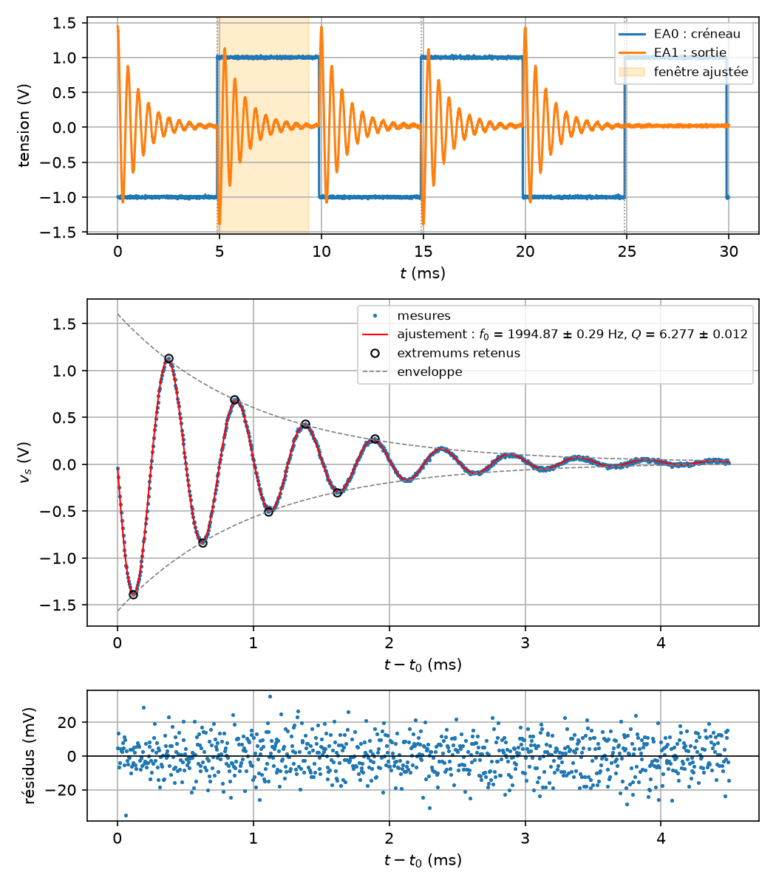

# Signaux acquis

`tpllg.signaux` repère dans un signal acquis ce qu'on veut y mesurer : les
fronts d'un créneau, une fenêtre de temps, la fréquence d'une oscillation,
ses extremums et son amortissement. Ce sont les briques de l'exploitation
d'un régime transitoire, et la dernière section les assemble sur un cas
complet. Toutes prennent le signal comme l'acquisition le rend, les instants
`t` en secondes puis les tensions `v`, en tableaux numpy ou en listes : la
période d'échantillonnage s'en déduit, il n'y a ni `te` ni `fe` à passer.
Une seule voie à la fois — `temps[0]` et `tensions[0]`, pas `temps` et
`tensions` entiers, que les fonctions refusent avec un message.

## Sommaire

- [Les fronts d'un créneau](#les-fronts-dun-créneau)
- [Le front utile](#le-front-utile)
- [Une fenêtre](#une-fenêtre)
- [La fréquence d'une oscillation](#la-fréquence-dune-oscillation)
- [Les extremums](#les-extremums)
- [Le taux d'amortissement et le décrément logarithmique](#le-taux-damortissement-et-le-décrément-logarithmique)
- [Le régime libre après un front](#le-régime-libre-après-un-front)
- [Anciens noms](#anciens-noms)

## Les fronts d'un créneau

```python
from tpllg.signaux import fronts_montants, fronts_descendants

instants, (v_bas, v_haut) = fronts_montants(t, v)
instants, (v_bas, v_haut) = fronts_descendants(t, v)
```

| Argument | Sens |
| --- | --- |
| `t` | les instants, en secondes, croissants |
| `v` | le signal, même longueur ; un créneau, ou tout signal à deux niveaux |

Retour : les instants des fronts, dans un tableau, et les deux niveaux du
signal.

Les niveaux sont les **médianes** des points de chaque côté du milieu entre
le minimum et le maximum, ce qui les rend insensibles aux dépassements et au
bruit, et les trouve même pour des impulsions brèves (des percentiles 5 et
95, eux, ne voyaient rien sous 5 % de rapport cyclique) ; le seuil est à
mi-hauteur. Une **hystérésis** d'un quart de l'amplitude évite qu'un signal
bruité ne compte plusieurs fronts au même passage : on passe à l'état haut
quand le signal dépasse le seuil plus la marge, à l'état bas quand il
descend sous le seuil moins la marge, et un front montant est une transition
bas vers haut. L'instant du front est **interpolé** linéairement entre les
deux points qui encadrent le passage à mi-hauteur : il est connu à mieux
qu'un point d'échantillonnage. `fronts_descendants` fait la même chose sur
le signal changé de signe. Le calcul est vectorisé : quelques millisecondes
pour une acquisition pleine de 262 000 points.

Sur un créneau à 100 Hz de phase quelconque, échantillonné à 200 kHz
pendant 30 ms, avec un bruit de 10 mV :

```python
import numpy as np
from tpllg.signaux import fronts_montants, fronts_descendants, front_utile

fe = 200000.0
t = np.arange(6000) / fe
rng = np.random.default_rng(3)
v = np.sign(np.sin(2 * np.pi * 100 * t + 2.3)) + rng.normal(0, 0.01, t.size)

fronts, (v_bas, v_haut) = fronts_montants(t, v)
print(np.round(fronts * 1e3, 3), "ms ; niveaux", round(v_bas, 3), round(v_haut, 3))
fronts_d, _ = fronts_descendants(t, v)
print(np.round(fronts_d * 1e3, 3), "ms")
```

```text
[ 6.338 16.337 26.338] ms ; niveaux -1.0 1.0
[ 1.338 11.338 21.337] ms
```

Les fronts sont à 10,00 ms les uns des autres, à 1 µs près, soit un
cinquième de la période d'échantillonnage : c'est l'interpolation.

Des impulsions de 20 µs toutes les millisecondes, 2 % de rapport cyclique,
sont trouvées de même :

```python
ti = np.arange(20000) / 1e6
impulsions = 5.0 * ((ti * 1000) % 1 < 0.02) + rng.normal(0, 0.01, ti.size)
fronts, niveaux = fronts_montants(ti, impulsions)
print(len(fronts), "fronts, le premier à", round(fronts[0] * 1e3, 3), "ms ; niveaux", np.round(niveaux, 3))
```

```text
19 fronts, le premier à 1.0 ms ; niveaux [0. 5.]
```

(L'acquisition commence dans une impulsion : le premier front montant est
le deuxième.)

Un signal **sans créneau**, GBF débranché ou éteint, donne deux niveaux
confondus et des fronts partout, puisque le bruit passe sans cesse par un
seuil qui est au milieu de lui :

```python
bruit = rng.normal(0, 0.01, t.size)
fronts, niveaux = fronts_montants(t, bruit)
print(len(fronts), "fronts ; niveaux", np.round(niveaux, 4))
```

```text
1125 fronts ; niveaux [-0.0065  0.0071]
```

Un script teste donc les niveaux avant d'aller plus loin : `v_haut - v_bas
< 0.2` V, par exemple, et un message qui dit quoi vérifier.

## Le front utile

```python
from tpllg.signaux import front_utile

t0, periode = front_utile(t, t_fronts, fraction=0.45)
```

| Argument | Sens |
| --- | --- |
| `t` | les instants de l'acquisition ; seul le dernier sert |
| `t_fronts` | les instants des fronts, ceux que `fronts_montants` rend |
| `fraction` | la part de période qu'il faut avoir derrière le front avant la fin de l'acquisition |

Retour : l'instant du premier front suivi d'au moins `fraction` de période
avant la fin de l'acquisition, et la **période** entre fronts, médiane des
écarts. Si aucun front ne convient, c'est le premier ; avec un seul front, la
période est ce qui reste jusqu'à la fin. Sans front, `ValueError`.

C'est ce qui choisit le front sur lequel on va travailler : après un front
montant du créneau on a une demi-période avant le front descendant, et l'on
veut cette demi-période entière, ou presque. `fraction=0.45` la demande
presque entière ; le front qui laisse moins de 4,5 ms d'un créneau à 100 Hz
derrière lui est écarté.

```python
t0, periode = front_utile(t, fronts)
print(t0, periode)
```

```text
0.006337539730742532 0.009999985749461204
```

## Une fenêtre

```python
from tpllg.signaux import fenetre

t_fen, v_fen = fenetre(t, v, t_debut, duree)
```

Rend les points de `(t, v)` dont l'instant est dans `[t_debut, t_debut +
duree[`, en tableaux. C'est un découpage, rien de plus, mais il revient à
chaque étape : la demi-période après le front, les dix premières
pseudo-périodes d'une oscillation, la fin de fenêtre où l'on lit l'offset.

```python
t_lib, v_lib = fenetre(t, v, t0, 0.45 * periode)  # du front à presque le suivant
```

## La fréquence d'une oscillation

```python
from tpllg.signaux import frequence_pic

f = frequence_pic(t, v)
```

La fréquence du pic de la transformée de Fourier de `v`, moyenne retirée.
La résolution est l'inverse de la durée du signal : sur 5 ms de signal,
200 Hz. Ce n'est donc pas une mesure, c'est une première estimation, celle
qu'on donne comme valeur de départ à un ajustement, et elle suffit à cela.
Le signal doit contenir quelques périodes, et l'oscillation doit dominer :
sur un régime libre très amorti, le pic est large mais toujours au bon
endroit.

```python
fe, f0, Q = 200000.0, 2000.0, 6.0
t = np.arange(2000) / fe  # 10 ms
v = -1.5 * np.exp(-np.pi * f0 * t / Q) * np.sin(2 * np.pi * f0 * t) + 0.02
print(frequence_pic(t, v), "Hz, résolution", fe / 2000, "Hz")
```

```text
2000.0 Hz, résolution 100.0 Hz
```

## Les extremums

```python
from tpllg.signaux import extremums

indices = extremums(t, v, f, offset=0.0, seuil=0.0)
```

| Argument | Sens |
| --- | --- |
| `t`, `v` | le signal |
| `f` | la fréquence de l'oscillation, celle de `frequence_pic` |
| `offset` | la valeur autour de laquelle le signal oscille |
| `seuil` | l'écart à `offset` sous lequel un extremum est écarté : cinq à dix fois le bruit |

Retour : les **indices** des extremums, maximums et minimums confondus, dans
`v`. Ce sont les pics de `|v - offset|` séparés d'au moins 0,4 période, ce
qui interdit à un point de bruit près d'un extremum de compter pour un
second. Les valeurs sont `v[indices]`, les instants `t[indices]`.

```python
pics = extremums(t, v, f0, offset=0.02)
print(pics[:6], "…", len(pics), "extremums")
print(np.round(v[pics[:6]], 3))
```

```text
[ 24  74 124 174 224 274] … 40 extremums
[-1.3    1.036 -0.762  0.622 -0.443  0.377]
```

Cinquante points d'un extremum à l'autre, une demi-période à 200 kHz et
2 kHz. Le premier extremum est à 24 points et non à 25, parce que
l'oscillation amortie a son maximum un peu avant le quart de période.

## Le taux d'amortissement et le décrément logarithmique

```python
from tpllg.signaux import taux_amortissement

alpha = taux_amortissement(t_pics, v_pics, offset=0.0)
```

Le taux d'amortissement `alpha` (en s⁻¹) d'une enveloppe `exp(-alpha t)`,
par régression linéaire du logarithme des amplitudes `|v_pics - offset|` sur
les instants `t_pics`. Le **décrément logarithmique** est le logarithme du
rapport de deux maximums successifs, `delta = alpha T`, sur une
pseudo-période `T` ; pour un oscillateur du second ordre peu amorti,
`alpha = pi f0/Q`, d'où `delta = pi/Q` et `Q = pi/delta`. (La fonction
s'appelait `decrement_logarithmique` et rendait déjà `alpha`, pas `delta` :
elle a pris son vrai nom.)

```python
alpha = taux_amortissement(t[pics], v[pics], offset=0.02)
print(alpha, "1/s ; delta =", alpha / f0, "; Q =", np.pi * f0 / alpha)
print("sans tenir compte de l'offset : Q =", np.pi * f0 / taux_amortissement(t[pics], v[pics]))
```

```text
1047.1975511965977 1/s ; delta = 0.5235987755982988 ; Q = 6.0
sans tenir compte de l'offset : Q = 17.0817506753877
```

L'offset compte : 20 mV oubliés sur une oscillation qui finit à quelques
dizaines de millivolts, et les derniers extremums paraissent trois fois trop
grands, la pente s'effondre, `Q` triple. Le **bruit** fait la même chose :
les derniers « extremums » ne sont plus que ses bosses. Avec 5 mV de bruit,
on ne garde que ceux qui dépassent dix fois le bruit :

```python
v_bruite = v + np.random.default_rng(5).normal(0, 0.005, v.size)
tous = extremums(t, v_bruite, f0, offset=0.02)
francs = extremums(t, v_bruite, f0, offset=0.02, seuil=0.05)
for nom, p in (("tous", tous), ("au-dessus de 50 mV", francs)):
    alpha = taux_amortissement(t[p], v_bruite[p], offset=0.02)
    print(f"{nom} : {len(p)} extremums, Q = {np.pi * f0 / alpha:.2f}")
```

```text
tous : 37 extremums, Q = 13.11
au-dessus de 50 mV : 14 extremums, Q = 6.27
```

On lit l'offset et le bruit à la fin de la fenêtre, là où l'oscillation
est éteinte.

## Le régime libre après un front

Le cas complet, `exemples/regime_libre.py`. Un filtre passe-bande du second
ordre est attaqué par un créneau ; on veut la sonnerie qui suit un front,
l'ajuster, et en tirer la fréquence propre et le facteur de qualité. Le
créneau est sur EA0, la sortie sur EA1, et l'acquisition commence n'importe
où dans le créneau, que le déclenchement matériel soit configuré ou non.

La chaîne tient en cinq temps, et les fonctions ci-dessus y sont chacune à
leur place :

1. **les fronts montants** du créneau, et le premier qui laisse une
   demi-période derrière lui ;
2. **une première fenêtre**, jusqu'au front suivant, pour estimer la
   pseudo-fréquence par le pic de la FFT ;
3. **la fenêtre de l'ajustement**, dix pseudo-périodes au plus, où l'on lit
   l'offset et le bruit en fin de fenêtre, les extremums nettement au-dessus
   du bruit, l'amortissement ;
4. **l'ajustement** du modèle, avec pour valeurs de départ ce qu'on vient
   d'estimer, l'instant du front compris ;
5. **la figure** : l'acquisition brute avec les fronts et la fenêtre, le
   régime libre ajusté avec son enveloppe et les extremums retenus, les
   résidus.

```python
import matplotlib.pyplot as plt
import numpy as np
from scipy.optimize import curve_fit

from tpllg.acquisition import acquerir
from tpllg.ajustement import ecarts_types, formater, resume_parametres
from tpllg.signaux import extremums, fenetre, frequence_pic, front_utile, fronts_montants, taux_amortissement

SIMULATION = True
ENTREES = [0, 1]
CALIBRE = 5
fe = 200000.0  # une centaine de points par pseudo-période
T = 0.03  # trois périodes du créneau : au moins un front montant complet
te, N = 1 / fe, int(fe * T)

# 1. l'acquisition
if SIMULATION:
    temps, tensions = acquisition_simulee(te, N)  # définie dans l'exemple
else:
    temps, tensions = acquerir(ENTREES, CALIBRE, te, N, trigger=(0, 0.0, 50))
t, ve, vs = temps[0], tensions[0], tensions[1]

# 2. les fronts montants du créneau, et le premier qui laisse une demi-période derrière lui
t_fronts, (v_bas, v_haut) = fronts_montants(t, ve)
if v_haut - v_bas < 0.2:
    raise SystemExit(
        f"pas de créneau sur EA0 (niveaux {v_bas:.2f} et {v_haut:.2f} V) : le GBF est-il branché ?"
    )
t0, periode = front_utile(t, t_fronts, fraction=0.45)

# 3. la fenêtre du régime libre et les valeurs de départ
t_demi, v_demi = fenetre(t, vs, t0, 0.45 * periode)  # jusqu'au front suivant
f_pic = frequence_pic(t_demi, v_demi)  # le pic de la FFT
t_lib, v_lib = fenetre(t, vs, t0, min(0.45 * periode, 10 / f_pic))  # dix pseudo-périodes au plus
fin = v_lib[-len(v_lib) // 5 :]  # la fin de fenêtre, où tout est amorti
offset, bruit = fin.mean(), fin.std()
# les extremums nettement au-dessus du bruit : ceux qui s'y noient aplatiraient l'enveloppe
pics = extremums(t_lib, v_lib, f_pic, offset, seuil=10 * bruit)
alpha = taux_amortissement(t_lib[pics], v_lib[pics], offset)
delta = alpha / f_pic  # le décrément logarithmique, sur une pseudo-période
Q_estime = np.pi / delta


# 4. l'ajustement
def regime_libre(t, A, f0, Q, t0, v_off):
    tau = t - t0
    fp = f0 * np.sqrt(1 - 1 / (4 * Q**2))
    return A * np.exp(-np.pi * f0 * tau / Q) * np.sin(2 * np.pi * fp * tau) + v_off


p0 = [1.2 * (v_lib[pics[0]] - offset), f_pic, Q_estime, t0, offset]
pfit, pcov = curve_fit(regime_libre, t_lib, v_lib, p0=p0)
print(resume_parametres(("A", "f0", "Q", "t0", "v_off"), pfit, pcov, unites=("V", "Hz", "", "s", "V")))
residus = v_lib - regime_libre(t_lib, *pfit)
print(f"résidus : écart-type {residus.std() * 1e3:.1f} mV")
```

Ce que le script imprime, sur l'acquisition simulée (créneau ±1 V à
100 Hz, filtre à 1994,6 Hz et Q = 6,27, bruit de 10 mV, offset de 20 mV) :

```text
créneau : niveaux -1.00 et 1.00 V, fronts montants à [ 4.88 14.88 24.88] ms
front retenu : t0 = 0.00488 s, période du créneau 10.00 ms
pseudo-fréquence (pic de la FFT) : 2000 Hz
offset : 0.018 V, écart-type en fin de fenêtre 25 mV
8 extremums au-dessus de 0.25 V, le premier à -1.39 V
amortissement : alpha = 972 1/s, décrément delta = 0.486, Q ≈ pi/delta = 6.47
A = -1.5897 ± 0.0021 V
f0 = 1994.87 ± 0.29 Hz
Q = 6.277 ± 0.012
t0 = 0.00488163 ± 0.00000010 s
v_off = 0.01940 ± 0.00034 V
résidus : écart-type 10.2 mV
```

Trois choses à lire. Les estimations sont grossières et suffisent : 2000 Hz
à 100 Hz près, `Q ≈ 6,5` pour 6,27, et l'ajustement, parti de là, retrouve
`f0` à 0,3 Hz et `Q` à 0,01. (Sans le seuil, les extremums de la fin, noyés
dans le bruit, donnaient `Q ≈ 7,2`.) L'écart-type « en fin de fenêtre »
surestime le bruit, l'oscillation n'y est pas tout à fait éteinte : le seuil
n'en est que plus prudent. L'instant du front `t0` est un **paramètre
ajusté** et non une donnée : l'interpolation le donne à une fraction de
point, l'ajustement à un dixième de microseconde, et c'est ce qui rend la
méthode indifférente au déclenchement, matériel ou non. Et l'écart-type des
résidus, 10 mV, est celui du bruit mis dans la simulation : le modèle
explique tout ce qui n'est pas du bruit. Sur une vraie mesure, des résidus
qui oscillent à la pseudo-fréquence disent que la fenêtre commence trop tôt
(le front du créneau n'est pas instantané) ou que le modèle est incomplet.

La suite du script fait la figure ; la voici en entier dans
`exemples/regime_libre.py`, avec la simulation d'acquisition. Le signe de
`A` vient de la phase de l'oscillation par rapport au front : sur un
passe-bande inverseur, la sortie part vers le bas après un front montant, et
le premier extremum, qui donne la valeur de départ, est négatif.



Pour comparer au diagramme de Bode du même filtre, voir
[bode.md](bode.md) ; pour ce que valent les incertitudes rendues par
`curve_fit`, [ajustement.md](ajustement.md#ce-que-curve_fit-fait).

## Anciens noms

Les formes de 2026.9 restent valables et rendent ce qu'elles rendaient,
sans avertissement. L'ancienne forme de
`frequence_pic` et d'`extremums` est reconnue à son second argument, un
nombre (`te` ou `fe`) là où la nouvelle attend le tableau `v`.

| Ancienne forme | Remplaçant |
| --- | --- |
| `frequence_pic(v, te)` | `frequence_pic(t, v)` |
| `extremums(v, fe, f, offset=0.0)` | `extremums(t, v, f, offset=0.0, seuil=0.0)` |
| `decrement_logarithmique(t_pics, v_pics, offset=0.0)` | `taux_amortissement(t_pics, v_pics, offset=0.0)`, même résultat, `alpha` en s⁻¹ |

`decrement_logarithmique` n'est pas dans `__all__` : `from tpllg.signaux
import *` ne la donne pas.
