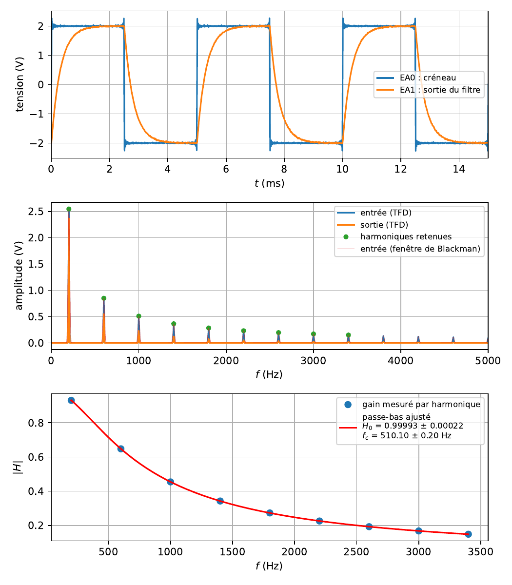

# Spectres et harmoniques

`tpllg.fft` calcule le spectre d'amplitude d'un signal acquis, brut ou avec
une fenêtre ; `tpllg.traitement` y relève les harmoniques, apparie celles
de deux signaux, et interpole un signal par sa transformée de Fourier. Le
cas complet est la mesure d'une fonction de transfert sur les harmoniques
d'un créneau. Le gain d'un filtre mesuré sur une sinusoïde et le Bode
automatique sont dans [bode.md](bode.md).

## Sommaire

- [Le spectre brut : calcule_DFT](#le-spectre-brut--calcule_dft)
- [Le spectre fenêtré : spectre](#le-spectre-fenêtré--spectre)
- [Relever les harmoniques](#relever-les-harmoniques)
- [Apparier deux relevés](#apparier-deux-relevés)
- [Interpoler par la FFT](#interpoler-par-la-fft)
- [Une fonction de transfert sur les harmoniques](#une-fonction-de-transfert-sur-les-harmoniques)

## Le spectre brut : calcule_DFT

```python
from tpllg.fft import calcule_DFT

freq, amplitudes = calcule_DFT(temps, valeurs)
```

| Argument | Sens |
| --- | --- |
| `temps` | les instants, régulièrement espacés, ce que la centrale garantit |
| `valeurs` | le signal, même longueur |

Retour : les fréquences positives, de 0 à `fe/2` exclu par pas de `1/T`
où `T` est la durée du signal, et pour chacune l'**amplitude en volts** :
une sinusoïde d'amplitude `A` donne un pic de hauteur `A`, la composante
continue vaut la moyenne du signal. La transformée de Fourier discrète rend
`N` nombres complexes ; la moitié positive est ramenée en amplitude par
`2/N`, la composante continue par `1/N`.

```python
import numpy as np
from tpllg.fft import calcule_DFT

fe, N = 20000.0, 20000                                   # une seconde
t = np.arange(N)/fe
u = 1.0*np.sin(2*np.pi*440*t) + 0.3*np.sin(2*np.pi*1320*t) + 0.5
freq, amp = calcule_DFT(t, u)
i = np.argsort(amp)[-3:]                                 # les trois plus grands
print(freq[i], np.round(amp[i], 4))
print("pas", freq[1] - freq[0], "Hz, dernière fréquence", freq[-1], "Hz,", len(freq), "points")
```

```text
[1320.    0.  440.] [0.3 0.5 1. ]
pas 1.0 Hz, dernière fréquence 9999.0 Hz, 10000 points
```

Deux règles de lecture. La **résolution** est l'inverse de la durée : une
seconde de signal sépare des raies à 1 Hz, dix millisecondes à 100 Hz ; on
allonge l'acquisition pour affiner le spectre, pas l'échantillonnage. Et la
plus haute fréquence est `fe/2` : au-delà, un signal se **replie** sur les
basses fréquences, sans erreur. Une harmonique à 30 kHz échantillonnée à
50 kHz apparaît à 20 kHz.

Un signal qui ne fait pas un **nombre entier de périodes** dans
l'acquisition étale son énergie sur les raies voisines, et le pic est plus
bas que l'amplitude :

```python
u2 = np.sin(2*np.pi*437.3*t)
freq, amp = calcule_DFT(t, u2)
print("maximum à", freq[np.argmax(amp)], "Hz, hauteur", round(amp.max(), 3))
```

```text
maximum à 437.0 Hz, hauteur 0.858
```

Quatorze pour cent perdus, et la fréquence lue est celle de la raie la plus
proche. C'est ce que `spectre` corrige.

## Le spectre fenêtré : spectre

```python
from tpllg.fft import spectre

freq, amplitudes = spectre(temps, valeurs, p=6)
```

Le signal est multiplié par une **fenêtre de Blackman**, qui l'éteint
progressivement aux deux bouts, puis complété par `p` fois sa longueur de
zéros avant la transformée. La fenêtre écrase les lobes secondaires d'un
signal qui ne fait pas un nombre entier de périodes ; les zéros
**interpolent** le spectre, dont le pas devient `fe/((p + 1)N)`, sept fois
plus fin par défaut, sans rien ajouter à la résolution vraie. L'amplitude
est normalisée par la fenêtre : une sinusoïde d'amplitude `A` donne encore
un pic de hauteur `A`. La fonction reprend `frequence()` de Frédéric Legrand,
dans [Mesure de déphasage](https://www.f-legrand.fr/scidoc/docmml/sciphys/caneurosmart/dephasage/dephasage.html)
(f-legrand.fr, CC BY-NC-SA 2.0 FR).

Les fréquences rendues vont de 0 à `fe` exclu : seule la moitié inférieure à
`fe/2` a un sens, l'autre en est le miroir, et l'on trace `freq[:len(freq)//2]`.

```python
freq, amp = spectre(t, u2)
moitie = len(freq)//2
print("maximum à", round(freq[:moitie][np.argmax(amp[:moitie])], 2), "Hz, hauteur", round(amp[:moitie].max(), 4))
print("pas", round(freq[1] - freq[0], 4), "Hz,", len(freq), "points")
```

```text
maximum à 437.29 Hz, hauteur 0.9998
pas 0.1429 Hz, 140000 points
```

La fréquence est retrouvée à 0,01 Hz et l'amplitude à 0,02 %, sur le même
signal. Le prix : sept fois plus de points, et un pic **plus large** que
celui de la transformée brute, la fenêtre élargissant chaque raie. Pour
lire des amplitudes et des fréquences, `spectre` ; pour compter des raies
serrées, ou pour relever des harmoniques à des positions connues,
`calcule_DFT`.

## Relever les harmoniques

Un signal périodique a un spectre de raies aux multiples de son fondamental.
Plutôt que chercher des pics n'importe où, on regarde une plage autour de
chaque multiple :

```python
from tpllg.traitement import indices_plages, detecte_maxima_secondaires

plages = indices_plages(freq, fondamental, delta_freq)
indices = detecte_maxima_secondaires(valeurs, plages, seuil=0.1)
```

| Argument | Sens |
| --- | --- |
| `freq` | les fréquences du spectre, régulièrement espacées |
| `fondamental` | la fréquence du fondamental, en Hz ; lue au maximum du spectre, ou connue |
| `delta_freq` | la largeur totale de la plage autour de chaque multiple, en Hz |
| `valeurs` | le spectre |
| `seuil` | l'amplitude au-dessous de laquelle un maximum n'est pas retenu, dans l'unité du spectre |

`indices_plages` rend la liste des `(début, fin)` en indices, une plage par
multiple du fondamental jusqu'à la fin du spectre ; `detecte_maxima_secondaires`
rend les indices des maximums de chaque plage qui dépassent le seuil. Les
amplitudes sont `valeurs[indices]`, les fréquences `freq[indices]`. Le seuil
écarte les multiples où le signal n'a pas d'harmonique, les pairs d'un
créneau symétrique par exemple, où le maximum de la plage n'est que du
bruit.

Sur un créneau ±2 V à 200 Hz, cent millisecondes à 100 kHz :

```python
freq, S = calcule_DFT(t, ve)
fondamental = freq[np.argmax(S)]
plages = indices_plages(freq, fondamental, delta_freq=0.3*fondamental)
i = detecte_maxima_secondaires(S, plages, seuil=0.1)
for k in i[:5]:
    n = int(round(freq[k]/fondamental))
    print("n = %2d : %.3f V mesuré, 4E/(n pi) = %.3f V" % (n, S[k], 4*2.0/(n*np.pi)))
```

```text
n =  1 : 2.546 V mesuré, 4E/(n pi) = 2.537 V
n =  3 : 0.849 V mesuré, 4E/(n pi) = 0.846 V
n =  5 : 0.509 V mesuré, 4E/(n pi) = 0.507 V
n =  7 : 0.364 V mesuré, 4E/(n pi) = 0.362 V
n =  9 : 0.283 V mesuré, 4E/(n pi) = 0.282 V
```

Les harmoniques impaires d'un créneau, en `4E/(nπ)`, à 0,4 % près ; les
paires n'y sont pas, leur plage ne dépassant pas le seuil.

## Apparier deux relevés

```python
from tpllg.traitement import valeurs_correspondantes

i1, i2 = valeurs_correspondantes(indices1, indices2, delta_indices)
```

Deux listes d'indices croissants, celles des harmoniques relevées sur
l'entrée et sur la sortie d'un filtre ; la sortie en perd en haute
fréquence, l'entrée peut en avoir que la sortie n'a pas. La fonction rend
les deux listes réduites aux indices qui se correspondent à
`delta_indices` près, un pour un, sans trou :

```python
>>> valeurs_correspondantes([10, 20, 30, 41], [11, 30, 40, 55], delta_indices=2)
(array([10, 30, 41]), array([11, 30, 40]))
```

Le 20 de la première liste n'a pas de vis-à-vis, le 55 de la seconde non
plus ; les trois autres paires sont appariées. En pratique `delta_indices`
vaut un dixième de fondamental en points, `int(0.1*fondamental/df) + 1`.

## Interpoler par la FFT

```python
from tpllg.traitement import interpolation_fft

y = interpolation_fft(x, n_interpolation)
```

Rend le signal `x` avec `n_interpolation + 1` fois plus de points, en
ajoutant des zéros aux hautes fréquences de sa transformée puis en revenant
au temps : c'est l'interpolation exacte d'un signal à bande limitée, celle
que `gain_std` emploie pour affiner un décalage d'un quart de période. Le
calcul est lourd, et le signal doit être périodique sur sa durée pour que
les bords ne se déforment pas.

## Une fonction de transfert sur les harmoniques

Le cas complet, `exemples/spectre_harmoniques.py`. Un créneau attaque un
filtre ; ses harmoniques sont autant de sinusoïdes de fréquences connues
envoyées d'un coup, et le rapport des amplitudes de sortie et d'entrée, à
chaque harmonique, donne le module de la fonction de transfert en une seule
acquisition. Ici un passe-bas du premier ordre à 510 Hz, attaqué par un
créneau ±2 V à 200 Hz, cent millisecondes à 100 kHz.

```python
import matplotlib.pyplot as plt
import numpy as np
from scipy.optimize import curve_fit

from tpllg.acquisition import acquerir
from tpllg.ajustement import resume_parametres
from tpllg.fft import calcule_DFT, spectre
from tpllg.traitement import detecte_maxima_secondaires, indices_plages, valeurs_correspondantes

SIMULATION = True
ENTREES = [0, 1]
CALIBRE = 5
fe = 100000.0
T = 0.1                    # 20 périodes du créneau
te, N = 1/fe, int(fe*T)

if SIMULATION:
    temps, tensions = acquisition_simulee(te, N)      # définie dans l'exemple
else:
    temps, tensions = acquerir(ENTREES, CALIBRE, te, N)
t, ve, vs = temps[0], tensions[0], tensions[1]

# 1. les spectres bruts, en volts
freq, S_ve = calcule_DFT(t, ve)
freq, S_vs = calcule_DFT(t, vs)
df = freq[1] - freq[0]
fondamental = freq[np.argmax(S_ve)]
print("résolution %.1f Hz, fondamental à %.0f Hz, %.1f périodes acquises"
      % (df, fondamental, t[-1]*fondamental))

# 2. les harmoniques : un maximum par plage autour de chaque multiple du fondamental
plages = indices_plages(freq, fondamental, delta_freq=0.3*fondamental)
i_ve = detecte_maxima_secondaires(S_ve, plages, seuil=0.1)     # V : les harmoniques au-dessus du bruit
i_vs = detecte_maxima_secondaires(S_vs, plages, seuil=0.02)
print("%d harmoniques détectées sur l'entrée, %d sur la sortie" % (len(i_ve), len(i_vs)))

# 3. le gain, harmonique par harmonique, sur celles présentes des deux côtés
i_ve, i_vs = valeurs_correspondantes(i_ve, i_vs, delta_indices=int(0.1*fondamental/df) + 1)
f_gain = freq[i_ve]
gain = S_vs[i_vs]/S_ve[i_ve]
print("%d points de gain, de %.0f à %.0f Hz" % (len(f_gain), f_gain[0], f_gain[-1]))


# 4. un passe-bas du premier ordre ajusté sur ces points
def passe_bas(f, H0, fc):
    return H0/np.sqrt(1 + (f/fc)**2)


pfit, pcov = curve_fit(passe_bas, f_gain, gain, p0=[1, 500])
print(resume_parametres(("H0", "fc"), pfit, pcov, unites=("", "Hz")))
```

```text
résolution 10.0 Hz, fondamental à 200 Hz, 20.0 périodes acquises
13 harmoniques détectées sur l'entrée, 9 sur la sortie
9 points de gain, de 200 à 3400 Hz
H0 = 0.99993 ± 0.00022
fc = 510.10 ± 0.20 Hz
```

Neuf points de gain en une acquisition, et la fréquence de coupure à
0,2 Hz. Les limites de la méthode se lisent dans les comptes : les
harmoniques d'un créneau décroissent en `1/n`, la sortie d'un passe-bas les
atténue encore, et au-delà de la dix-septième (3,4 kHz) l'amplitude de
sortie passe sous le seuil de 20 mV. On n'a donc que les basses fréquences
du diagramme, sur une décade ; un relevé point par point ou le Bode
automatique vont plus loin. Et les seuils sont en **volts**, ils se règlent
sur le bruit du spectre : trop bas, on retient du bruit ; trop haut, on perd
les harmoniques faibles.

La suite du script trace les signaux, les deux spectres avec les harmoniques
retenues et le spectre fenêtré de l'entrée, et le gain avec son ajustement.
Pour ajuster le module et la phase ensemble, on relève aussi la phase de
chaque harmonique, `np.angle` de la transformée complexe aux mêmes indices,
différence sortie moins entrée, et l'on passe le tout à
`curve_fit_complex`, [ajustement.md](ajustement.md#curve_fit_complex-module-et-phase-ensemble).


